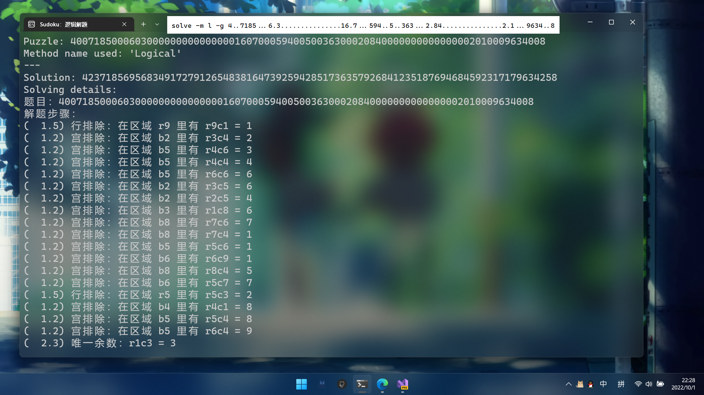
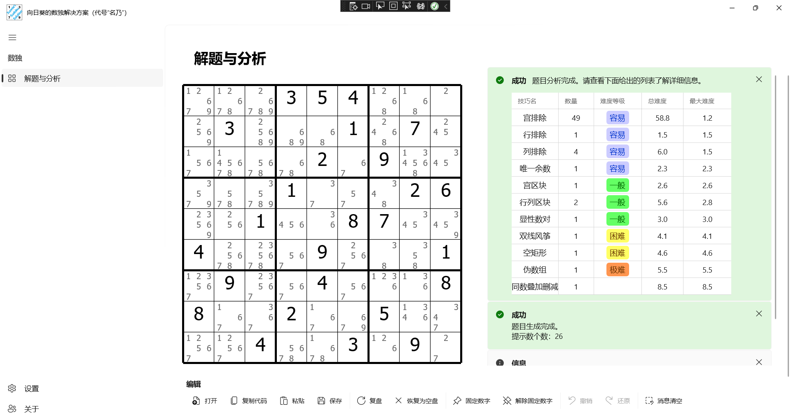

Language switch to: <a href="README.md">English</a>

# Sudoku Studio

> 以前仓库叫 Sunnie's Sudoku Solution（即向向的数独解决方案）。

## 简介

一个使用暴力破解和普通逻辑算法解题的数独分析解题 SDK。目前该解决方案支持对数独的题目生成、使用逻辑技巧或无逻辑技巧解题和一些常见数独特性的验证（例如，验证是否一个指定的盘面是一个最小题目。所谓的最小题目指的是，盘面任意一个数字消失后，都会使得题目多解的题）。

API 有很多，所以这里给出其中一个[基本解题](https://sunnieshine.github.io/Sudoku/usages/solve-by-manual)的操作，提供参考。

以后，我想把这个解决方案用于**几乎所有平台**上。我可能会完成 Win11 App 项目、安卓项目、常用网络平台上的机器人（比如可能 QQ 啊，哔哩哔哩之类的）。

我很遗憾我并未创建英文版的 Wiki 内容，因为工程量太大了。我学了很多年的英语，但是对于一些描述（尤其是细节的表达）要翻译成英语仍然有点困难。

当然，你也可以使用 JetBrains 的 Rider 作为你的 IDE 来开发。随便你用什么都行，甚至是记事本（大笑）。虽说 C# 拥有一些只能在 VS 上使用的语法（`__makeref` 之类的关键字），不过这个项目里没有使用这些内容，因此你可以大大方方地使用别的 IDE 开发。

MVVM 框架对我来说有些复杂，我还在学习期间，所以如果上手使用 MVVM 会影响我设计程序的进度，这有点太慢了，所以我暂时不打算考虑用这个框架进行架构的定义和设计。

## 界面

控制台：

UI：

程序还在完成之中！

## 关于该仓库的克隆（Fork）及代码拉取请求（Pull Requests）

当然，你可以复制这个仓库到你的账号下，然后做你想做的任何事情。你可以在基于 [MIT](https://github.com/SunnieShine/Sudoku/blob/main/LICENSE) 开源协议的情况下做你任何想做的事情。不过，由于 Gitee 是从 GitHub 拷贝过来的，所以 Gitee 项目暂时不支持任何的代码拉取请求，敬请谅解；不过这两个仓库都可以创建 issue。

另外，这个仓库可能会更新得**非常频繁**（大概一天至少一次代码提交），而备份过去的 Gitee 的仓库由于配置了 WebHook，因此在上传到 GitHub 的时候会自动同步过来。

实际上，每天至少一次更新的内容多数都是在重构代码，API 更进其实确实比较少。不过，数独游戏这种东西要想模拟人工解题算法的话，写代码的话就不容易看懂。我非常注重代码的整洁、代码的可读性，所以我要权衡算法的性能和可读性，找到一个平衡点。总之，敬请期待吧。

## 计划

这个项目计划的相关内容全部列举在[这个页面](https://github.com/users/SunnieShine/projects/2)之中，需要了解可以查阅一波。

## 开源协议

本项目使用的开源协议比较复杂。简要说明一下。

### 代码部分

所有的代码文件全部使用的是 MIT 开源协议。MIT 开源协议意味着你需要在你的应用程序里声明本项目的作者信息。

### Wiki 文档部分

本项目里包含了一些 Wiki 文档（即放入 docs 文件夹的所有文件，包含 Markdown 文件以及关联的图片，还有位于仓库根目录下的 README.md 和中文版本 README-zh-cn.md），由于均为自己写的内容，所以它们需要遵守 CC 协议。如果你需要使用，请在你的资料文献等内容里说明本文的版权信息，并且附上改动过的条目。

## 行为准则

请查看 [行为准则](CODE_OF_CONDUCT) 文件。

## 数独技巧参考

我列举一些我这个解决方案里用到和参考的数独技巧网站。这些网站内容都是我自己写和出品的，所以如果你想要了解数独技巧的具体细节，你可以参考这些链接来了解它们。

* [标准数独技巧教程（视频）_bilibili](https://www.bilibili.com/video/BV1Mx411z7uq)
* [标准数独技巧教程（专栏）_bilibili](https://www.bilibili.com/read/readlist/rl291187)

> 这些页面都是中文的。不过，我以后可能会考虑写其它语言版本的页面。

## 作者

小向，来自成都的一名四川~~普通大学~~师范大学的本科大学生。

