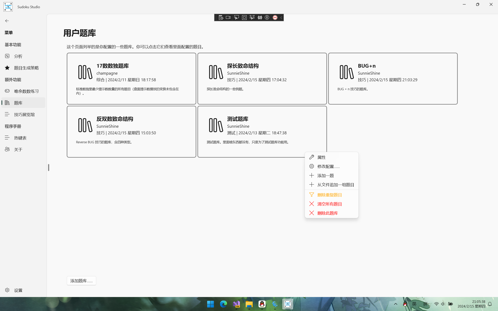
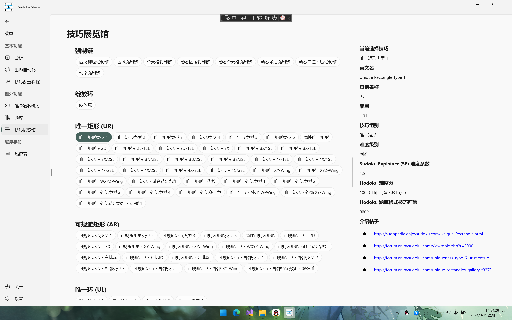

Language switch to: <a href="README.md">English</a>

# Sudoku Studio

> 以前仓库叫 Sunnie's Sudoku Solution（即向向的数独解决方案）。

## 简介

一个使用暴力破解和普通逻辑算法解题的数独分析解题 SDK。目前该解决方案支持对数独的题目生成、使用逻辑技巧或无逻辑技巧解题和一些常见数独特性的验证（例如，验证是否一个指定的盘面是一个最小题目。所谓的最小题目指的是，盘面任意一个数字消失后，都会使得题目多解的题）。

API 有很多，所以这里给出其中一个[基本解题](https://sunnieshine.github.io/Sudoku/usages/solve-by-manual)的操作，提供参考。

以后，我想把这个解决方案用于**几乎所有平台**上。我可能会完成 Win11 App 项目、安卓项目、常用网络平台上的机器人（比如可能 QQ 啊，哔哩哔哩之类的）。

我很遗憾我并未创建英文版的 Wiki 内容，因为工程量太大了。我学了很多年的英语，但是对于一些描述（尤其是细节的表达）要翻译成英语仍然有点困难。

当然，你也可以使用 JetBrains 的 Rider 作为你的 IDE 来开发。随便你用什么都行，甚至是记事本（大笑）。虽说 C# 拥有一些只能在 VS 上使用的语法（`__makeref` 之类的关键字），不过这个项目里没有使用这些内容，因此你可以大大方方地使用别的 IDE 开发。

## 项目定位

这个仓库的代码适用于下面这些人群：

* **喜欢钻研数独算法的人**：如果你想要钻研数独有关的实现机制和背后运行机制的话，你可以在这个项目里找到对应的答案。
* **尝试学习 C# 有关特性的人**：这个项目使用了一些较新的 C# 语言特性，并且你可以在这里学到一些 .NET 相关的技术，比如 Windows UI。
* **我自己**：我自己会提前对之前想到的代码和算法进行一些实现，这样就防止我忘记它们的原理和处理规则。

## 界面

### 主页

### 题库

### 技巧展览馆

## 支持的技巧

本项目支持众多人工解题技巧的逻辑推理过程。下面给大家列举一下这些技巧。

* 出数类技巧
  * 排除（含同数九缺一）
  * 唯一余数（含同区域九缺一）
* 复杂出数类技巧
  * 直观区块（区块排除、区块唯一余数）
  * 直观数组（数组排除、数组唯一余数）
* 候选数技巧
  * 区块类技巧
    * 区块
    * 割补（LoL）
    * 欠一数组（ALC）
    * 烟花数组
  * 数组
    * 显性数组
      * 死锁数组
      * 数组带区块
      * 普通显性数组
    * 隐性数组
      * 死锁数组
      * 普通隐性数组
  * 鱼（含鱼鳍逻辑）
    * 普通鱼
    * 复杂鱼（宫内、交叉鱼）
  * 链式同数结构
    * 双强链（标准、区块类型）
    * 空矩形（ER）
  * 短链结构
    * 规则 Wing（XY-Wing、XYZ-Wing 等）
    * 不规则 Wing
      * W-Wing（标准、区块、多分支类型）
      * M-Wing（标准、区块类型）
      * S-Wing（标准、区块类型）
      * H-Wing（标准、区块类型）
      * L-Wing（标准、区块类型）
    * XYZ 环（半环、全环类型）
  * 唯一性
    * 唯一矩形（UR）
    * 唯一环（UL）
    * 拓展矩形（XR）
    * 探长致命结构
    * 淑芬致命结构
    * 唯一矩阵
    * 全双值格致死解法（BUG）
    * 反转双数致命结构（反 BUG）
    * 唯一性提示信息覆盖（两数）
  * 链（SE 算法）
    * 链/环
    * 强制链
    * 动态强制链
    * 绽放环
  * 待定数组（ALS）
    * 链式待定数组（待定数组・双强链、待定数组・XY-Wing、待定数组・W-Wing）
    * 伪数组
    * 对交空矩形（ERIP）
    * 死亡绽放
      * 单元格绽放
      * 区域绽放
      * 唯一矩形/可规避矩形绽放（缺少例子，不知道实现得对不对）
      * n 次 ALS 绽放
  * 秩逻辑
    * 0 秩逻辑
      * 融合待定数组（SDC，标准类型、孤立数类型和自噬类型）
      * 三维融合待定数组
      * 多米诺环
      * 网（MSLS）
    * 负秩逻辑
      * 守护者
      * 双值死环（即死环）
      * 三值死环（“三顺一逆”规则）
  * 飞鱼
    * 初级飞鱼（JE）
    * 高级飞鱼（SE）
    * 双飞鱼
    * 衰弱飞鱼（含标准衰弱和全衰弱类型，WE）
    * 复杂飞鱼
      * 复杂初级飞鱼
      * 复杂高级飞鱼
  * 对称性
    * 宇宙（GSP，标准和反演类型）
  * 枚举类技巧
    * 均衡数组
  * 爆破类技巧
    * Bowman 试数
    * 计算机算法技巧
      * 图案叠加删数
      * 模板
      * 计算机试数（BF）

其它的一些技巧等待实现，比如代数逻辑和链。现在的链算法照搬的是 Sudoku Explainer 的实现，因为我不太擅长自己写一份链的算法。

> 其中的“不规则 Wing”技巧就是除了 Broken Wing（守护者）以外的所有名字带 Wing 的技巧类型。这些技巧一般长度为 5，三强两弱，只比双强链多了一个强链关系，因此在国内一般称为“短链结构”，包含 W-Wing、M-Wing、Hybrid-Wing、Local-Wing 和 Split-Wing 五种，以及一个叫 Purple Cow 的技巧（这个技巧名称特殊，但也归在这个范围之中）。其中，只有 W-Wing 单独有实现规则的代码，剩下的短链结构全部在“交替推导链”（即 AIC）的代码里实现。

## 关于该仓库的复刻（Fork）及代码拉取请求（Pull Requests）

当然，你可以复制这个仓库到你的账号下，然后做你想做的任何事情。你可以在基于 [MIT](https://github.com/SunnieShine/Sudoku/blob/main/LICENSE) 开源协议的情况下做你任何想做的事情。不过，由于 Gitee 是从 GitHub 拷贝过来的，所以 Gitee 项目暂时不支持任何的代码拉取请求，敬请谅解；不过这两个仓库都可以创建 issue。

另外，这个仓库可能会更新得**非常频繁**（大概一天至少一次代码提交），而备份过去的 Gitee 的仓库由于配置了 WebHook，因此在上传到 GitHub 的时候会自动同步过来。

实际上，每天至少一次更新的内容多数都是在重构代码，API 更进其实确实比较少。不过，数独游戏这种东西要想模拟人工解题算法的话，写代码的话就不容易看懂。我非常注重代码的整洁、代码的可读性，所以我要权衡算法的性能和可读性，找到一个平衡点。总之，敬请期待吧。

## 开源协议

本项目使用的开源协议比较复杂。简要说明一下。

### 代码部分

所有的代码文件全部使用的是 MIT 开源协议。MIT 开源协议意味着**你需要在你的应用程序里声明本项目的作者信息**。

### `Sudoku.Recognition` 代码项目

该项目比较特殊。该项目的代码使用到了 [EmguCV](https://github.com/emgucv/emgucv) 仓库里的 API 以及部分源代码。根据源仓库的开源协议规则和规范，该项目也需要严格遵守此点。因此它采用的是独立的开源协议。请查看该项目在仓库里的 `LICENSE` 文件。

### `SudokuTutorial` 项目

该项目的文件需要遵守 CC-BY-4.0 协议。如果你需要使用，**请在你的资料文献等内容里说明本文的版权信息，并且附上改动过的条目**。

### Wiki 文档部分

本项目里包含了一些 Wiki 文档（即放入 docs 文件夹的所有文件，包含 Markdown 文件以及关联的图片，还有位于仓库根目录下的 README.md 和中文版本 README-zh-cn.md），由于均为自己写的内容，所以它们需要遵守 CC-BY-4.0 协议。如果你需要使用，**请在你的资料文献等内容里说明本文的版权信息，并且附上改动过的条目**。

## 行为准则

为了建立好良好的讨论氛围和代码提交规范，本项目使用了默认规定的行为准则。请查看[行为准则](CODE_OF_CONDUCT)文件。

## 数独技巧参考

我列举一些我这个解决方案里用到和参考的数独技巧网站。这些网站内容都是我自己写和出品的，所以如果你想要了解数独技巧的具体细节，你可以参考这些链接来了解它们。

* [标准数独技巧教程（视频）_bilibili](https://www.bilibili.com/video/BV1Mx411z7uq)
* [标准数独技巧教程（专栏，新版）_bilibili](https://www.bilibili.com/read/readlist/rl717501)

> 新版专栏尚未完成，请耐心等待。

## 作者

小向，一个热爱开发的非开发人员，来自四川成都。

如果要联系我，请查看 [CONTACTS-zh-cn](CONTACTS-zh-cn) 文件了解我的联系方式。
