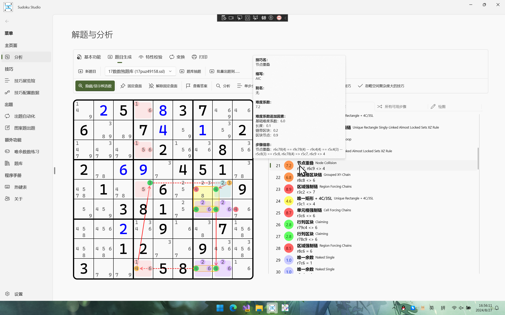

Language switch to: <a href="README.md">English</a> 

## 简介

一个使用暴力破解和普通逻辑算法解题的数独分析解题 SDK。目前该解决方案支持对数独的题目生成、使用逻辑技巧或无逻辑技巧解题和一些常见数独特性的验证（例如，验证是否一个指定的盘面是一个最小题目。所谓的最小题目指的是，盘面任意一个数字消失后，都会使得题目多解的题）。

## 项目定位

这个仓库的代码适用于下面这些人群：

* **喜欢钻研数独算法的人**：如果你想要钻研数独有关的实现机制和背后运行机制的话，你可以在这个项目里找到对应的答案。
* **尝试学习 C# 有关特性的人**：这个项目使用了一些较新的 C# 语言特性，并且你可以在这里学到一些 .NET 相关的技术，比如 Windows UI。
* **我自己**：我自己会提前对之前想到的代码和算法进行一些实现，这样就防止我忘记它们的原理和处理规则。

## 界面

## 支持的技巧

本项目支持众多人工解题技巧的逻辑推理过程。下面给大家列举一下这些技巧。

* 直观技巧
  * 同区九缺一（Full House）
  * 同数九缺一（Last Digit）
  * 排除
  * 唯一余数
* 局标候选数技巧
  * 直观区块（区块排除、区块唯一余数）
  * 直观数组（数组排除、数组唯一余数）
* 全标候选数技巧
  * 区块类技巧
    * 区块
    * 割补（LoL）
    * 欠一数组（ALC）
    * 烟花数组
  * 数组
    * 显性数组
      * 死锁数组
      * 区块数组
      * 显性数组
    * 隐性数组
      * 隐性死锁数组
      * 隐性数组
  * 鱼（含鱼鳍逻辑）
    * 普通鱼
    * 复杂鱼
      * 宫内鱼
      * 交叉鱼
  * 链式同数结构
    * 双强链
      * 摩天楼
      * 双线风筝
      * 多宝鱼
    * 空矩形（ER）
  * 短链结构
    * 规则 Wing（XY-Wing、XYZ-Wing 等）
    * 不规则 Wing
      * W-Wing
      * M-Wing
      * 其他（S-Wing、H-Wing、L-Wing）
    * XYZ 环
  * 致命结构
    * 无条件致命结构
      * 唯一矩形（UR）
      * 唯一环（UL）
      * 拓展矩形（XR）
      * 探长致命结构
      * 淑芬致命结构
      * 唯一矩阵
      * 唯一性提示信息覆盖（UCC）
    * 条件致命结构
      * 旋转致命结构
      * 其他致命结构（规格 = 8）
    * 其他
      * 全双值格致死解法（BUG）
      * 反转双数致命结构（反 BUG）
  * 涂色（**只有 API 支持**）
    * 简易涂色
      * 色链规则
      * 色分规则
  * 链
    * 非区块链
      * 标准链（AIC）
      * 连续环（CNL）
    * 有名字的链
      * 远程数对
        * 标准远程数对
        * 复杂远程数对
    * 区块链
      * 区块链（GAIC）
      * 区块环（GCNL）
      * 节点重叠
    * 绽放逻辑
      * 绽放环
    * 鳍逻辑
      * 鳍链
      * 区块鳍链
  * 强制链
    * 区域强制链
    * 单元格强制链
  * 线性动态链
    * 试数
  * 待定数组（ALS）
    * 链式待定数组
      * 待定数组・双强链
      * 待定数组・XY-Wing
      * 待定数组・W-Wing
    * 伪数组
    * 对交空矩形
    * 死亡绽放
      * 单元格绽放
      * 区域绽放
      * n 次 ALS 绽放
  * 秩逻辑
    * 0 秩逻辑
      * 融合待定数组（SDC，标准类型、孤立数类型和自噬类型）
      * 三维融合待定数组
      * 多米诺环
      * 网（MSLS）
    * 负秩逻辑
      * 守护者
      * 双值死环（即死环）
      * 三值死环（“三顺一逆”规则）
  * 飞鱼
    * 初级飞鱼（JE）
    * 高级飞鱼（SE）
    * 双飞鱼
    * 衰弱飞鱼（WE）
    * 复杂飞鱼
      * 复杂初级飞鱼
      * 复杂高级飞鱼
  * 对称性
    * 宇宙（GSP，标准和反演类型）
  * 枚举类技巧
    * 均衡数组
  * 爆破类技巧
    * Bowman 试数
    * 图案叠加删数
    * 模板
    * 计算机试数（BF）

其它的一些技巧等待实现，比如代数逻辑和链。现在的链算法照搬的是 Sudoku Explainer 的实现，因为我不太擅长自己写一份链的算法。

> 其中的“不规则 Wing”技巧就是除了 Broken Wing（守护者）以外的所有名字带 Wing 的技巧类型。这些技巧一般长度为 5，三强两弱，只比双强链多了一个强链关系，因此在国内一般称为“短链结构”，包含 W-Wing、M-Wing、Hybrid-Wing、Local-Wing 和 Split-Wing 五种，以及一个叫 Purple Cow 的技巧（这个技巧名称特殊，但也归在这个范围之中）。其中，只有 W-Wing 单独有实现规则的代码，剩下的短链结构全部在“交替推导链”（即 AIC）的代码里实现。

## 关于该仓库的复刻（Fork）及代码拉取请求（Pull Requests）

当然，你可以复制这个仓库到你的账号下，然后做你想做的任何事情。你可以在基于 [MIT](https://github.com/KyouyamaKazusa0805/Sudoku/blob/main/LICENSE) 开源协议的情况下做你任何想做的事情。不过，由于 Gitee 是从 GitHub 拷贝过来的，所以 Gitee 项目暂时不支持任何的代码拉取请求，敬请谅解；不过这两个仓库都可以创建 issue。

另外，这个仓库可能会更新得**非常频繁**（大概一天至少一次代码提交），而备份过去的 Gitee 的仓库由于配置了 WebHook，因此在上传到 GitHub 的时候会自动同步过来。

实际上，每天至少一次更新的内容多数都是在重构代码，API 更进其实确实比较少。不过，数独游戏这种东西要想模拟人工解题算法的话，写代码的话就不容易看懂。我非常注重代码的整洁、代码的可读性，所以我要权衡算法的性能和可读性，找到一个平衡点。总之，敬请期待吧。

## 开源协议

### `Sudoku.Drawing.Ocr` 代码项目

该项目比较特殊。该项目的代码使用到了 [EmguCV](https://github.com/emgucv/emgucv) 仓库里的 API 以及部分源代码。根据源仓库的开源协议规则和规范，该项目也需要严格遵守此点。因此它采用的是独立的开源协议。请查看该项目在仓库里的 `LICENSE` 文件。

### 其他项目

本仓库的其他项目都采用 MIT 开源协议。MIT 开源协议意味着**你需要在你的应用程序里声明本项目的作者信息**。

## 行为准则

为了建立好良好的讨论氛围和代码提交规范，本项目使用了默认规定的行为准则。请查看[行为准则](CODE_OF_CONDUCT)文件。

## 数独技巧参考

我列举一些我这个解决方案里用到和参考的数独技巧网站。这些网站内容都是我自己写和出品的，所以如果你想要了解数独技巧的具体细节，你可以参考这些链接来了解它们。

* [标准数独技巧教程（视频）_bilibili](https://www.bilibili.com/video/BV1Mx411z7uq)
* [标准数独技巧教程（文章）](https://t.sudoku-studio.wiki)

## 作者

一个热爱开发的非开发人员。

如果要联系我，请查看 [CONTACTS-zh-cn](CONTACTS-zh-cn) 文件了解我的联系方式。
