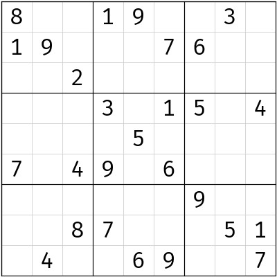
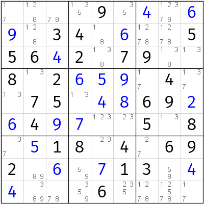
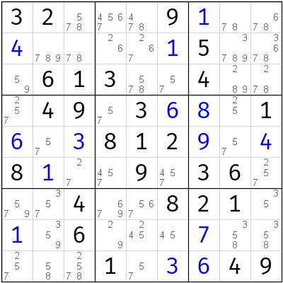

# Sudoku

标题：**数独**

A sudoku handling SDK using brute forces and logical techniques (Update files gradually).

一个使用暴力破解和普通逻辑算法解题的数独分析解题 SDK（逐渐更新）。


## C# Version and IDE

标题：**C# 版本和 IDE 使用情况**

* C# version: 8.0<br/>C# 版本：8.0
* IDE using: Visual Studio 2019 V16.4<br/>IDE 使用：Visual Studio 2019 V16.4


## How to use

标题：**如何使用**

Clone this repo, and you can take all codes!

只需要你克隆这个仓库就可以带走所有的代码了！

You can write code in your computer like this:

你可以在你的机器上使用这样的代码：

```csharp
using System;
using Sudoku.Data.Meta;
using Sudoku.Solving.Manual;

internal static class Program
{
    private static void Main()
    {
        var solver = new ManualSolver
        {
            OptimizedApplyingOrder = true,
            EnableFullHouse = true,
            EnableLastDigit = true
        };
        var grid = Grid.Parse(
            "500000482030007000000000309690085000000020000000970035102000000000100050764000008");
        var analysisResult = solver.Solve(grid);
        Console.WriteLine(analysisResult);
    }
}
```

And the puzzle solution and analysis result will be displayed on console screen, like this!

然后答案和分析结果都会在你的控制台界面呈现出来，就像这样！

```
Puzzle: .9...8..13...1.7.8..2..7.697.6....839..........3.2..................5.2..8..3.615
Solving tool: Manual
 (1.2) Hidden Single (In Block): r1c7 = 2 in b3
 (1.2) Hidden Single (In Block): r5c9 = 2 in b6
 (1.2) Hidden Single (In Block): r4c2 = 2 in b4
 (1.2) Hidden Single (In Block): r6c9 = 6 in b6
 (1.2) Hidden Single (In Block): r1c3 = 7 in b1
 (1.2) Hidden Single (In Block): r3c1 = 8 in b1
 (1.2) Hidden Single (In Block): r3c2 = 1 in b1
 (1.2) Hidden Single (In Block): r5c3 = 8 in b4
 (1.2) Hidden Single (In Block): r6c1 = 1 in b4
 (1.2) Hidden Single (In Block): r6c4 = 8 in b5
 (1.5) Hidden Single (In Column): r5c6 = 3 in c6
 (1.5) Hidden Single (In Row): r6c8 = 7 in r6
 (1.5) Hidden Single (In Row): r9c4 = 7 in r9
 (1.2) Hidden Single (In Block): r5c5 = 7 in b5
 (1.2) Hidden Single (In Block): r5c4 = 6 in b5
 (1.5) Hidden Single (In Row): r5c7 = 1 in r5
 (1.5) Hidden Single (In Column): r7c8 = 9 in c8
 (1.5) Hidden Single (In Column): r1c8 = 3 in c8
 (1.2) Hidden Single (In Block): r3c4 = 3 in b2
 (2.6) Pointing: 5 in b5\r4 => r4c7 <> 5
 (2.6) Pointing: 4 in b4\c2 => r2c2 <> 4, r7c2 <> 4, r8c2 <> 4
 (2.6) Pointing: 5 in b4\c2 => r2c2 <> 5, r7c2 <> 5
 (2.3) Naked single: r2c2 = 6
 (1.2) Hidden Single (In Block): r1c5 = 6 in b2
 (1.2) Hidden Single (In Block): r7c6 = 6 in b8
 (1.1) Last Digit: r8c1 = 6
 (1.5) Hidden Single (In Column): r4c6 = 1 in c6
 (2.0) Locked Pair: 4, 7 in b9 => r7c7 <> 4, r8c7 <> 4
 (3.0) Naked Pair: 4, 5 in b2 => r2c4 <> 4, r2c6 <> 4, r2c4 <> 5
 (4.0) Hidden Triple: 1, 2, 5 in r7 => r7c1 <> 4, r7c3 <> 4, r7c4 <> 4
 (5.4) Finned Jellyfish: 4 in c2368\r2569 (With a fin cell: r8c3) => r9c1 <> 4
 (1.5) Hidden Single (In Column): r1c1 = 4 in c1
 (1.0) Full House: r2c3 = 5
 (1.0) Full House: r1c4 = 5
 (1.2) Hidden Single (In Block): r3c5 = 4 in b2
 (1.0) Full House: r3c7 = 5
 (1.0) Full House: r2c8 = 4
 (1.0) Full House: r5c8 = 5
 (1.0) Full House: r5c2 = 4
 (1.0) Full House: r6c2 = 5
 (1.2) Hidden Single (In Block): r4c5 = 5 in b5
 (1.1) Last Digit: r7c1 = 5
 (1.0) Full House: r9c1 = 2
 (1.2) Hidden Single (In Block): r7c4 = 2 in b8
 (1.1) Last Digit: r2c6 = 2
 (1.0) Full House: r2c4 = 9
 (1.2) Hidden Single (In Block): r8c4 = 1 in b8
 (1.0) Full House: r4c4 = 4
 (1.0) Full House: r6c6 = 9
 (1.0) Full House: r4c7 = 9
 (1.0) Full House: r6c7 = 4
 (1.0) Full House: r9c6 = 4
 (1.0) Full House: r9c3 = 9
 (1.1) Last Digit: r7c3 = 1
 (1.0) Full House: r8c3 = 4
 (1.1) Last Digit: r7c9 = 4
 (1.0) Full House: r8c9 = 7
 (1.1) Last Digit: r7c2 = 7
 (1.0) Full House: r8c2 = 3
 (1.1) Last Digit: r7c7 = 3
 (1.0) Full House: r8c7 = 8
 (1.0) Full House: r7c5 = 8
 (1.0) Full House: r8c5 = 9
Puzzle has been solved.
Puzzle solution: 497568231365912748812347569726451983948673152153829476571286394634195827289734615
Time elapsed: 00:00.00.115
Technique used:
21 * Full House
7 * Last Digit
19 * Hidden Single (In Block)
5 * Hidden Single (In Column)
3 * Hidden Single (In Row)
1 * Locked Pair
1 * Naked single
3 * Pointing
1 * Naked Pair
1 * Hidden Triple
1 * Finned Jellyfish
Total solving steps count: 63
Difficulty total: 88.0
Puzzle rating: 5.4/1.2/1.2
```


## Intro to Solution Folders

标题：**解决方案文件夹介绍**

Here displays the introduction to all folders in this whole solution.

这里陈列出所有本解决方案会使用到的文件夹的所有介绍。

* `Sudoku.Core`
    * The implementation of all core data in sudoku, such as a sudoku [grid](https://github.com/Sunnie-Shine/Sudoku/blob/master/Sudoku.Core/Data/Meta/Grid.cs). All extension method in use is also in here.<br/>对于数独里所有核心部件的主要实现，比如[数独盘面类](https://github.com/Sunnie-Shine/Sudoku/blob/master/Sudoku.Core/Data/Meta/Grid.cs)。当然，所有在项目里使用到的扩展方法也都在这里。
* `Sudoku.Core.Old`
    * Same as [`Sudoku.Core`](https://github.com/Sunnie-Shine/Sudoku/tree/master/Sudoku.Core) project, but use older implementation logic. For example, this project uses LINQ to implement all SSTS (Standard sudoku technique set) step finder, and uses very simple information to describe all information in a grid, which is reduced efficiency of calculation. One of implementations of step finders is [here](https://github.com/Sunnie-Shine/Sudoku/blob/master/Sudoku.Core.Old/Solving/Subsets/SubsetStepFinder.cs#L27).<br/>和 [`Sudoku.Core`](https://github.com/Sunnie-Shine/Sudoku/tree/master/Sudoku.Core) 项目一样，不过这个项目里的所有部件都采用了很老旧的实现方式。举个例子，这个项目使用的是 LINQ 来实现的四大基本数独技巧（排除、唯一余数、区块、数组）的查找，而使用了人类一眼就能看明白的、很简单的信息表示手段来存储一个盘面的每一个细节信息，这样就会降低计算效率。其中一个使用 LINQ 实现的步骤搜索类的执行思路可以点击[此链接](https://github.com/Sunnie-Shine/Sudoku/blob/master/Sudoku.Core.Old/Solving/Subsets/SubsetStepFinder.cs#L27)查看。
* `Sudoku.Checking`
    * The checking module aiming to a sudoku grid, such as checking pearl puzzle, minimal puzzle, backdoors and so on.<br/>检测数独盘面的一些指定额外特性的模块，例如检测一个题目是否是珍珠题、最小题，或者是检测一个题目存在的所有后门（和魔术格）等信息。
* `Sudoku.Solving`
    * Solving module of this whole solution.<br/>控制整个解决方案完成解题操作的所有内容的模块。
* `Sudoku.Generating`
	* Provides generating operations of sudoku.<br/>为整个数独项目提供出题的模块。
* `Sudoku.Drawing`
    * Painting module of this solution, which is used for GDI+.<br/>控制整个解决方案有关绘制图形的模块，一般用于 GDI+ 上。
* `Sudoku.Forms`
    * Provides all UI forms and controls.<br/>提供所有程序使用的 UI 界面和控件。
* `Sudoku.Diagnostics`
    * The diagnostic controlling through all over the solution. In addition, those files are used with my own custom code analyzer and fixer (But this analyzer is not included in this solution. Therefore codes has not been uploaded).<br/>控制整个解决方案执行行为和编译期间行为的项目。另外，所有的文件都会依赖于我自己实现的分析器和代码修补工具（不过这一部分代码不属于项目，所以我没有上传）。
* `Sudoku.IO`
    * I/O operations to sudoku data.<br/>控制数独文件流处理的项目。
* `Sudoku.Runtime`
    * Provides all custom runtime exceptions in this solution.<br/>为整个解决方案提供所有的自定义运行时异常类。
* `Sudoku.Solving.BruteForces.Bitwise`
    * The bitwise brute force solver to a sudoku puzzle.<br/>项目解题期间使用的位运算爆破算法（JCZSolver）的源代码。
* `Sudoku.Debugging`
    * The console program aiming to debugging codes logic of other projects.<br/>旨在解决这整个解决方案里其它项目的 bug 和调试操作的项目。
* `Sudoku.Terminal`
    * The terminal of this project. You can use console arguments (such as `--solve` to solve a grid).<br/>这整个解决方案里的终端控制部分。你可以在控制台输入比如 `--solve` 来完成对一道题的分析和解题。


## Intro to Files

标题：**文件介绍**

Here displays the introduction to files in root folder.

这里陈列出根目录下的文件的基本说明。

* `.editorconfig`
    * Editor configuration file.<br/>用户配置文件（项目整体控制编译器错误等信息的控制信息，以及控制成员名称规范的信息）。
* `Priority of operators.txt`
    * Operators priority through C# language. (P.S. I don't know why I will upload this file, maybe of vital importance?)<br/>C# 语言里的运算符的优先级表。（我也不知道为啥我要上传它，可能它很重要？）


## Grid Format and Parsing format

标题：**盘面格式和解析为盘面的字符串样式**

If you has known the whole outline of this solution, you want to know how to use grid format. First of all, I will give you some characters you should use.

如果你对这个项目有所了解的话，你肯定想知道数独盘面的输入的具体格式。首先我会给你一个表，陈列的各种字符就是你需要用到的。

### Single line format characters

标题：**单行输出模式下的格式化字符**

| Format chararcters<br/>格式化字符 | Meanings<br/>意思                                                                  |
| -------------------------------- | ---------------------------------------------------------------------------------- |
| `.` and `0`                      | Placeholder option.<br/>占位符选项。                                                |
| `+`                              | Modifiable values option.<br/>显示可修改的数值选项。                                |
| `!`                              | Modifiable values will be regarded as given ones.<br/>把可修改数值视为提示数的选项。 |
| `:`                              | Candidates-has-been-eliminated option.<br/>显示盘面已删除的候选数的选项。            |
| `#`                              | Intelligent output option.<br/>智能输出选项。                                       |

If you write `grid.ToString("0")`, all empty cells will be replaced by character `'0'`; but if you write `grid.ToString(".")`, empty cells will be shown by `'.'`.

如果你写的是 `grid.ToString("0")` 的话，所有的空格都会使用字符 `'0'` 所占据；而如果你写的是 `grid.ToString(".")` 的话，就会是 `'.'` 字符填充空格了。

If you add modifiable-value option `'+'`, all modifiable values (if exists) will be shown by `+digit` (In default case, modifiable values will not be output). In addition, if you write `'!'` rather than `'+'`, all modifiable values will be treated as given ones, so output will not be with plus symbol (i.e. `digit` rather than `'+digit'`). **Note that you should write either `'+'` or `'!'`**. Both characters written will generate a runtime exception.

如果你使用了可修改数值的选项 `'+'` 的话，所有可修改的数值（如果存在的话）都会以 `'+数字'` 的形式被显示在盘面里（在默认情况下，这些数字都是不会显示出来的）。另外，如果你写的是 `'!'` 而不是 `'+'` 的话，所有可修改的数值都会被当作提示数看待，输出的时候不会带有 `+` 符号。注意**这两个符号不要同时使用**。同时使用它们会产生一个运行时异常。

If you want to show candidates which have been eliminated before, you should add `':'` at the tail of the format string, which means all candidates that have been eliminated before current grid status can be also displayed in the output. However, **you should add this option `':'` at the tail position only**; otherwise, generating a runtime exception.

如果你想展示盘面当前情况下的候选数被删除的样子的话，你可以在整个格式化字符串的末尾添加 `':'` 字符，这表示所有当前盘面下被删除的候选数也会被显示出来。但是，**你只能把这个字符放在整个格式化字符串的末尾**，否则它会生成一个运行时异常。

If you cannot raise a decision, you can try intelligent output option `'#'`, which will be output intelligently.

如果你无法作出决定，你可以使用 `'#'` 字符作为格式化字符串，来表示输出智能化处理（检测到有候选数排除的情况会被显示出来；检测到如果有填入的数字也会被呈现出来）。

For examples, if you write:

比如你这么写代码：

```csharp
grid.ToString("0+");
```

This format `"0+"` means that all empty cells will be shown as digit 0, givens will be shown with digit 1 to 9, and modifiable values will be shown.

这个格式化字符串 `"0+"` 表示你的空格是用 `'0'` 字符表示的，并且还会显示所有可修改的数字；而提示数则直接使用 1 到 9 显示。

And another example:

另外一个例子：

```csharp
grid.ToString(".+:");
```

Output will treat:

输出：

* empty cells as `'.'` character,<br/>空格用 `'.'` 占位；
* modifiable values as `'+digit'`,<br/>可修改数值用 `'+数字'` 形式显示；
* candidates as `':candidateList'`.<br/>候选数使用 `:候选数序列` 形式显示。


All examples are shown at the end of this part.

上面所有解释在最后都会给出例子集，可以对照。


### Multiline format characters

标题：**多行输出模式下的格式化字符**

If you want to output pencil marked grid (PM grid), you should use options below:

另外，如果你要输出这个题目的候选数盘面的话，你可以使用下面的选项：

| Format chararcters<br/>格式化字符 | Meanings<br/>意思                                                      |
| -------------------------------- | ---------------------------------------------------------------------- |
| `@`                              | Default PM grid character.<br/>默认的候选数盘面输出的格式化字符。        |
| `0` and `.`                      | Placeholders.<br/>占位符。                                             |
| `:`                              | Candidates option.<br/>输出候选数选项。                                 |
| `*`                              | Simple output option.<br/>普通格线字符输出选项。                        |
| `!`                              | Treat-modifiable-as-given option.<br/>把填入的数字视为提示数的选项。     |

These option are same or similar as normal grid (Susser format) output, so I don't give an introduction about those characters. Learn them from examples at the end of this part. I wanna introduce `'*'` option which is not mentioned above however.

这些选项都和普通盘面输出样式的输出模式差不多，所以我就不给出解释了。你可以在例子集里找到这些东西的详细用法。不过我需要提一下上文没有介绍过的 `'*'` 字符。

By the way, character `'*'` is for simple output. If the format has not followed by this option, the grid outline will be handled subtly. You can find the difference between two outputs:

当然了，字符 `'*'` 用作简单格线的输出。如果你的格式化字符串没有这个选项的话，那么格线看起来就没有那么“圆润”。你可以对比下面两个示例，看看区别。

```
.---------------.---------------.------------------.
| 17   128  78  | 135  <9>  35  | *4*   12378  *6* |
| *9*  128  <3> | <4>  18   *6* | 1278  1278   <5> |
| <5>  <6>  *4* | <2>  138  <7> | <9>   138    13  |
:---------------+---------------+------------------:
| <8>  13   <2> | *6*  *5*  *9* | 17    <4>    137 |
| 13   <7>  <5> | 13   *4*  *8* | <6>   <9>    *2* |
| *6*  <4>  *9* | *7*  123  23  | <5>   13     <8> |
:---------------+---------------+------------------:
| 37   *5*  <1> | <8>  23   <4> | 27    <6>    <9> |
| <2>  89   *6* | 59   *7*  <1> | <3>   58     *4* |
| *4*  389  78  | 359  <6>  235 | 1278  12578  17  |
'---------------'---------------'------------------'

+---------------+---------------+------------------+
| 17   128  78  | 135  <9>  35  | *4*   12378  *6* |
| *9*  128  <3> | <4>  18   *6* | 1278  1278   <5> |
| <5>  <6>  *4* | <2>  138  <7> | <9>   138    13  |
+---------------+---------------+------------------+
| <8>  13   <2> | *6*  *5*  *9* | 17    <4>    137 |
| 13   <7>  <5> | 13   *4*  *8* | <6>   <9>    *2* |
| *6*  <4>  *9* | *7*  123  23  | <5>   13     <8> |
+---------------+---------------+------------------+
| 37   *5*  <1> | <8>  23   <4> | 27    <6>    <9> |
| <2>  89   *6* | 59   *7*  <1> | <3>   58     *4* |
| *4*  389  78  | 359  <6>  235 | 1278  12578  17  |
+---------------+---------------+------------------+
```

Multiline output environment will be more relaxed when ordering different options than single line output one.

多行输出环境下的格式化字符顺序要在单行输出环境下的要求更宽松一些。

Note that in multiline output environment, placeholder characters `'0'` or `'.'` cannot appear with candidates option `':'` together, because placeholders may not appear when outputing all candidates.

唯一需要注意的地方是，占位符 `'0'` 和 `'.'` 不允许和 `':'` 一起出现，因为需要输出候选数情况时，是不可能出现占位符的。


### Examples

标题：**示例**



```
Format（格式）:
"0"

Output（输出结果）:
800190030190007600002000000000301504000050000704906000000000900008700051040069007

---

Format（格式）:
"@:"

Output（输出结果）:
.---------------------.--------------------.----------------------.
| <8>   567     567   | <1>   <9>    245   | 247    <3>     25    |
| <1>   <9>     35    | 2458  2348   <7>   | <6>    248     258   |
| 3456  3567    <2>   | 4568  348    3458  | 1478   14789   589   |
:---------------------+--------------------+----------------------:
| 269   268     69    | <3>   278    <1>   | <5>    26789   <4>   |
| 2369  12368   1369  | 248   <5>    248   | 12378  126789  23689 |
| <7>   12358   <4>   | <9>   28     <6>   | 1238   128     238   |
:---------------------+--------------------+----------------------:
| 2356  123567  13567 | 2458  12348  23458 | <9>    2468    2368  |
| 2369  236     <8>   | <7>   234    234   | 234    <5>     <1>   |
| 235   <4>     135   | 258   <6>    <9>   | 238    28      <7>   |
'---------------------'--------------------'----------------------'
```




```
Format（格式）:
"0+"

Output（输出结果）:
000090+40+6+90340+600556+4207900802+6+5+90400750+4+869+2+64+9+7005080+5180406920+60+7130+4+400060000

---

Format（格式）:
"@"

Output（输出结果）:
.-------+-------+-------.
| . . . | . 9 . | . . . |
| . . 3 | 4 . . | . . 5 |
| 5 6 . | 2 . 7 | 9 . . |
:-------+-------+-------:
| 8 . 2 | . . . | . 4 . |
| . 7 5 | . . . | 6 9 . |
| . 4 . | . . . | 5 . 8 |
:-------+-------+-------:
| . . 1 | 8 . 4 | . 6 9 |
| 2 . . | . . 1 | 3 . . |
| . . . | . 6 . | . . . |
'-------+-------+-------'

---

Format（格式）:
"@*:"

Output（输出结果）:
+---------------+---------------+------------------+
| 17   128  78  | 135  <9>  35  | *4*   12378  *6* |
| *9*  128  <3> | <4>  18   *6* | 1278  1278   <5> |
| <5>  <6>  *4* | <2>  138  <7> | <9>   138    13  |
+---------------+---------------+------------------+
| <8>  13   <2> | *6*  *5*  *9* | 17    <4>    137 |
| 13   <7>  <5> | 13   *4*  *8* | <6>   <9>    *2* |
| *6*  <4>  *9* | *7*  123  23  | <5>   13     <8> |
+---------------+---------------+------------------+
| 37   *5*  <1> | <8>  23   <4> | 27    <6>    <9> |
| <2>  89   *6* | 59   *7*  <1> | <3>   58     *4* |
| *4*  389  78  | 359  <6>  235 | 1278  12578  17  |
+---------------+---------------+------------------+
```




```
Format（格式）:
"0+:"

Output（输出结果）:
320009+100+40000+150006130040004903+6+801+60+3812+90+48+10090360004008210+106000+70000010+3+649:515 615 724 825 228 229 731 235 738 748 563 972 574 882 484 584 792 295

---

Format（格式）:
"@:!"

Output（输出结果）:
.----------------.----------------.-----------------.
| <3>  <2>  578  | 4567  478  <9> | <1>  78    678  |
| <4>  789  78   | 26    267  <1> | <5>  3789  3678 |
| 59   <6>  <1>  | <3>   578  57  | <4>  289   278  |
:----------------+----------------+-----------------:
| 257  <4>  <9>  | 57    <3>  <6> | <8>  25    <1>  |
| <6>  57   <3>  | <8>   <1>  <2> | <9>  57    <4>  |
| <8>  <1>  27   | 457   <9>  457 | <3>  <6>   257  |
:----------------+----------------+-----------------:
| 579  357  <4>  | 679   567  <8> | <2>  <1>   35   |
| <1>  359  <6>  | 29    245  45  | <7>  358   358  |
| 257  58   2578 | <1>   57   <3> | <6>  <4>   <9>  |
'----------------'----------------'-----------------'
```


## Conditional Compilation Symbols

标题：**条件编译符号**

This solution uses conditional compilation symbols. I will introduce all of them.

本项目使用了条件编译符号。我将会为你介绍它们。

* `CODE_ANALYSIS_EXTENDED_BLOCK`
	* The code block is used to replace my own code analyzer and fixer. Above the introduction in project folders, I have told that all attributes in the [`Sudoku.Diagnostics`](https://github.com/Sunnie-Shine/Sudoku/tree/master/Sudoku.Diagnostics) project is only used and does work with my own code analyzer but the analyzer is not any part of the code in this whole sudoku solution. Therefore, this symbol is used when the analyzer does not work, all code surrounded with `#if CODE_ANALYSIS_EXTENDED_BLOCK` block will work. For example, the code analyzer will check the validity of a string marked on `PatternAttribute`, which is finished at compilation time, so the runtime, all values marked on this attribute will be guaranteed that they are valid regular expression patterns. However, the code analyzer does not work somehow, this block will check the pattern using `Contract.Requires(pattern.IsRegexPattern());` to check the value is valid one. If this code block does not work and the pattern is invalid, we will get a runtime exception that the pattern is invalid.<br/>这个代码块用来代替我自己的代码分析器和修补工具。在前文介绍文件夹的时候我提到过，所有位于 [`Sudoku.Diagnostics`](https://github.com/Sunnie-Shine/Sudoku/tree/master/Sudoku.Diagnostics) 项目下的特性均需要配合我自己设计的代码分析器才能正常工作。但这个分析器的代码并不属于整个项目的任何一个部分，所以我没有上传上来。所以，这个预编译符号就起作用了：如果我们把 `CODE_ANALYSIS_EXTENDED_BLOCK` 启用起来的话，整个项目就可以正常工作了。举个例子，代码分析器会验证标注了 `PatternAttribute` 特性的字符串是否是一个合法的正则表达式的模式串，这一点将在编译期就完成处理（如果不是的话会立刻报错，防止错误留到运行时）。如果我们不启用这个代码块的话，如果传入的这个参数标记了这个特性，却不是一个合法模式串的话，我们就会在运行时获得一个异常。而整个被这个预编译符号包裹起来的代码块里写的就是验证这个字符串是否是合法模式串的代码（`Contract.Requires(pattern.IsRegexPattern());`）。
* `LAZY_CODE`
	* This part of codes is only written by purely simple logic. However these are always complex and diffcult to maintain.<br/>这部分的代码纯粹是为了写起来更快，不需要思考而搞定的（俗称懒惰环境下完成的代码书写）。这部分代码一般都比较复杂，而且很难维护，只是因为这部分代码逻辑很好思考。
* `I_DONT_KNOW_WHY_GENERATING_BUG`
	* This part of codes is ones which will always generate a bug that I cannot fix it. If you can solve this problem, you can add this symbol in your project and enable to compile them, in order to fix the bugs.<br/>这部分的代码一般都会产生 bug，而且这个 bug 我目前还没有修复。如果你能解决这个问题，你可以为你的项目加上这个符号来编译启用这部分代码，来修复 bug。


## Author

标题：**作者**

Sunnie, from Chengdu, is an original undergraduate.

小向，来自成都的一名普通大学生。
