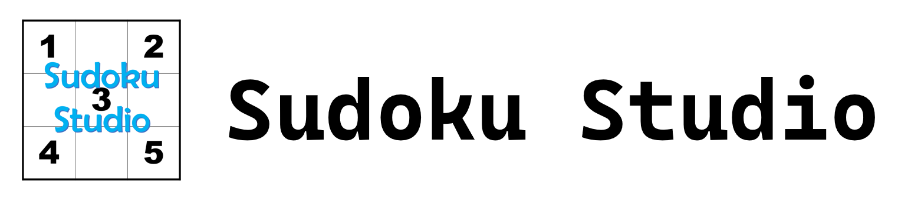
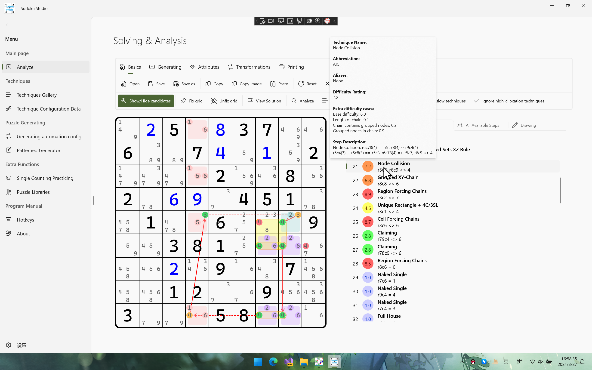

语言切换：<a href="README-zh-cn.md">简体中文</a> 

## Introduction

A sudoku handling SDK using brute forces and logical techniques. Now this solution supports generating puzzles, solving puzzles (with logical & illogical techniques) and some attribute checking (for example, to determine whether the specified grid is a minimal puzzle, which will become multiple solutions when any a digit is missing).

### Repository Positioning

This repository is created for the following users:

* **who likes sudoku algorithms**: If you like to study for sudoku techniques and its backing implementation and running mechanism, you can find answer in this repository.
* **who wants to learn about C#-related features**: This repository uses some C# newer features and .NET-related features such as Windows UI, which can help you learn more about it as practicing.
* **myself**: The codes are very important for me to learn sudoku and algorithms.

## Prefaces

## Technique Supports

This solution supports many kinds of human-friendly techniques. Here I will list them.

* Directs
  * Full House
  * Last Digit
  * Hidden Single (Crosshatching)
  * Naked Single
* Partial-mark Candidates
  * Direct Intersection
  * Direct Subset
  * Complex Singles
* Full-mark Candidates
  * Intersections
    * Locked Candidates (*LC*)
    * Law of Leftover (*LoL*)
    * Almost Locked Candidates (*ALC*)
    * Firework Subsets (Hanabi)
  * Subsets
    * Naked Subsets
      * Locked Subsets
      * Semi-Locked Subsets
      * Normal Naked Subsets
    * Hidden Subsets
      * Locked Hidden Subsets
      * Normal Hidden Subsets
  * Fishes
    * Normal Fishes
    * Complex Fishes
      * Franken Fishes
      * Mutant Fishes
  * Single-Digit Patterns (*SDP*)
    * Two Strong Links
      * Skyscraper
      * Two-String Kite
      * Turbot Fish
    * Empty Rectangle
  * Wings
    * Regular Wing (XY-Wing, XYZ-Wing, etc.)
    * Irregular Wing[^2]
      * Woods-Wing (*W-Wing*)
      * Medusa/Split/Hybrid/Local-Wing (*M/S/H/L-Wing*)
    * XYZ-Loop
  * Deadly Patterns
    * Unique Rectangle (*UR*)
    * Unique Loop (*UL*)
    * Extended Rectangle (*XR*)
    * Borescoper's Deadly Pattern
    * Qiu's Deadly Pattern
    * Unique Matrix (*UM*)
    * Bi-value Universal Grave (*BUG*)
    * Reverse Bi-value Universal Grave (*Reverse BUG*)
    * Uniqueness Clue Cover (*UCC*)
  * Coloring (**Only in API**)
    * Simple Coloring
      * Simple Coloring Wrap
      * Simple Coloring Trap
  * Baba Grouping
    * Remote Pair
      * Standard Remote Pair
      * Complex Remote Pair
    * Unique Rectangle Baba Grouping
  * Chains
    * Non-grouped Chains
      * Alternating Inference Chains (*AIC*)
      * Continuous Nice Loops (*CNL*)
    * Grouped Chains
      * Grouped Alternating Inference Chains (*GAIC*)
      * Grouped Continuous Nice Loops (*GCNL*)
      * Node Collision
    * Blossom logic
      * Blossom Loop
    * Finned logic
      * Finned Chain
      * Grouped Finned Chain
  * Forcing Chains
    * Region Forcing Chains
    * Cell Forcing Chains
  * Almost Locked Sets (*ALS*)
    * Chaining ALSes
      * Almost Locked Sets XZ Rule (*ALS-XZ*)
      * Almost Locked Sets XY-Wing (*ALS-XY-Wing*)
      * Almost Locked Sets W-Wing (*ALS-W-Wing*)
    * Extended Subset Principle (*ESP*)
    * Empty Rectangle Intersection Pair (*ERIP*)
    * Death Blossom
  * Rank Logic
    * 0 Ranks
      * Sue de Coq (SdC)
      * 3-Dimensional Sue de Coq (*3D SdC*)
      * Domino Loop
      * Multi-sector Locked Sets
    * Negative Ranks
      * Guardian
      * Bi-value Oddagon
      * Chromatic Pattern (i.e. Tri-value Oddagon)
  * Exocets
    * Junior Exocet (*JE*)
    * Senior Exocet (*SE*)
    * Double Junior Exocet (*Double JE*)
    * Weak Exocet (*WE*)
    * Complex Exocet
      * Complex Junior Exocet (*Complex JE*)
      * Complex Senior Exocet (*Complex SE*)
  * Symmetrical Placements
    * Gurth's Symmetrical Placement (*GSP*)
      * Standard Type
      * Anti Type
  * Permutations
    * Aligned Exclusion
  * Last Resorts
    * Bowman's Bingo
    * Pattern Overlay
    * Templating
    * Brute Force

Some other techniques will be implemented later, such as baba grouping and chains. Today I use algorithm from Sudoku Explainer to implement, because I'm not good at writing chaining algorithms by myself.

## Forks & PRs (Pull Requests) for This Repo

Of course you can fork my repo and do whatever you want. You can do whatever you want to do under the [MIT license](https://github.com/SunnieShine/Sudoku/blob/main/LICENSE). However, due to the copy of the GitHub repo, Gitee repo doesn't support any PRs. I'm sorry. But you can create the issue on both two platforms. Please visit the following part "Basic Information" for learning about more details.

In addition, this repo may update **frequently** (At least 1 commit in a day).

## Open source license

### Special project: `Sudoku.Drawing.Ocr`

This project uses some APIs and source code from repo [EmguCV](https://github.com/emgucv/emgucv). Therefore, the project uses a standalone open-source license. For more information please visit the file `LICENSE` in that project in source code.

### The others

All the other projects use **MIT license**, which means you should mention the copyright of the author of the repository if you want to use code snippet in this repository.

## Code of Conduct

Please see file [CODE_OF_CONDUCT](CODE_OF_CONDUCT).

## Sudoku Technique References

Here we list some websites about sudoku techniques that I used and referenced. The contents are constructed by myself, so if you want to learn more about sudoku techniques that this solution used and implemented, you can visit the following links[^4] to learn about more information.

* [标准数独技巧教程 (Video)_bilibili](https://www.bilibili.com/video/BV1Mx411z7uq)
* [标准数独技巧教程 (Text)](https://t.sudoku-studio.wiki)

QR Code

## Author

I'm not a developer, but I like it!

Please visit file [CONTACTS](CONTACTS) to contact me if you want.

[^1]: The old name of the repository is "Sunnie's Sudoku Solution".

[^2]: W-Wing is implemented by a single technique searcher type, while other irregular wing types are implemented by AIC searchers.

[^3]: Because only type 2 contains a valid test example.

[^4]: I'm sorry that those pages are only written in Chinese. However, I may create pages written in other languages in the future.
