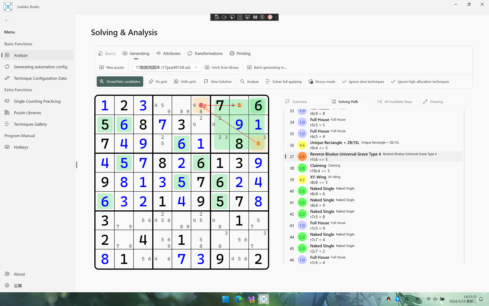
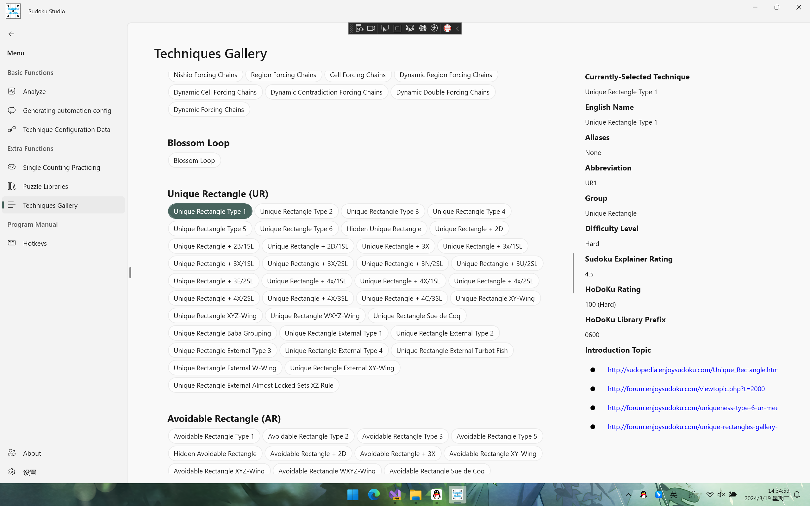

语言切换：<a href="README-zh-cn.md">简体中文</a>

# Sudoku Studio[^1]

## Introduction

A sudoku handling SDK using brute forces and logical techniques. Now this solution supports generating puzzles, solving puzzles (with logical & illogical techniques) and some attribute checking (for example, to determine whether the specified grid is a minimal puzzle, which will become multiple solutions when any a digit is missing).

### Sample

Here I give you [a sample](https://sunnieshine.github.io/Sudoku/usages/en/solve-by-manual) to demonstrate how to solve a puzzle using manual sudoku techniques.

### Extra description

In the future, I'd like to apply this solution to **almost every platform**. I may finish the Win10/11 app project, android app project, bot on common on-line platforms (QQ, Bilibili and so on).

Please note that the programming language version is always used as 'preview', which means some preview features are still used in this solution.

You can also use JetBrains Rider as your IDE. Use whatever you want to use, even Notepad :D Although C# contains some syntaxes that are only allowed in Visual Studio (e.g. keyword `__makeref`), this repo doesn't use them. Therefore, you can use other IDEs to develop the code in this repo liberally.

In addition, the framework and IDE version may update in the future; in other words, they aren't changeless. The information is **for reference only**.

### Repository Positioning

This repository is created for the following users:

* **who likes sudoku algorithms**: If you like to study for sudoku techniques and its backing implementation and running mechanism, you can find answer in this repository.
* **who wants to learn about C#-related features**: This repository uses some C# newer features and .NET-related features such as Windows UI, which can help you learn more about it as practicing.
* **myself**: The codes are very important for me to learn sudoku and algorithms.

## Prefaces

### Main Page

### Technique Gallery Page

## Technique Supports

This solution supports many kinds of human-friendly techniques. Here I will list them.

* Singles
  * Naked Single, Full House
  * Hidden Single, Last Digit
* Complex Singles
  * Direct Intersection
  * Direct Subset
* Candidate-Related Techniques
  * Locked Candidates Family
    * LC (Locked Candidates)
    * LoL (Law of Leftover)
    * ALC (Almost Locked Candidates)
    * Firework Subsets (Hanabi)
  * Subsets
    * Naked Subsets
      * Locked Subsets
      * Semi-Locked Subsets
      * Normal Naked Subsets
    * Hidden Subsets
      * Locked Hidden Subsets
      * Normal Hidden Subsets
  * Fishes (including finned types)
    * Normal Fishes
    * Complex Fishes (Franken, Mutant)
  * Single-Digit Structures
    * Two-Strong-Links (Non-grouped, Grouped)
    * Empty Rectangle
  * Wings
    * Regular Wing (XY-Wing, XYZ-Wing, etc.)
    * Irregular Wing[^2]
      * W-Wing (Non-grouped, Grouped, Multi-Branch)
      * M-Wing (Non-grouped, Grouped)
      * S-Wing (Non-grouped, Grouped)
      * H-Wing (Non-grouped, Grouped)
      * L-Wing (Non-grouped, Grouped)
    * XYZ-Loops (Non-nice, Nice)
  * Uniqueness
    * UR (Unique Rectangle)
    * UL (Unique Loop)
    * XR (Extended Rectangle, fit & fat types)
    * Borescoper's Deadly Pattern
    * Qiu's Deadly Pattern
    * Unique Matrix
    * BUG (Bivalue Universal Grave)
    * Reverse BUG (Reverse Bivalue Universal Grave)
    * Uniqueness Clue Cover (2-Digit)
  * Chains
    * Forcing Chains / Bidirectional Cycles
    * Multiple Forcing Chains
    * Dynamic Forcing Chains
    * Blossom Loop
  * Almost Locked Sets
    * Chaining ALSes (Including ALS-XZ, ALS-XY-Wing, ALS-W-Wing)
    * Extended Subset Principle
    * Empty Rectangle Intersection Pair
    * Death Blossom
      * Cell Blooming
      * House Blooming
      * Unique/Avoidable Rectangle Blooming
      * $\text{A}^n\text{LS}$ Blooming
  * Rank Logic
    * 0 Ranks
      * SDC (Sue de Coq, Including basic type, isolated digit type and cannibalistic type)
      * 3D SDC (3-Dimensional Sue de Coq)
      * DL (Domino Loop)
      * MSLS (Multi-Sector Locked Sets)
    * Negative Ranks
      * Guardian
      * Bi-value Oddagon
      * Chromatic Pattern (i.e. Tri-value Oddagon)
  * Exocets
    * JE (Junior Exocet)
    * SE (Senior Exocet)
    * Double JE (Double Junior Exocet)
    * WE (Weak Excocet)
    * Complex Exocet
      * Complex JE (Complex Junior Exocet)
      * Complex SE (Complex Senior Exocet)
  * Symmetrical Placements
    * GSP (Gurth's Symmetrical Placements, Normal & Anti Type)
  * Permutations
    * Aligned Exclusion
  * Last Resorts
    * Bowman's Bingo
    * Computer Algorithms
      * Pattern Overlay
      * Templating
      * Brute Force

Some other techniques will be implemented later, such as baba grouping and chains. Today I use algorithm from Sudoku Explainer to implement, because I'm not good at writing chaining algorithms by myself.

## Forks & PRs (Pull Requests) for This Repo

Of course you can fork my repo and do whatever you want. You can do whatever you want to do under the [MIT license](https://github.com/SunnieShine/Sudoku/blob/main/LICENSE). However, due to the copy of the GitHub repo, Gitee repo doesn't support any PRs. I'm sorry. But you can create the issue on both two platforms. Please visit the following part "Basic Information" for learning about more details.

In addition, this repo may update **frequently** (At least 1 commit in a day).

## Open source license

### Codes

The codes in this repository uses **MIT license**, which means you should mention the copyright of the author of the repository if you want to use code snippet in this repository.

### Special project: `Sudoku.Recognition`

This project uses some APIs and source code from repo [EmguCV](https://github.com/emgucv/emgucv). Therefore, the project uses a standalone open-source license. For more information please visit the file `LICENSE` in that project in source code.

### Document project: `SudokuTutorial`

This project use **CC-BY-4.0 license** to constraint your usage and copyright statements on this repository. You should mention the copyright of the author in this repository and give the state changes after modified the content in the copied one if you want to use the Wiki pages.

### Wiki pages

The repository also lists many wiki pages, being stored in the folder `docs`. In addition, files `README.md` and `README-zh-cn.md` (as Chinese translation version) are also included as wiki pages. Those pages uses **CC-BY-4.0 license** to constraint your usage and copyright statements on this repository. You should mention the copyright of the author in this repository and give the state changes after modified the content in the copied one if you want to use the Wiki pages.

## Code of Conduct

Please see file [CODE_OF_CONDUCT](CODE_OF_CONDUCT).

## Sudoku Technique References

Here we list some websites about sudoku techniques that I used and referenced. The contents are constructed by myself, so if you want to learn more about sudoku techniques that this solution used and implemented, you can visit the following links[^4] to learn about more information.

* [标准数独技巧教程 (Video)_bilibili](https://www.bilibili.com/video/BV1Mx411z7uq)
* [标准数独技巧教程 (Text)](https://t.sudoku-studio.wiki)

## Author

Sunnie, from Chengdu, SiChuan, China. I'm not a developer, but I like it!

Please visit file [CONTACTS](CONTACTS) to contact me if you want.

[^1]: The old name of the repository is "Sunnie's Sudoku Solution".

[^2]: W-Wing is implemented by a single technique searcher type, while other irregular wing types are implemented by AIC searchers.

[^3]: Because only type 2 contains a valid test example.

[^4]: I'm sorry that those pages are only written in Chinese. However, I may create pages written in other languages in the future.
