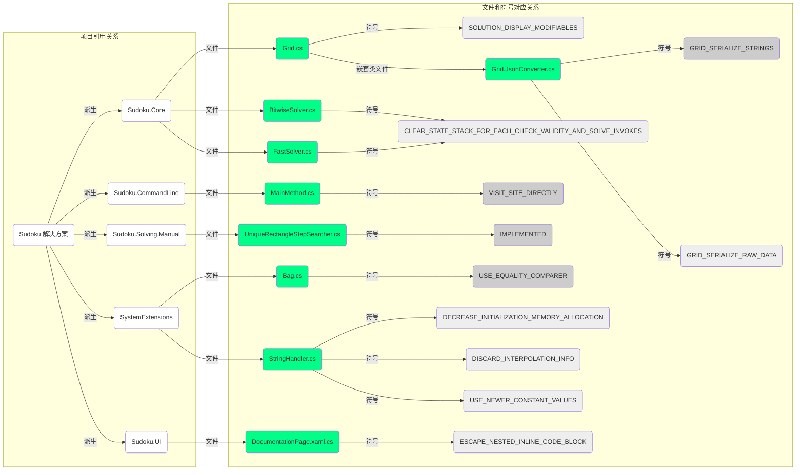

# 条件编译符号

这里列举一些整个解决方案里使用到的单文件和项目为单位的条件编译符号。

## 单文件的条件编译符号

| 符号名[^1]                                                   | 含义                                                         |
| :----------------------------------------------------------- | :----------------------------------------------------------- |
| `IMPLEMENTED`                                                | 表示唯一矩形技巧搜索器是否实现当前技巧的子类型的搜寻功能。   |
| `DECREASE_INITIALIZATION_MEMORY_ALLOCATION`                  | 表示 `StringHandler` 字符串拼接器对象是否在初始化的时候减少内存分配。[^2] |
| `DISCARD_INTERPOLATION_INFO`                                 | 表示 `StringHandler` 字符串拼接器对象是否在初始化的时候，忽略掉基本初始化信息（比如字符串内插元素数量以及总长度）。 |
| `USE_NEWER_CONSTANT_VALUES`                                  | 表示 `StringHandler` 字符串拼接器对象假设内插字符串只有 8 个内插部分（如果不设置此符号的话，则是 11）。 |
| `CLEAR_STATE_STACK_FOR_EACH_CHECK_VALIDITY_AND_SOLVE_INVOKES` | 表示是否在每一次解题和验证题目之前都刷新一下底层字段的内存空间，以获得最佳效果。如果没有这一步，程序可以运行并且仍然会表现得很好，不过时而也会导致一些 bug，比如问题 [#229](https://github.com/SunnieShine/Sudoku/issues/229)。 |
| `SOLUTION_DISPLAY_MODIFIABLES`                               | 表示是否显示出终盘里自己填入的数据信息。如果没有该符号的话，所有数字都会被当作提示数显示。 |
| `GRID_SERIALIZE_STRINGS`                                     | 表示序列化数独盘面信息是按照字符串输出的格式进行序列化的方式。 |
| `GRID_SERIALIZE_RAW_DATA`                                    | 表示序列化数独盘面信息是按照底层的原始掩码表进行序列化的方式。 |
| `USE_EQUALITY_COMPARER`                                      | 表示是否使用 `EqualityComparer<T>` 类型来给对象进行比较运算操作。 |
| `VISIT_SITE_DIRECTLY`                                        | 表示是否直接弹出浏览器显示指定的链接。如果不设置该符号的话，那么就只会输出网址信息到控制台。 |
| `ESCAPE_NESTED_INLINE_CODE_BLOCK`                            | 目前渲染 Markdown 代码的控件由于自身的 bug 导致无法正确渲染嵌入图片代码 `[]()` 的 `[]` 部分里的内联代码块 ```` ``。 |

完整的符号引用树状图如下：



如图所示，深灰色的条件编译符号没有，而浅灰色的条件编译符号有。绿色为文件名，白色的则是项目名。

## 项目的条件编译符号

| 符号名  | 默认值 | 含义                                                         |
| ------- | ------ | ------------------------------------------------------------ |
| `DEBUG` | 有     | 表示当前项目是否出于调试期间。只有调试期间才会使用这个符号。 |
| `TRACE` | 无     | 表示当前项目的一些追踪信息操作。注意，当前解决方案尚未使用此符号，但是它客观存在。 |
| `true`  |        | 表示无条件编译此段代码。                                     |
| `false` |        | 表示无条件忽略此段代码。                                     |

## UI 特性专用符号

部分符号只用于测试新功能，作为增量内容呈现出来。这些符号只在 UI 窗体项目（以及引用的 UI 类库项目）里才会使用和启用。这部分的条件编译符号一般都带有“AUTHOR_FEATURE_”的前缀，意味着这些部分的内容都是作者保留的功能和特性。

| 符号                             | 默认值 | 含义                                         |
| -------------------------------- | ------ | -------------------------------------------- |
| `AUTHOR_FEATURE_CELL_MARKS`      | 有     | 表示数独盘面是否支持用户往单元格上添加图形。 |
| `AUTHOR_FEATURE_CANDIDATE_MARKS` | 有     | 表示数独盘面是否支持用户往候选数上添加图形。 |

## 其它符号

这些符号是 .NET 库文件和官方库 API 提供和预带的条件编译符号，它们多用于区分项目所使用的库 API 的版本。它们多以“NET”开头。

| 符号名                      | 使用范围               | 含义                                                      |
| --------------------------- | ---------------------- | --------------------------------------------------------- |
| `NETSTANDARD2_1_OR_GREATER` | 源代码生成器的生成代码 | 表示当前 .NET 框架是否为 .NET Standard 2.1 以及以上版本。 |
| `NET5_0_OR_GREATER`         | 源代码生成器的生成代码 | 表示当前 .NET 框架是否为 .NET 5 以及以上版本。            |
| `NET7_0_OR_GREATER`         | 源代码生成器的生成代码 | 表示当前 .NET 框架是否为 .NET 7 以及以上版本。            |
| `NETCOREAPP3_0`             | 源代码生成器的生成代码 | 表示当前 .NET 框架是否为 .NET Core 3.0 版本。             |
| `NETCOREAPP3_1`             | 源代码生成器的生成代码 | 表示当前 .NET 框架是否为 .NET Core 3.1 版本。             |

[^1]: “符号名”表示该条件编译符号在代码里使用的标识符名称。
[^2]: 在代码实现里，`StringHandler` 为了减少内存分配以提升性能，这里故意提供了这个符号处理。如果配置了该符号，那么在初始化的时候，直接将计算得到的结果作为内存分配的大小；否则会按照“按 2 的次幂向上取整”的约定将计算得到的结果进行处理，然后将处理后的结果作为分配大小。

