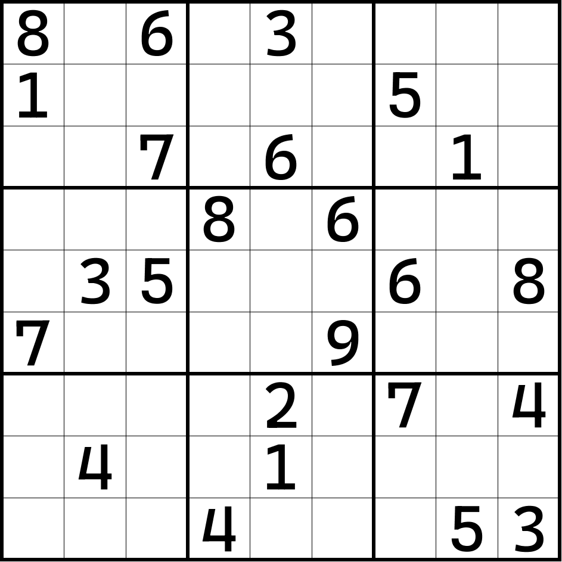
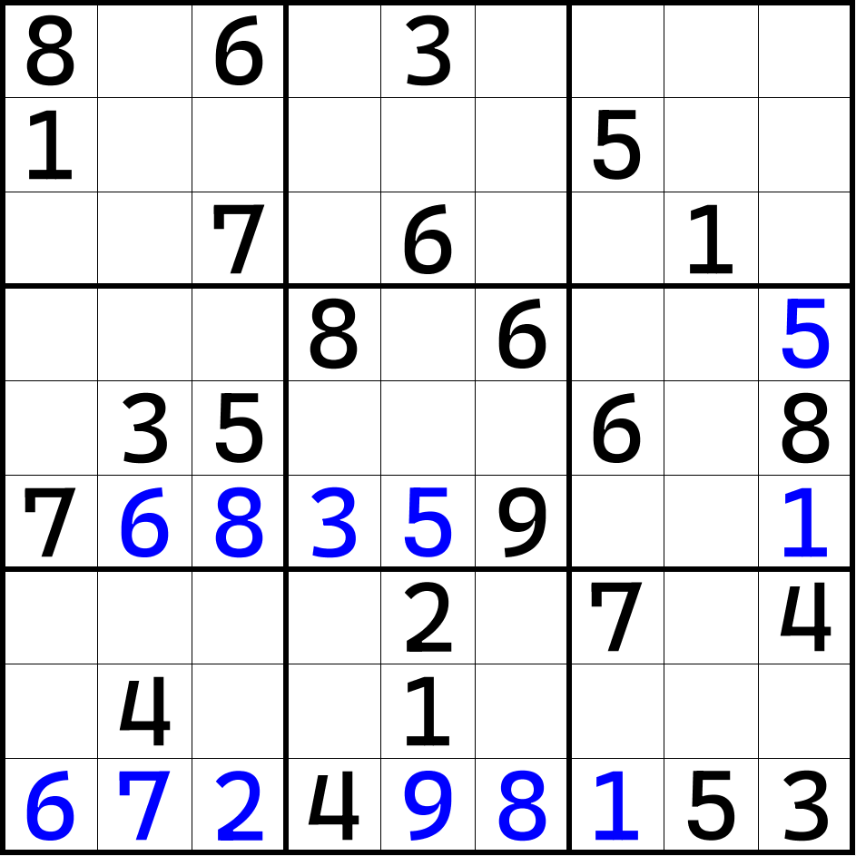
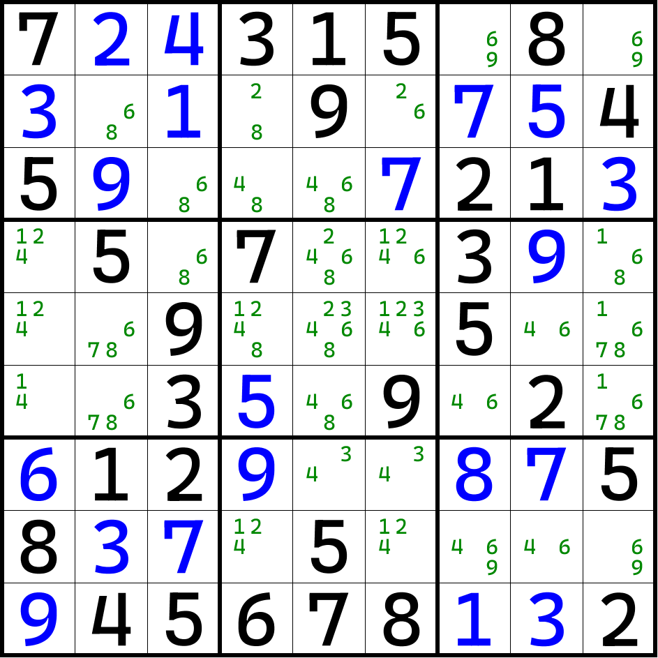

# `Grid` 数据结构支持的字符串可解析格式

本文解释和列举一下 [`Grid` 结构](grid)可用于显示的字符串格式。

## 总体介绍

`Grid` 数据类型拥有众多的格式化字符串，用来处理和呈现字符串形式的数独盘面的信息。

格式化字符串支持部分的排列组合，单位字符分别是：

* 小数点 `"."`：只显示提示数和空格信息，其中空格会被显示为小数点字符 `'.'`，而自行填入的数据会被视为空格显示为小数点字符 `'.'`；
* 加号 `"+"`：表示展示出自行填入的数字信息。自行填入的数字信息会在数字前面追加加号字符 `'+'` 来区分它和普通的提示数信息。比如 `"+3"` 会被视为自行填入的 3，而不是提示数 3；提示数 3 则必须去掉加号字符，即 `"3"`；
* 零 `"0"`：和 `"."` 类似，只不过小数点字符用的是零字符 `'0'` 作为替换；
* 冒号 `":"`：表示展示出当前盘面里被额外删掉的候选数的序列信息。如果带有这个格式化字符串，那么结果里会在盘面的字符串信息之后紧跟上一个冒号字符 `':'`，然后使用一组若干个三位数构成的数字序列，表示删去的数字序列。比如 `:123 234`，表示基于这个盘面下，第 2 行第 3 列的 1，以及第 3 行第 4 列的 2 也被去掉了；
* 感叹号 `"!"`：表示将自行填入的数据按照提示数展示，即省去里面的加号字符 `'+'`；
* 星号 `"*"`：表示将前文得到的字符串表达规则进一步简化，省去连续的若干零字符 `'0'` 或小数点字符 `'.'` 以缩短字符串长度；
* 艾特符号 `"@"`：表示将整个盘面按照多行的表达形式、包含候选数状态的完整信息呈现出来；
* 波浪号 `"~"`：表示将盘面按照 [Sukaku](https://sudocue.net/sukaku.php)（候选数数独）的字符串表示规则进行表达；
* 百分号 `"%"`：表示将盘面按照 Excel 能够读取的字符串格式（`*.csv` 格式）进行表达；
* 脱字号 `"^"`：表示将盘面按照 Open Sudoku 软件能够读取的字符串格式（`*.opensudoku` 格式）进行表达。

这些符号部分可以排列组合。下面我们来挨个说一说。

## 各个符号的意思

### 小数点 `'.'`

如果将小数点符号作为格式化字符串的话，它表示的是将一个数独盘面的所有提示数都呈现出来，显示为 1 到 9；而空格则会使用小数点来表示。比如说：



这样的盘面的话，我们将从 r1c1 开始，从左到右从上到下列举所有单元格的填数信息。

```csharp
string str = grid.ToString(".");
//8.6.3....1.....5....7.6..1....8.6....35...6.87....9.......2.7.4.4..1.......4...53
```

注意，这种格式并不会识别自己填入的数值。如果是填入数的话，因为它并不是提示数，所以该格式下仍然会被视为空格。

### 加号 `'+'`

为了解决小数点格式化字符串无法识别填入数的问题，加号格式化字符串就诞生了。加号 `'+'` 作为格式化字符串，表示将填入数也显示出来。其中，填入的数字是多少，就会显示多少。但是为了区分它和提示数，它的左边会带有一个默认的加号。这也就是为什么该格式化字符串用加号作为记号的原因。



比如这个题目的话，会得到这样的结果：

```csharp
string str = grid.ToString("+");
//8.6.3....1.....5....7.6..1....8.6..+5.35...6.87+6+8+3+59..+1....2.7.4.4..1....+6+7+24+9+8+153
```

### 零 `'0'`

小数点字符用来占位表示空格是一种比较普通的操作，但是也有些时候，为了兼容和支持一些别的 API，小数点需要被处理为数字 0。换句话说，有些程序功能会用数字 0 来表示空格。于是这个格式化字符就表示，我显示的时候，用 0 字符来表示空格，而不是小数点。

该字符作为小数点的替代品，因此它支持和加号复合使用。默认情况下，单纯的加号导出会按照小数点视为空格的格式，因此 `".+"`、`"+."` 和 `"+"` 是一样的操作；而如果必须强制要求使用 0 表示空格的话，可以手动追加 0 到加号上去，拼凑为整个格式化字符串。比如 `"0+"` 或者 `"+0"` 就表示显示的时候用 0 来表示空格。

还是刚才上面那道题，此时我使用这样的格式化字符串就会得到不一样的结果：

```csharp
string str = grid.ToString("+0");
//80603000010000050000706001000080600+50350006087+6+8+3+5900+1000020704040010000+6+7+24+9+8+153
```

不过要注意的是，小数点和零字符不能混合使用，毕竟都是做显示空格的工作。

### 冒号 `':'`

在有些时候，题目可能会比较难，可能会呈现出候选数删数的迹象。而前面的格式化字符串并不能保存候选数为单位的删数信息，因此这个格式化字符串就有了。

这个格式化字符串表示，我在呈现盘面的时候，将当前盘面本应该有但已经没有了的候选数也呈现出来。举个例子。



如图所示，如果题目按照基本的填数规则进行填数的话，所有的候选数全部完全呈现出来是长图上这样的。不过，我们可以通过基本的区块和数对技巧删除一些不需要的候选数，比如第 8 个宫的 3、4 显性数对等。于是我们可以排除一些候选数情况。


得到的这个盘面候选数会有所缺少。基于前面给出的盘面我们可以得到一些删数，而在呈现结果的时候，会将这些数值全部显示出来。与此同时，盘面前面给出的那些数字和这些删数中间会有一个冒号分开。

```csharp
string str = grid.ToString("0+:");
//7+2+4315080+30+1090+7+545+9000+721+30507003+90009000500003+509020+612+900+8+758+3+7050000+945678+1+32:246 649 254 256 659 669 484 486
```

从冒号开始，后面是三个数字一组的序列，以空格分隔。三个数字的后面两个数字表示删数的所在行和列，而第一个数字则表示的是这个格子的什么数字被删掉了。比如这个例子里从冒号开始第一个序列是 246，这表示 r4c6 的 2 被删除。

和前面的 `+` 一样，它也可以配套别的格式化字符组合在一起使用。比如这个例子里用到的格式化字符串是 `"0+:"`，暗示了三层意思：

1. 空格用零字符 `'0'` 表示；
2. 区分提示数和填入数；
3. 显示当前盘面里已经去掉的候选数。

### 感叹号 `'!'`

如果不想区分提示数和填入数，而且要显示出填入数的话，可以使用感叹号。感叹号表示将填入数也视为提示数显示。


```csharp
string str = grid.ToString(".!");
//724315.8.3.1.9.75459...7213.5.7..39...9...5....35.9.2.6129..875837.5....945678132
```

但请注意。因为它会无视提示数和填入数的区分，因此该符号不能和加号一起使用。

### 星号 `'*'`

星号表示在前文的字符串基础上进一步进行简化。将连续的空格收缩为一个星号，而收缩的机制按行作为分隔。换句话说，盘面被分割为 9 行，而每一行里最长连续的空格序列会被收缩为一个星号。

### 井号 `'#'`

井号和 `".+:"` 是完全一样的格式化字符串，作为新人使用的话，如果觉得不好记，可以使用此符号来表达和 `".+:"` 等价的效果。如果你要改成零字符的话，可以组合上零字符，比如 `"#0"` 或者 `"0#"`，不区分先后顺序。

### 艾特符号 `'@'`

艾特符号表示不再显示为单行的字符串，而是多行的字符串，这样的字符串构造信息更贴近于盘面真正的长相。它也可以组合感叹号，组合之后显示的数据不论是提示数还是填入数都视为提示数。


```csharp
string str = grid.ToString("@!");
/*
.------------------.-------------------.----------------------.
| 8      259   6   | 12579  3    12457 | 249    2479     279  |
| 1      29    349 | 279    478  247   | 5      2346789  2679 |
| 23459  259   7   | 259    6    245   | 23489  1        29   |
:------------------+-------------------+----------------------:
| 249    129   149 | 8      47   6     | 2349   23479    5    |
| 249    3     5   | 127    47   1247  | 6      2479     8    |
| 7      6     8   | 3      5    9     | 24     24       1    |
:------------------+-------------------+----------------------:
| 359    1589  139 | 56     2    35    | 7      689      4    |
| 359    4     39  | 567    1    357   | 289    2689     269  |
| 6      7     2   | 4      9    8     | 1      5        3    |
'------------------'-------------------'----------------------'
*/
```

### 波浪符号 `'~'`

波浪号表示将盘面按照 Sukaku 游戏兼容的格式显示盘面。Sukaku 字符串要求全盘的所有数字都视为候选数，所有格子都记作 123456789，如果有数字缺失，则将当前位置上的这个数字置为零。

### 百分号 `'%'`

百分号表示显示盘面按照 Excel 可以兼容的读取的格式进行字符串呈现。

### 脱字号 `'^'`

脱字号表示显示盘面按照 Open Sudoku 可以兼容的读取格式进行字符串呈现。
