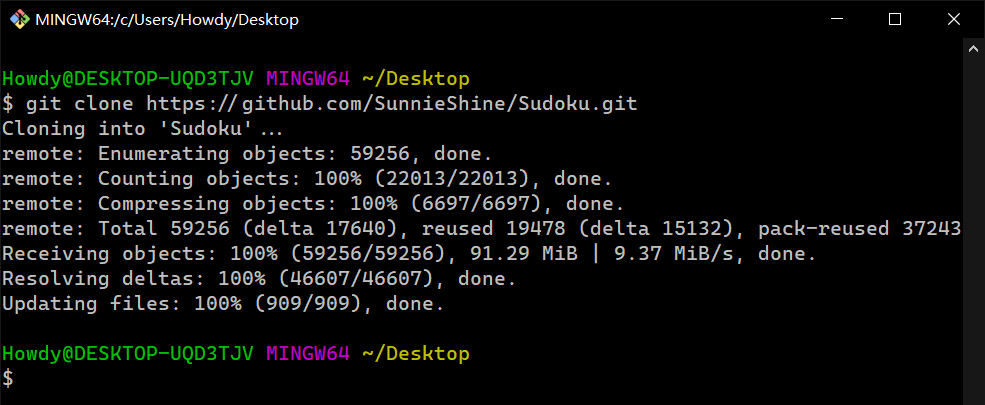
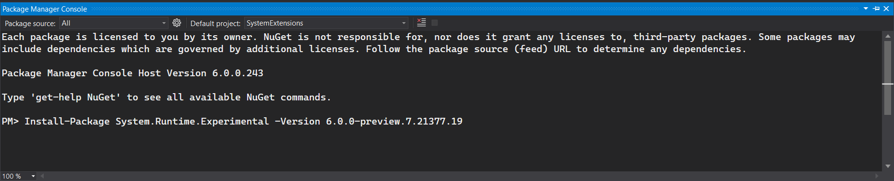
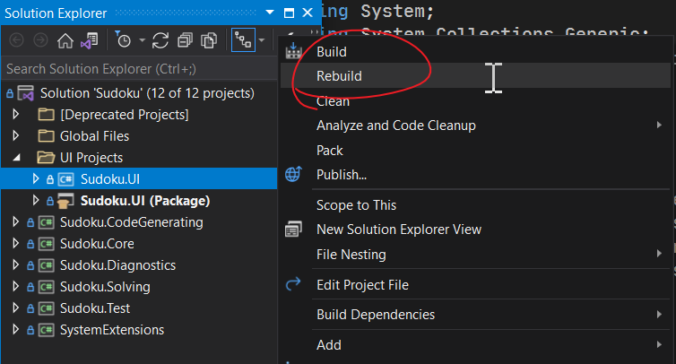
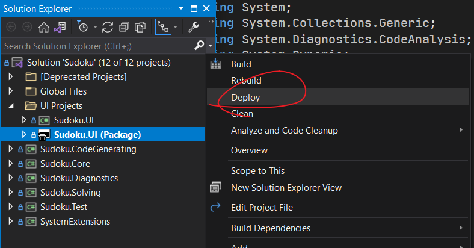
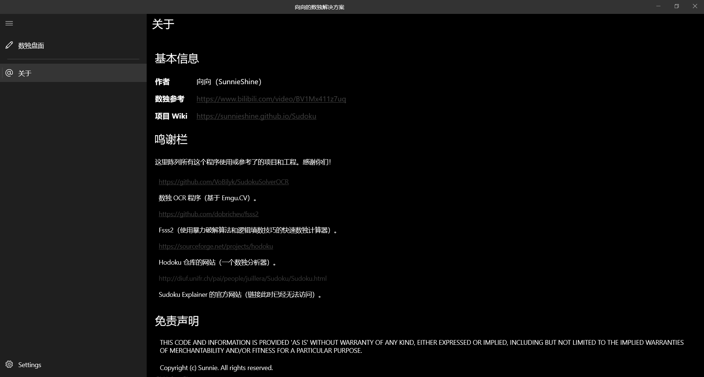

# **如何编译代码 (How to compile the solution)**
## Step 1: Clone the repo

第一步：克隆本代码库

Please open a terminal, and input the bash code:

请打开一个终端，然后输入如下的 Bash 代码：

```bash
git clone https://github.com/Sunnie-Shine/Sudoku.git
```

Then you just wait for the downloading finish.

然后你就等着下载完成吧。




## Step 2: Open the file `Sudoku.sln` with Visual Studio 2022

第二步：用 Visual Studio 2022 打开 `Sudoku.sln` 文件

Please note that, the file `Sudoku.sln` is located in the root path, you don't need to find it in sub-folders. In addition, only VS2022 can open it.

请注意，文件 `Sudoku.sln` 就在根目录下，你不需要进入任何子文件夹里去找。另外，只有 VS2022 可以打开。

Then we step through the branch to compile the solution. There are two projects you can compile and run:

接着我们需要编译解决方案。目前这个解决方案包含两个不同的项目可以参与编译：

* `Sudoku.Windows.Old` (Old project)
* `Sudoku.UI` (New project but under construction)

第一个是 `Sudoku.Windows.Old` 项目，这个是老版本的项目。

第二个是 `Sudoku.UI` 项目，这个是新项目，但还在写代码完成实现中。

## Step 3: Install `System.Runtime.Experimental` package

第三步：安装 `System.Runtime.Experimental` 包

Download the package `System.Runtime.Experimental 6.0.0-preview.7.21377.19`. The website link is [here](https://www.nuget.org/packages/System.Runtime.Experimental).

下载名为 `System.Runtime.Experimental 6.0.0-preview.7.21377.19` 的包。网站在[这里](https://www.nuget.org/packages/System.Runtime.Experimental)

The site provides you with the package manager console code. Just copy the code and then paste onto the package manager console:

这个网站提供了包管理控制台的代码。你只需要复制这段代码，然后粘贴到你的包管理控制台里就可以：

```bash
Install-Package System.Runtime.Experimental -Version 6.0.0-preview.7.21377.19
```

Then wait for downloading.

然后，等着它下载就可以了。

Please note that you must install the package to the project `SystemExtensions`, because this project relies on this package.



Here 'Default project' we should select the value `SystemExtensions`.

这里“默认项目”选择 `SystemExtensions`。

> Now you will skip the following 2 steps and skip to the step 4 to continue if you want to compile the project `Sudoku.UI` instead of `Sudoku.Windows.Old`.
>
> 如果你编译的是 `Sudoku.UI` 而不是 `Sudoku.Windows.Old` 项目的话，你可以跳过如下的两个步骤，直接看第四步。

## Extra Step 1 (If you want to compile `Sudoku.Windows.Old`): Copy files

额外步骤一（如果你要编译 `Sudoku.Windows.Old` 项目的话）：拷贝文件

This step is important for the compilation of project `Sudoku.Windows.Old`. You should copy folders `lang` into debug folders in the project `Sudoku.Core` and `Sudoku.Windows.Old`, and copy `tessdata` into the debug folder of the project `Sudoku.Windows.Old`. Those two folders are both in `required` folder.

这一步对于编译 `Sudoku.Windows.Old` 来说非常重要。你需要拷贝 `lang` 文件夹到 `Sudoku.Core` 和 `Sudoku.Windows.Old` 两个项目的调试文件夹里，然后把 `tessdata` 文件夹拷贝到 `Sudoku.Windows.Old` 项目的调试文件夹里。这两个文件夹都在 `required` 文件夹下。


## Extra Step 2: Remove compilation symbol `WINDOWS_APP`

额外步骤二：删除 `WINDOWS_APP` 条件编译符号

Due to being developing the solution, `Sudoku.UI` relies on the `WINDOWS_APP` compilation symbol. However, if you want to compile the old program, you should remove the symbol in the project configuration file of projects `Sudoku.Core` and `SystemExtensions`.

因为我正在开发这个项目，因此它依赖于 `WINDOWS_APP` 条件编译符号。但是如果你要启用和编译老版本的项目的话，你需要删除 `Sudoku.Core` 和 `SystemExtensions` 这两个项目配置文件里配置的 `WINDOWS_APP` 条件编译符号。

In project `SystemExtensions`:

`SystemExtensions` 项目：

```diff
 <PropertyGroup Condition="'$(Configuration)|$(Platform)'=='Debug|AnyCPU'">
-    <DefineConstants>DEBUG; SOLUTION_WIDE_CODE_ANALYSIS; WINDOWS_APP</DefineConstants>
+    <DefineConstants>DEBUG; SOLUTION_WIDE_CODE_ANALYSIS</DefineConstants>
 </PropertyGroup>

 <PropertyGroup Condition="'$(Configuration)|$(Platform)'=='Release|AnyCPU'">
-    <DefineConstants>SOLUTION_WIDE_CODE_ANALYSIS; WINDOWS_APP</DefineConstants>
+    <DefineConstants>SOLUTION_WIDE_CODE_ANALYSIS</DefineConstants>
 </PropertyGroup>
```

In project `Sudoku.Core`:

`Sudoku.Core` 项目：

```diff
 <PropertyGroup Condition="'$(Configuration)|$(Platform)'=='Debug|AnyCPU'">
-    <DefineConstants>DEBUG; AUTHOR_RESERVED; SOLUTION_WIDE_CODE_ANALYSIS; WINDOWS_APP</DefineConstants>
+    <DefineConstants>DEBUG; AUTHOR_RESERVED; SOLUTION_WIDE_CODE_ANALYSIS</DefineConstants>
     <NoWarn>1701;1702</NoWarn>
 </PropertyGroup>

 <PropertyGroup Condition="'$(Configuration)|$(Platform)'=='Release|AnyCPU'">
-    <DefineConstants>AUTHOR_RESERVED; SOLUTION_WIDE_CODE_ANALYSIS; WINDOWS_APP</DefineConstants>
+    <DefineConstants>AUTHOR_RESERVED; SOLUTION_WIDE_CODE_ANALYSIS</DefineConstants>
 </PropertyGroup>
```

Then we finish the current step.

这样删除掉就可以了。

## Step 4-1: Debug and run the project `Sudoku.UI`

步骤 4-1：调试运行项目 `Sudoku.UI`

The last step is to debug and run. Just click the build or re-build button to compile the solution.

最后一个步骤就是编译和运行了。点击编译或重新编译按钮来编译项目。



Then choose `Sudoku.UI (Package)` to deploy the project to your local machine.

然后编译完成后选择 `Sudoku.UI (Package)` 项目，然后右键选择“部署”（Deploy）来部署项目到你的电脑上。



Then you'll get the final solution (Picture displaying is in Chinese):

最后就可以享受程序了（展示图片为中文）。



## Step 4-2: Debug and run the project `Sudoku.Windows.Old`

步骤 4-2：调试运行项目 `Sudoku.Windows.Old`

If you compile `Sudoku.Windows.Old`, the last step will be to debug and run. Just click the compile button or select `Debug > Start Debugging` to debug. Make sure you have selected `Sudoku.Windows.Old` as the start project.

如果你要编译 `Sudoku.Windows.Old` 项目的话，最后一个步骤是调试运行。请点击编译按钮，或者选择 `调试 > 开始调试` 来调试程序。请确保你已经把 `Sudoku.Windows.Old` 作为启动项目。


Okay. Now you can enjoy the program!

行了，现在你可以用这个程序了！

English version:

英文版：


Simplified Chinese version:

简体中文版：


