# QQ 机器人部署

本文为各位呈现项目里包含的 QQ 机器人部署和使用方式。

> 请注意。目前 QQ 机器人的官方设计平台还处于预览阶段，比较不稳定，因此并未对所有用户都开放使用机器人功能。有些功能可能在未来有巨大改变，因此本文可能会动态更新。请各位注意和留意本文的内容，如果你对机器人项目比较感兴趣的话。
>
> 这个机器人项目已经被删除，原因是我最近没有时间管理和维护这个项目，而且确实项目里并未添加特别多的东西，因此决定暂时先移除。但是这不代表 QQ 机器人项目以后不会回归；不过这篇文章我不打算删除；而我又添加了新的机器人项目，但由于使用的是别的框架，因此和本文介绍的内容**没有任何关系**。该文件是之前使用的框架的配置介绍文章，但因为后续该项目可能会回归，所以该介绍文章未被删除。

## 第一步：打开“频道”入口

第一步是需要用户打开频道的入口。频道（QQ 官方简称为 GUILD），是 QQ 的应用里和“联系人”、“消息”以及“动态”等功能完全平行的一个单独选项卡页面。它长这样：

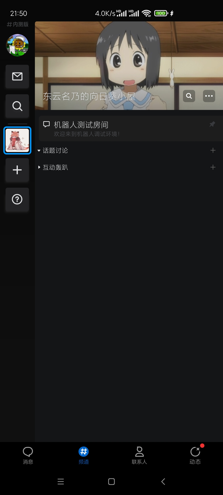

该功能带有类似贴吧的功能，也可以用于交流。本文需要用到该环境进行部署和测试，因此需要各位能够通过修改本地文件来打开该环境。本文介绍的内容因为是部署测试环境功能，因此类似贴吧等发帖的功能本文不作提及，毕竟跟本文的配置操作无关。

请打开各位手机 QQ（目前支持 QQ 不支持 TIM）的配置文件路径：

`/data/user/0/com.tencent.mobileqq/shared_prefs/TabDataHelper_Shared_Prefs.xml`

经测试，我的手机上是没有的。我的手机是小米的。如果你的路径上也没有类似的文件或文件夹的话，需要你通过电脑端，下载安装一个安卓模拟器（例如 Bluestack 等）。

安卓模拟器是等效的，因为我们需要是打开入口，为 QQ 提供 UI 的入口和使用功能，因此校验会和服务器进行操作，并不是你手机本地。我们找的本地是为了配置文件来打开第一步的入口，为了帮助和 QQ 服务器通信以能够开通此功能。

找到文件后，请打开此文件。文件里包含一些配置项，不过我们并不修改它们，而是去增加两行内容。

```xml
<map>
    <int name="KeyTabSwitch123456789_GUILD" value="2" />
    <int name="KeyTabLocalSwitch123456789_GUILD" value="2" />
</map>
```

我们在文件的 `map` 标签的末尾，追加 `int` 标签作为对应的信息。注意，本代码为参考，里面的“123456789”请自行替换为你的 QQ 号。注意，是你的 QQ 号码，而不是机器人的，也不是别的。

> 可能你使用过别的 QQ 机器人第三方的框架。那些机器人框架都依赖于一个真实的账号。QQ 官方机器人在架构设计上，QQ 机器人并不依赖于你自己的某个账号，而是单独有一个自己的账号。因此，这里我们需要接入的入口是你自己的 QQ 号码而不是别的什么东西。

在添加完毕后，保存并退出文件。确保你的 QQ 已经全部退出，包括后台。在确认完全退出后，重启 QQ，频道功能就有了。而隔一段时间，你的电脑端也会多出频道的选项页面。

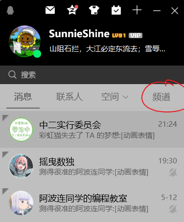

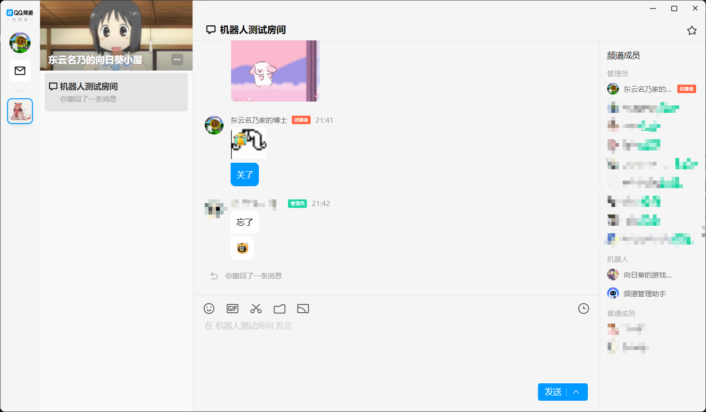

## 第二步：创建一个调试用的频道

在我们使用机器人之前，我们需要创建一个单独的频道，以便我们使用后续的功能。做法其实相当简单，请查看前面给出的手机 QQ 里的频道页面，左侧的菜单栏图标里有一个加号“+”样子的图标，这个就是创建频道的图标。我们需要自行创建一个。

创建过程就省略了，因为这个也不复杂，按照指导过程创建即可。

> 稍微要说一点的是，在创建期间，我们会看到选择模板的页面。这里我们需要使用的模板是“自定义”（图片就省略了，自己创建期间就肯定看得到）。别的模板也不是不行，但是因为是保留用的测试频道，因此别的功能我们都不需要。越是带有复杂功能的频道，对我们的帮助就越小。

## 第三步：注册机器人

在使用机器人的前提是能保证你有一个自己的机器人的关联权限。因此，你必须要注册一个单独的、适用于机器人的平台账号。注意说的是平台账号，也不是 QQ 机器人的账号。

请打开[此页面](https://q.qq.com/#/app/bot)，并选择右上角的“立即注册”。

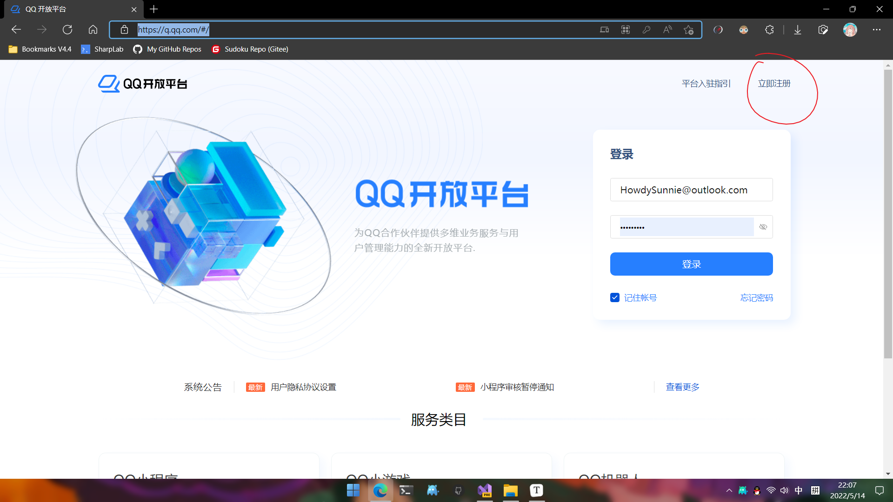

然后在页面里选择“个人”。

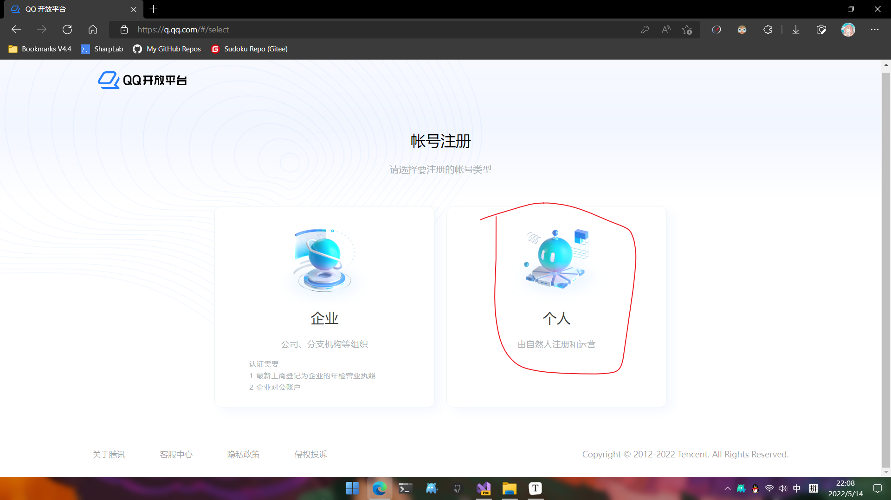

然后开始注册。页面如下。

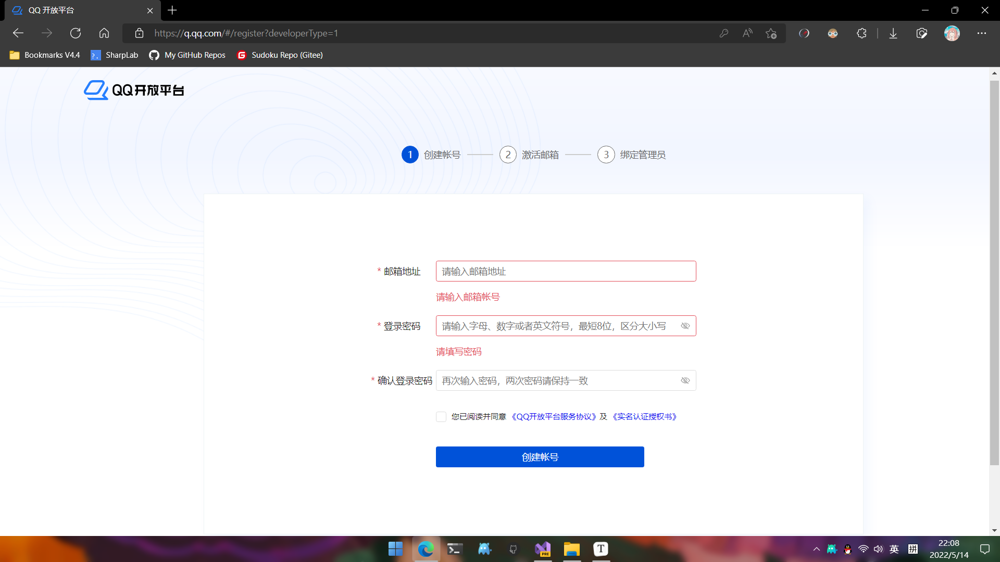

这里包含三个子步骤：创建账号、激活邮箱以及绑定管理员。这些内容应该可以自行操作，因此此处就省略了。

> 这里稍微说一下。邮箱地址就是你自己想要和该平台交互和收发邮件的邮箱。可以是 QQ 邮箱也可以不是；登陆密码和确认登陆密码要一致。

在完成创建之后，请重新打开前面我给出链接的主页面。

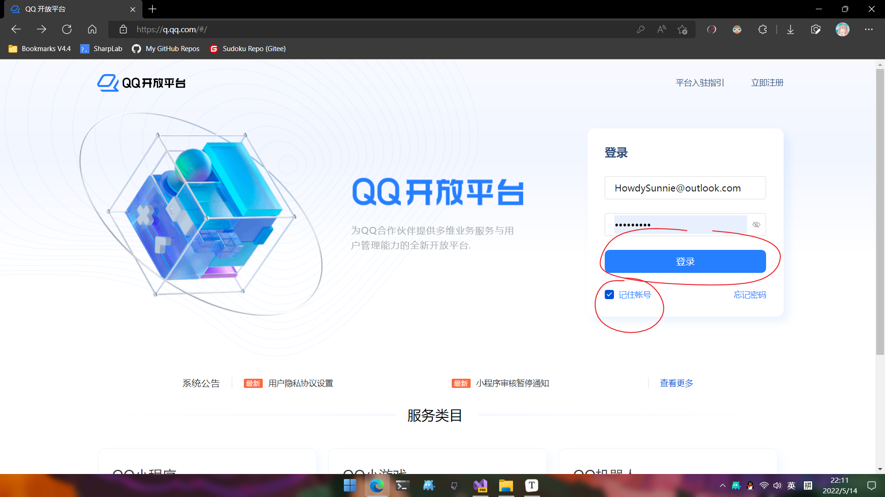

这里，我们试着登录此账号。注意选择记住密码然后登录。

期间会让你进行验证，例如拼图验证以及二维码验证，正确验证即可。

打开后，是一个空页面，因为我们还没创建任何的机器人。现在我们需要创建一个。选择右上角的“创建机器人”。


然后，开始填入创建的机器人的信息。

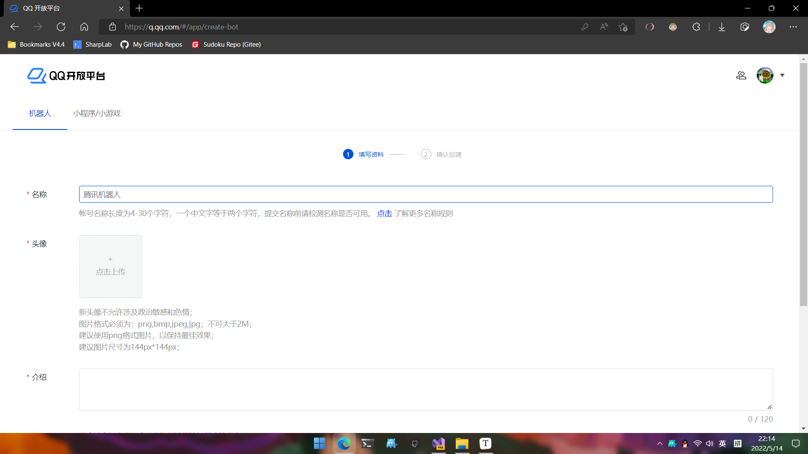

在创建过程的时候，我们会看到有两个不是很能理解的选项。

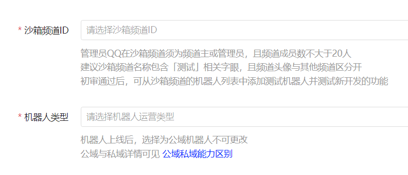

这里要稍微说一下这两个词语的定义。

* 沙箱频道：**沙箱**（Sandbox）是为了我们调试方便而创建的术语词。沙箱是机器人在调试改动代码期间使用的环境。单位是一个频道。所谓的频道，就是我们在第二步里创建出来的频道；
* 机器人类型：机器人为了使用权限，分为**公域**（Public Domain）机器人和**私域**（Private Domain）机器人。公域机器人和私域机器人的使用 QQ 提供的 API 的权限并不相同，而且权限大小不是包含关系。私域机器人可以提供更灵活的调试处理，所以调试选择私域机器人；公域机器人比较复杂，而且一旦选择之后，就无法修改了。

在填入数据后，会弹出确认界面。此时确认即可。

> 这里稍微说一下。在填入介绍文字信息的时候，有时会因为一些不知道的原因而无法进入确认页面。这个时候多数原因都是文字带有敏感词。请删去你觉得是敏感词语的部分（或修改掉）后重试。

在创建完成后，我们会得到一个机器人的页面。

此时，我们进入配置页面。而且，由于我们已经完成创建，此时的沙箱频道里会自动包含此机器人，所以就不需要我们手动去拉人之类的了。

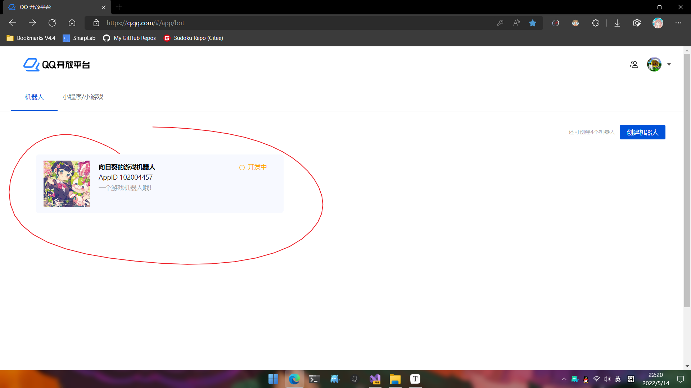

然后我们可以看到配置页面。

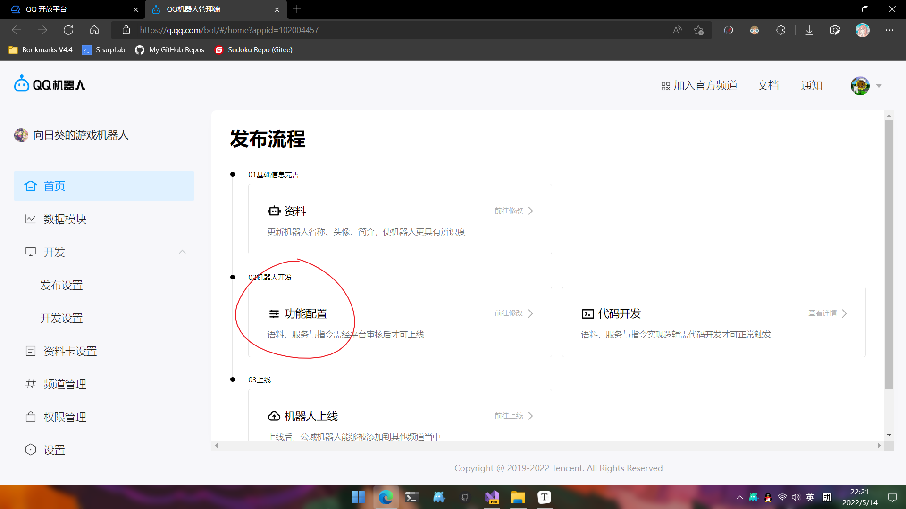

点击“功能配置”，我们可以看到“功能配置与提审”的页面。此时我们要选择第一个选项：配置。

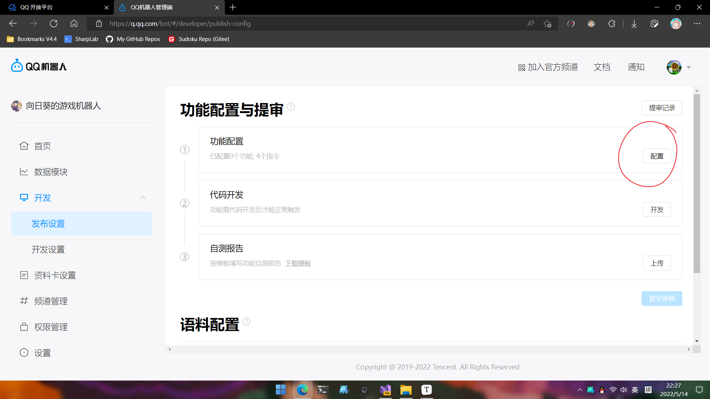

此时，我们选择“配置”后方可进入配置页面。

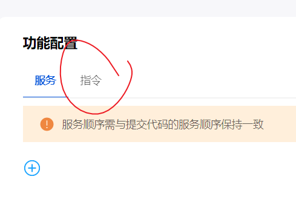

在弹出的页面里，选择“指令”。“服务”功能我们此时讲不到，因此不作展开。

进来之后，我们就可以为机器人添加指令了。

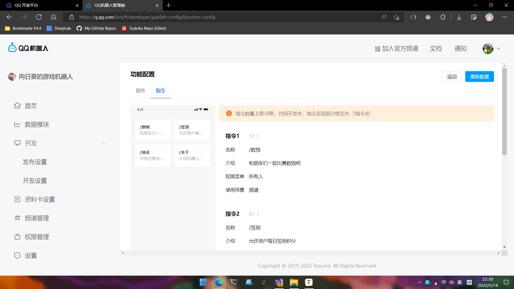

添加指令可以选择右上角的“添加”按钮；而修改指令，就选择“重新配置”按钮。

注意，重新配置会修改指令集里的指令，它会影响到我们的机器人。指令集里的指令，如果你选择了私域机器人的话，那么配置项目里的前缀符号就必须是斜杠 `/` 无法修改；公域机器人可以修改这一点。而且，在配置指令的时候，“名称”和“介绍”里只能写中文汉字。

配置完成后，返回到手机频道，我们就可以看到机器人的指令了：在我们创建的频道聊天室里，输入斜杠 `/`，就会自动弹出指令序列。

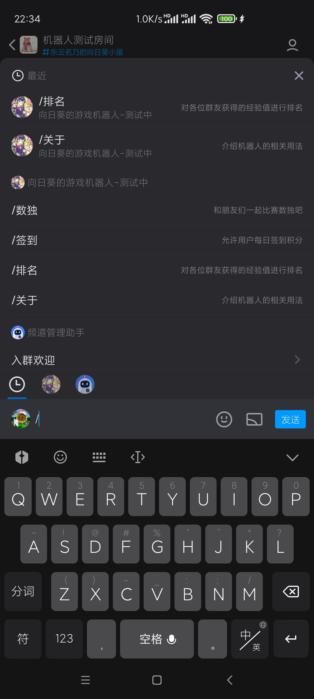

这就是我们创建好之后的效果。

## 第四步：将机器人的信息关联到代码里

这是最后一步。请打开我们写的程序代码，机器人的项目（例如本仓库里的机器人项目是 `Sudoku.Bot`）。

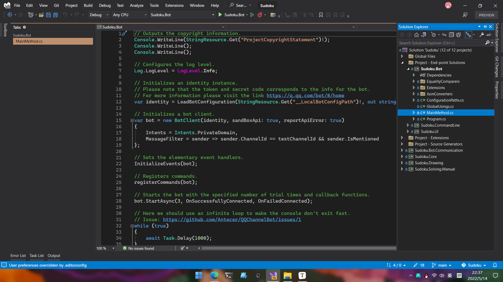

拿我的项目举例说明。项目需要录入如下的内容到机器人配置代码里去：

1. 版权声明（不是必要内容，如果你自己写的代码可以不要）；
2. 日志记录级别（用于显示到控制台界面里）；
3. **录入授权信息**（这个我们马上说）；
4. 声明机器人类型实例（图上的 `BotClient` 类型），并设置相关的内容：
   1. 公域还是私域机器人（图上的 `Intent` 属性）；
   2. 信息的过滤器（图上的 `MessageFilter` 属性）；
   3. 机器人收发消息的事件的挂载；
   4. **注册机器人的指令配置**；
5. 启动机器人（`StartAsync` 方法）。

这里根据你自己的代码设计而变动不同的风格。我们挑选重要的两个内容（授权机器人指令配置）说明一下。

> 各位。如果你在这一个步骤的刚开始就听得一头雾水的话，多半是因为你没有写代码导致的。我们只是配置好了机器人的环境，并未实现机器人的相关逻辑，因此必须要手动实现代码逻辑才可以使用机器人。请自行参考机器人的实现代码过程吧。

### 重要步骤一：授权机器人

机器人授权是需要关联上我们刚才创建的机器人的信息的，否则任何人都可以随便用，肯定是不行的。

机器人的授权信息包含三个：App ID、令牌信息（Token）和密钥信息（Secret）。这三个数据均可在[页面端](https://q.qq.com/bot/#/developer/developer-setting)查到：

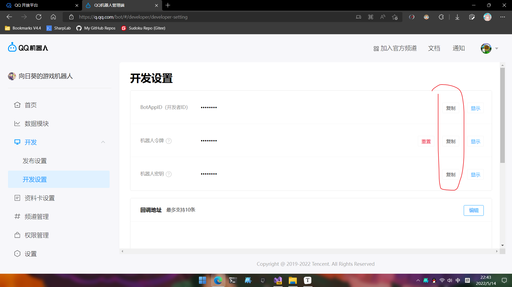

在机器人授权信息得到之后，我们需要将信息录入到代码里。拿我的项目来说，请关注到代码的这部分：

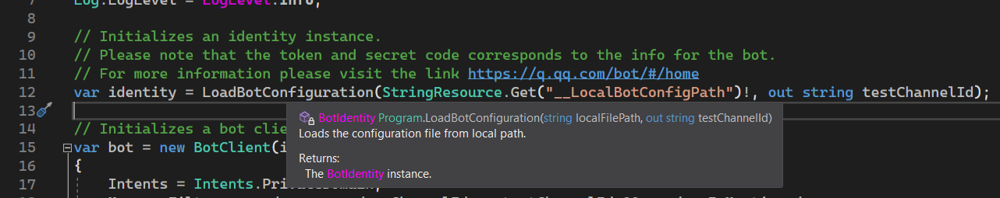

在这里，我们调用到 `LoadBotConfiguration` 方法。它的声明位于 `Program.cs` 之中：

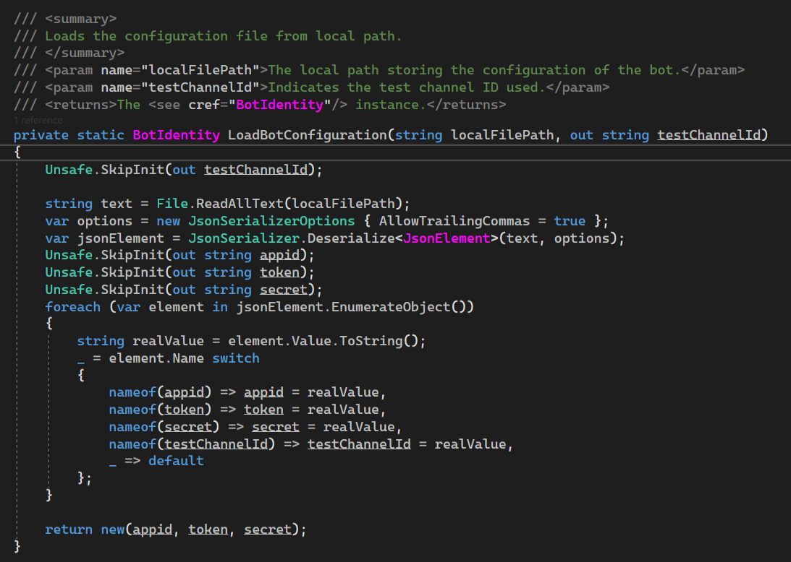

实际上就是一个很简单的读取本地文件的路径，然后视为 JSON 文件然后读取成 JSON 对象之后，然后将每一个数值读取到后传入对应的临时变量，最后返回一个 `BotIdentity` 实例。该实例会在主方法里使用。

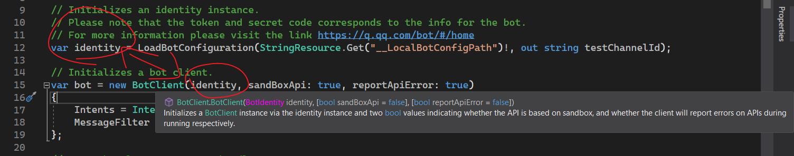

如果你的代码不给别人看的话，你完全可以把密钥、token 等重要信息直接写进代码。不过我非常不建议这么做，因为它们是敏感信息，写进去就意味着如果被别人看到，别人就可以用了。

因为我的代码是开源公开的，因此我的这些敏感信息被我存在了本地，因此多了这么一个步骤。

### 重要步骤二：注册指令

在项目完成代码实现后，我们需要配置指令。这些配置的指令，是我们在页面端创建好了的，就是我刚才说的公域不限、私域机器人必须斜杠 `/` 开头的那些指令信息。

注意，我们这里用的是中文的指令名称，因此我们需要匹配上它们，需要在我们代码书写里也用这样的指令名称。

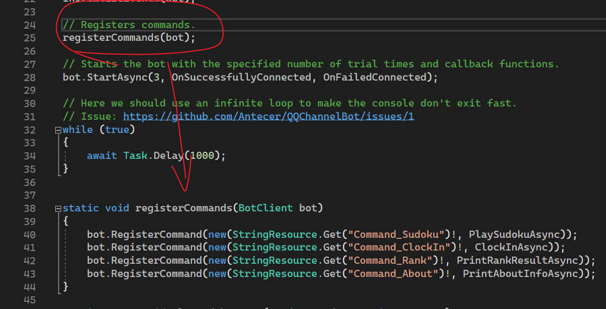

这里我们使用到一个叫 `RegisterCommand` 的方法来注册指令。实际上可以看到，参数也是相当简单的：一个 `new` 语句，实例化一个 `Command` 类型的指令对象。指令传入两个参数，一个是指令名称（也就是我刚才说的匹配上页面端设置的指令名）；另一个则是回调函数。

指令名称需要的是不带斜杠 `/` 的后面的中文汉字部分，而在我的代码实现上，所有汉字字符全部被我使用资源字典包裹起来了，因此这些指令名称（中文字符）都放在资源字典里，因此才有了 `StringResource.Get` 方法的这一步（取字典里指定键的字符串值）。如果你的代码不公开给别人看的话，你可以明文将汉字放在这里即可，注意用双引号。

然后第二个参数是回调函数。这里的回调函数指的是指令需要执行的代码段。每一个指令都会匹配一个我们需要做的工作，因此此时传入的是一个委托类型的实例。这里你可以用 lambda 表达式来完成，也可以使用匿名函数完成，也可以使用实际的方法来完成，总之，能放进这里的委托类型实例兼容的东西都可以。

### 重要步骤三：在代码末尾加入一个死循环

是的，你需要强制加入一个死循环：

```csharp
while (true)
{
    await Task.Delay(1000);
}
```

加入这么一段代码的原因是，防止异步执行的时候快速退出主方法。因为项目使用的 API 均为异步的方法。如果我们不等待的话，异步方法会当成异步去执行，于是主线程会继续走下去，导致程序快速退出。

加入死循环的目的是防止程序退出。而我们要退出这个程序的办法是发出 `Ctrl + C` 组合键的方式来退出程序执行。

## 第五步：尝试跑起来吧！

完成了代码编写后，我们试着运行一下程序。

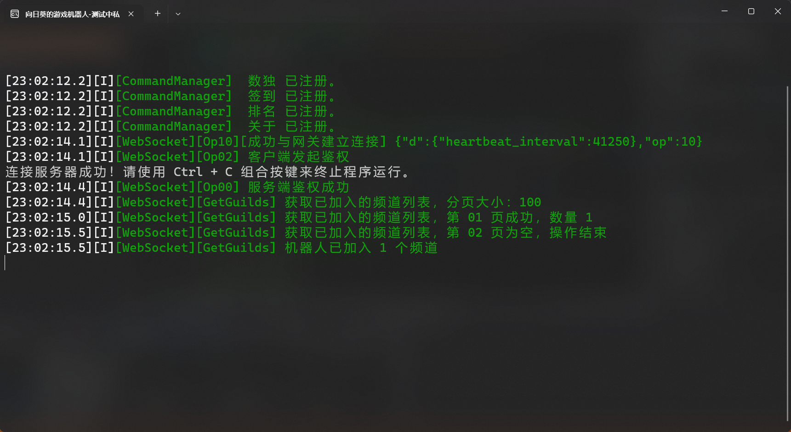

打开页面，并输入指令。

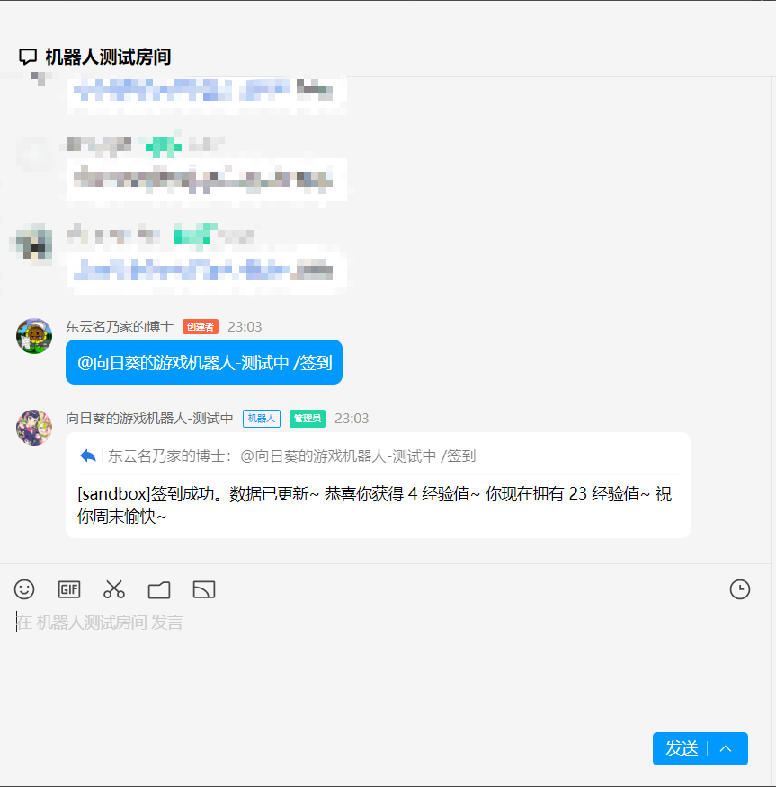

如果可以看到配置指令输出显示出来的话，就说明机器人全部完成。本文结束。

## 总结

通过本文，我们介绍了如何使用机器人的部署，以及代码完成，简要说明了一下，如何配置一个 QQ 官方提供的机器人。虽然看起来略微复杂一些，但是可以看出 QQ 对开放平台做出的贡献和努力。