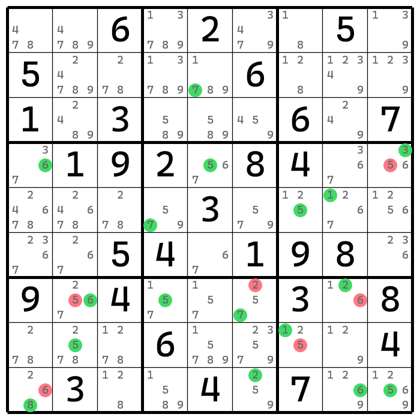

# 后门（Backdoor）

**Sudopedia 同术语词介绍页面**：http://sudopedia.enjoysudoku.com/Backdoor.html

后门是一个针对于候选数出数或删数结论的术语词。

假设一个题目非常难（至少有短链）。如果盘面的某一个候选数在删掉（或填入到格子里）之后，题目的难度会直接下降到只使用排除、唯一余数、区块和数对四大技巧就可以完成的地步，那么这个候选数的删数或出数结论，我们就称为题目的后门。

一个题目的后门越少，那么这个题目就是精心挑选的优良题目。后门的存在使得玩家可以在做题期间通过无逻辑地猜测结论来大幅度降低题目的难度。如果一个题目没有后门，就说明玩家无法通过任何一个候选数的出数和删数结论的猜测，来大幅度降低题目难度，绕过复杂的技巧的使用。因此，后门具有防猜的特性。

题目的后门分布是不均匀也无直接规则的，只能通过一些软件测评来获取它们；题目可以做到无后门，但找到这样的题目，难度会很高，一般的题目都有或多或少的几个甚至数十个后门。

如盘面所示，这个题目就具有如下的后门，其中绿色的数字是出数结论，而红色的数字则是删数结论。



题目的代码如下：

```
006020050500006000103000607019208400000030000005401980904000308000600004030040700
```

该题的难度为需要强制链技巧的级别。