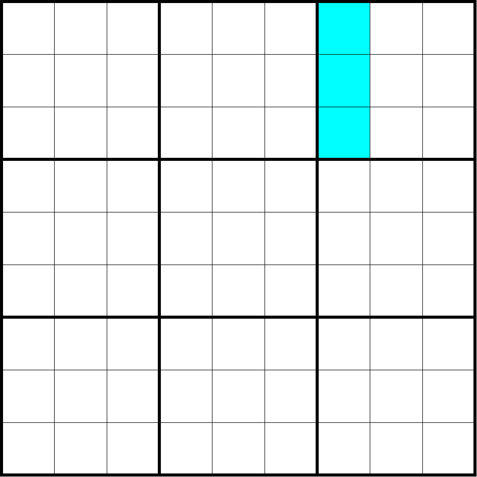

# 宫列（Boxcolumn）

**Sudopedia 同术语词介绍页面**：http://sudopedia.enjoysudoku.com/Boxcol.html

表示数独里某个宫和某一列相交的三个单元格。也叫**小列**。

如图所示，该图表示的是第 7 列和第 3 宫相交的三个单元格，满足宫列的基本定义，属于一个宫列。

一个数独题目一共包含 27 个不同的宫列。

> 注意本术语词和大列的区别。大列是 27 个单元格，而宫列只包含 3 个单元格。
