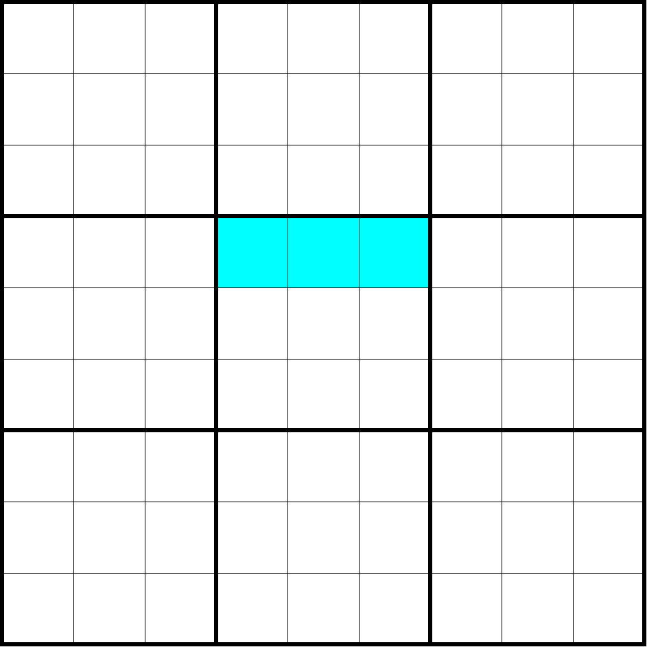

# 宫行（Boxrow）

**Sudopedia 同术语词介绍页面**：http://sudopedia.enjoysudoku.com/Boxrow.html

表示数独里某个宫和某一行相交的三个单元格。也叫**小行**。

如图所示，该图表示的是第 4 行和第 5 宫相交的三个单元格，满足宫行的基本定义，属于一个宫行。

一个数独题目一共包含 27 个不同的宫行。

> 注意本术语词和大行的区别。大行是 27 个单元格，而宫行只包含 3 个单元格。
