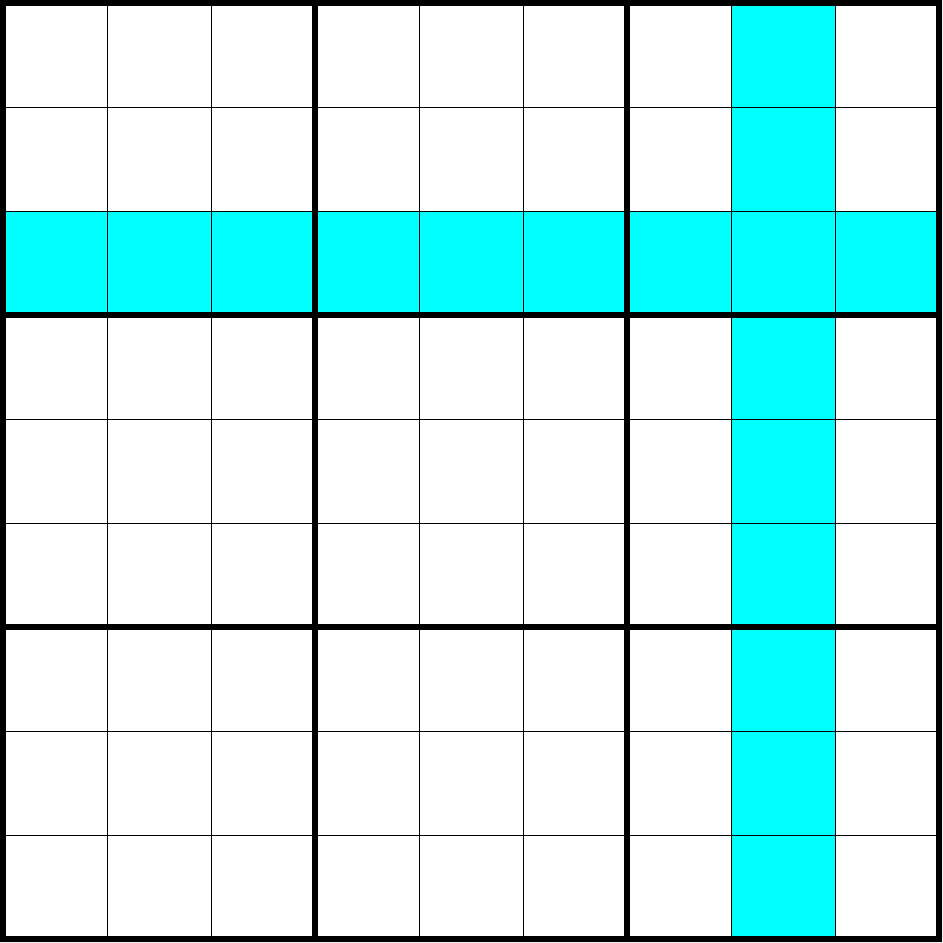

# 行列（Line）

**Sudopedia 同术语词介绍页面**：http://sudopedia.enjoysudoku.com/Line.html

表示一个行或一个列。

> 注意，这是一个术语词汇，称为“行列”。所以此时使用的汉字“行”和“列”是一个词语，因此不可拆分。比如“一个行”表示一行的 9 个单元格，“一个列”表示一列的 9 个单元格，而“一个行列”则表示的是一个行或者一个列上的 9 个单元格。

如图所示，涂色单元格可构成一个行和一个列，也可以统称为两个行列。
