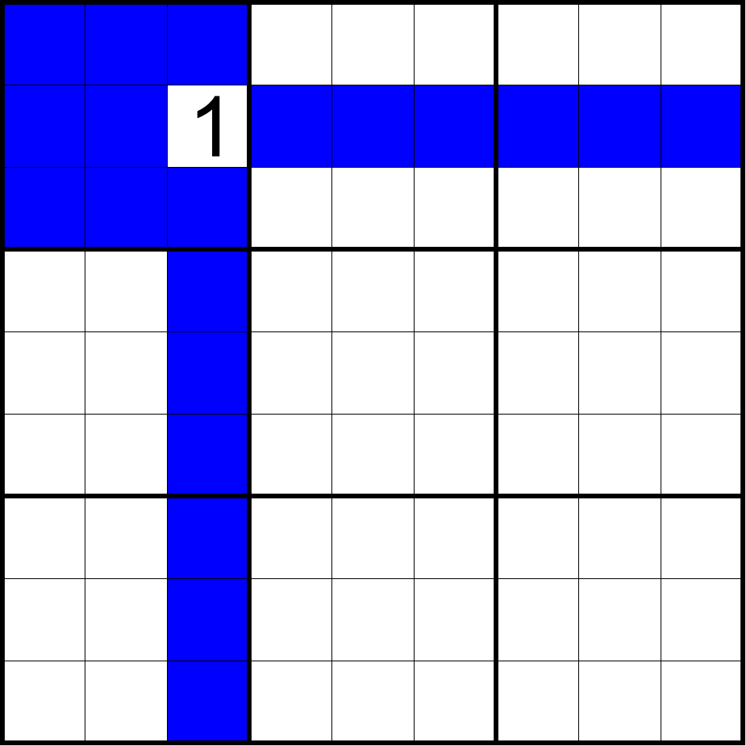

# 相关单元格（Peer）

**Sudopedia 同术语词介绍页面**：http://sudopedia.enjoysudoku.com/Peer.html

表示一个单元格所在的行、列、宫里别的所有单元格的集合。每一个单元格都有 20 个相关单元格。相关单元格也简称为相关格。

如图所示，蓝色单元格表示 r3c3 单元格的所有相关格。

> 一定注意，相关单元格并不包含自己。

英语环境下，相关单元格也可以用 buddy 表示。
