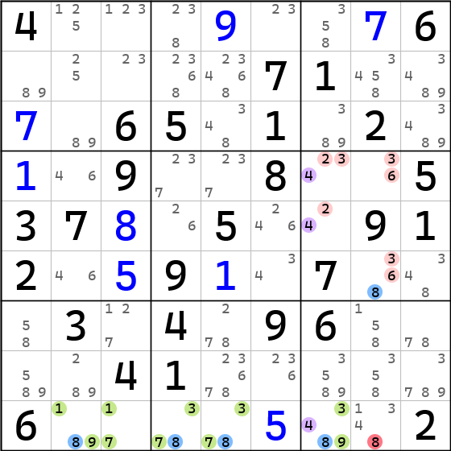
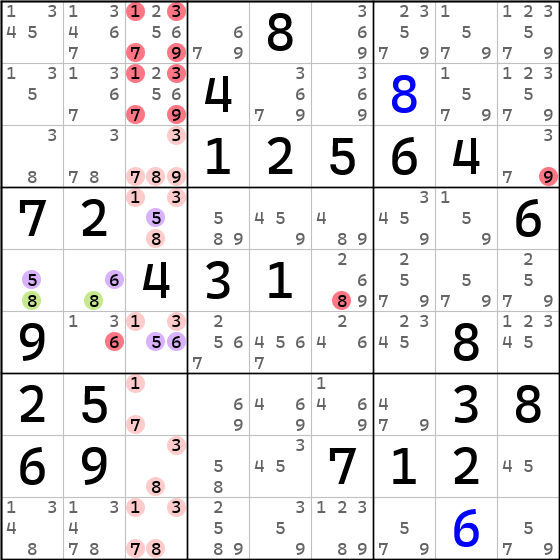

# 严格共享候选数（Restricted Common Candidate）

**Sudopedia 同术语词介绍页面**：http://sudopedia.enjoysudoku.com/Restricted_common.html

严格共享候选数（一般简称 RCC）指的是在 ALS 链式技巧之中（ALS-XZ、ALS-XY-Wing、ALS-W-Wing）出现的两个 ALS 之间的“桥梁”数字。

对于 ALS-XZ 技巧而言，严格共享候选数一般只会有一个，因为 ALS-XZ 技巧可改成链来理解，并且它包含两个强关系和一个弱关系，两个强关系是 ALS 内部产生的，而这个弱关系，就是两个 ALS 里相同数字构建起来的弱关系了。

如盘面所示，这就是一个 ALS-XZ 技巧。其中用紫色标注的三个候选数 4（其中 r45c7(4) 属于上面的 ALS，而 r9c7(4) 属于下面的 ALS）就是一个 RCC 了。

不过，ALS-XZ 也可能同时包含两个 RCC，此时的 ALS-XZ 将构成一个环状结构。

如盘面所示，这就是一个包含两个 RCC 的 ALS-XZ。紫色数字 5、6 都是 RCC，才会构造成环状结构。