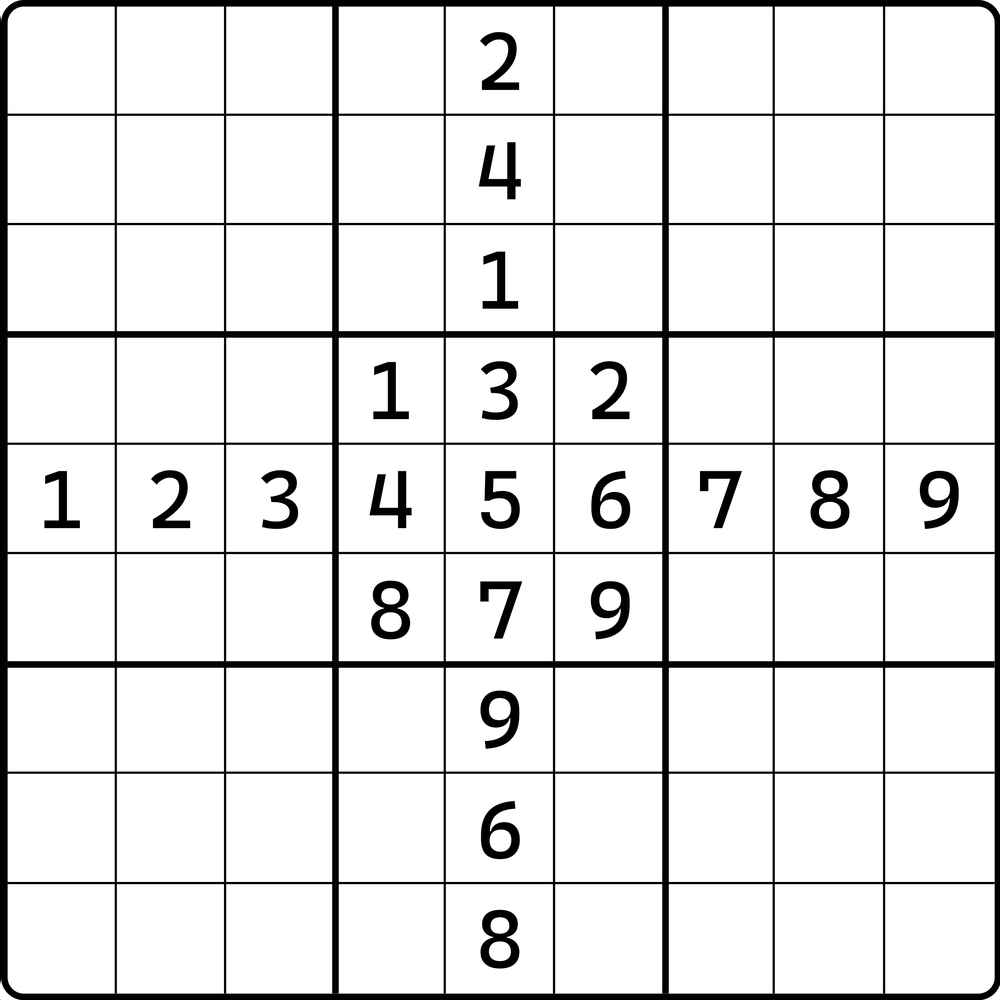

# 初来乍到

是欢迎你来到数独的世界。这里将会为你展示各种各样的数独推理技巧，帮助你在做题的过程之中，通过逻辑推理得到乐趣的同时，完成题目。

## 数独规则 

<figure><figcaption>
演示
</figcaption></figure>

如图所示。我们可以看到，整个游戏会使用 9 × 9 一共 81 个单元格，我们将整个游戏棋盘称为一个[**盘面**（Grid）](#user-content-fn-1)[^1]。

数独游戏规定，我们在数字 1 到 9 里选取 9 组完整的 1 到 9，并填入到盘面里，并使得每一个横排、每一个竖列，以及每一个由粗线围起来的 3 × 3 的小区域里，都完整包含一套 1 到 9。换言之，任意的数字都不可产生重复项，就像是图上那样。

只是说，你需要完整完成一道题，使得全部的空格都填满数字。图示只给出了其中第 5 行、第 5 列和第 5 个“小宫格”里满足需求的情况。

### 术语介绍 

下面简要介绍一下数独需要掌握的基本的术语词汇。

* **行**（Row）：一个横排。一共包含 9 个格子。一个数独盘面包含 9 个行。
* **列**（Column）：一个竖列。一共包含 9 个格子。一个数独盘面包含 9 个列。
* **宫**（Block）：一个 3 × 3 的、由粗线围起来的 9 个格子。一个数独盘面包含 9 个宫。
* **单元格**（Cell）：一个格子。一般也简称**格子**或**格**。
* **空格**（Empty Cell）：一个没有填数的空白格子。

这些术语都是基础词汇，需要掌握；后续的教程内容也会使用这些词语来简化表达的内容。

### 一些要求 

在完成一个数独题目的时候，我们会有一些基础的信息作为辅助，并非上手就给玩家完成。

<figure><figcaption>
一个题，和它的答案
</figcaption></figure>

如图所示，左边的图是这个题目，而右边这个是它的答案。我们也叫它**解**（Solution）。可以看出，一个题是必须拥有一些合适的填数作为初始提示项，才能完成的；如果是空白的盘面的话，是无论如何都没有任何依赖项可提供推演提示的。我们把左边初始状态就给出的数字称为**提示数**或**已知数**（Given）。

[^1]: 所有的加粗项都是术语，会列在术语列表里提供查看。
