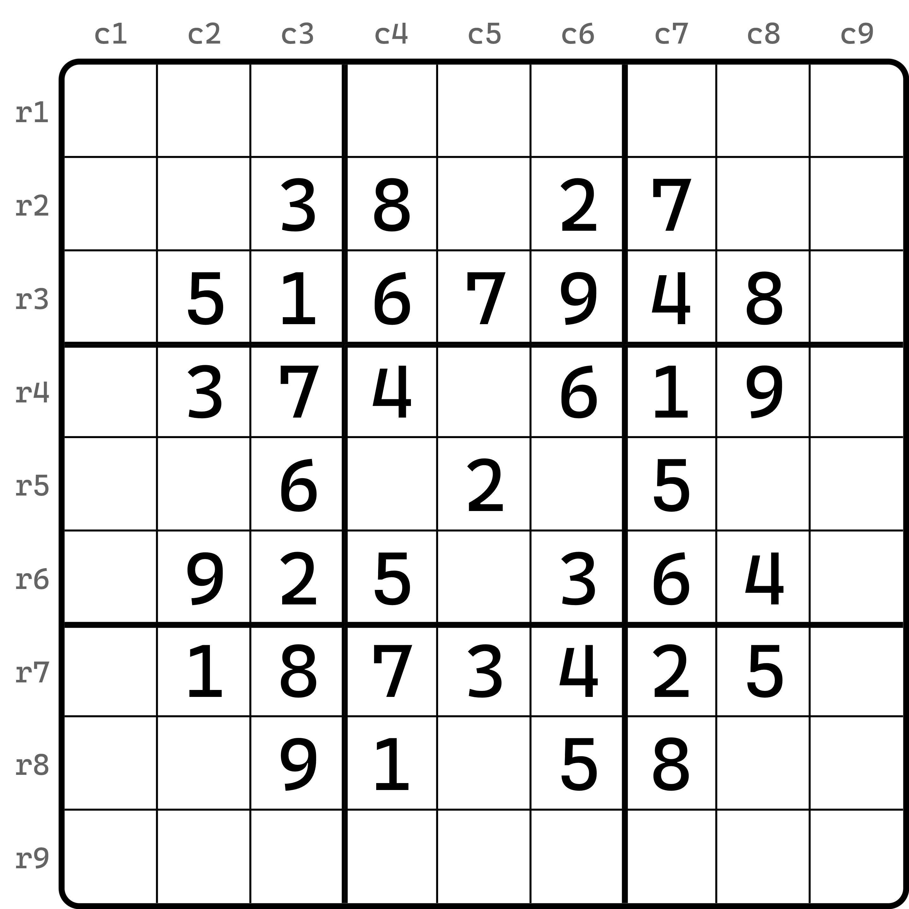
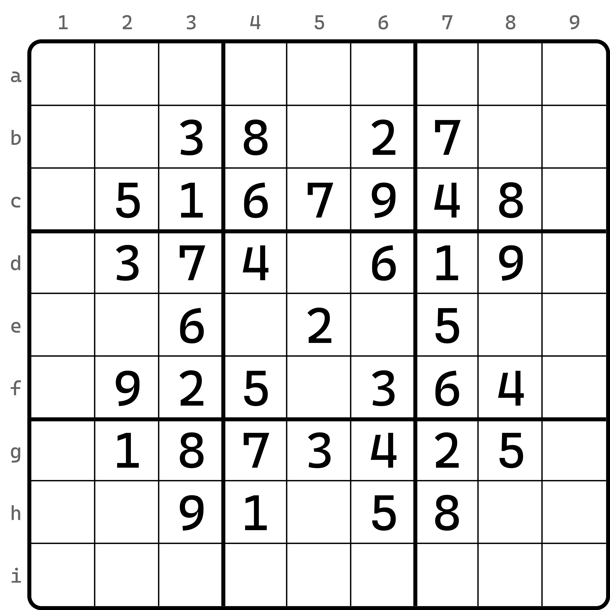

---
description: Coordinate
---

# 坐标

下面介绍本教程使用的所有坐标表达的规范。

## 坐标 

所谓**坐标**（Coordinate），指的是表达单元格在盘面里具体位置的一种手段。由于数独游戏在不同国家的文字描述上有所差异，不同国家对坐标的表述方式也有所不同。本文会将全部表达都介绍一次提供以后临时查阅，不过本教程整体只会使用第一种表示方式：[RCB 表示](02-coordinate.md#rcb-notation)。

我们拿一个题作说明，后续都按这个图里的内容作说明。

<figure><figcaption>
一个例子
</figcaption></figure>

## RCB 

RCB 表示是全球通用的一种表示方法，本教程也会使用这个表示方法。盘面会按第 1 行到第 9 行、第 1 列到第 9 列进行顺次编号。编号次序是从左到右、从上到下。

<figure><figcaption>
RCB 表示下的坐标布局
</figcaption></figure>

我们使用行、列、宫的英文单词首字母 row、column 和 box 的 r、c、b 来表示一个坐标。比如说，正中间的单元格是提示数 2，我们将这个说法直接记为 `R5C5 = 2` 或 `r5c5 = 2`。其中，等号 `=` 体现的是诸如“填入”、“是”等等的含义。不过，b 这个字母暂时用不到，以后用到了会继续说明。

> 正中心的单元格我们有时候也称为**天元**（Tengen）。不过这个词语数独里早期是没有的，为了表述简单，直接借用了围棋的说法来表示中心的概念。为了确保表述的严谨，这里我们直接人为规定，只有第 5 宫里的中心的单元格称为天元。

## K9 

K9 表示是将坐标用一个字母加一个数字的组合形式表达出来。这样的好处在于简化了 RCB 的书写，但与此同时，字母的次序也会增大表示的复杂度。

<figure><figcaption>
K9 表示下的坐标布局
</figcaption></figure>

例如上面的题目，会按照字母 A - I 的次序编号 9 个行，而仍然使用数字 1 - 9 来编号列。那么这样的话，中心单元格（天元）就会被记作 `E5` 或 `e5`。而单元格的提示数是 2 仍然可以用等号连接：`E5 = 2` 或 `e5 = 2`。

不过这里记号使用了字母 C 和 B，这可能在后续讲解的坐标记号规则里与 RCB 表示产生冲突，所以不要混用两种表示方式。或者，由于习惯问题，我们更希望 K9 表示下字母都统一采用大写字母而不是小写，而小写字母的书写机会预留给 RCB 表示，这样可以一定程度上规避歧义性。

> 另外，你可能会好奇，这个记号尚不会用到 K 字母，但名字里却用到了字母 K，这是为什么呢？这其实是因为老外的习惯问题。由于第 9 行的行号用的是字母 I，而大写的 I 字母容易和数字 1 区分不开，所以老外在使用这种坐标时会故意不用 I 这个字母，而是直接顺延到 K。而 J 不用的原因也是因为它和 1 比较像（当然，这取决于一些字体，有些字体的 J 在小写时只是拉长了字母，并没有 J 下方的弯钩）。总之，老外的坐标列表里，第 1 - 9 行的坐标分布其实是 A、B、C、D、E、F、G、H、K，因此用最大的行号第 9 行（K 字母）和最大的列号第 9 列（数字 9）拼凑的 K9 来称呼这个记号，这是这个名字的由来。

## Excel 坐标 

Excel 表示完全把字母和数字反过来表示，即行用数字，列用字母。

<figure><figcaption>
Excel 表示下的坐标布局
</figcaption></figure>

例如 Excel 坐标表示的天元仍记为 `E5`。但是这一次是反过来的，即先说的列号，后说的行号。那么第 2 行的第 6 个单元格，前面记作 `r2c6`（RCB 表示）或 `B6`（K9 表示），而这里我们记作 `F2`。

确实是有些绕，所以就不展开说明了。点到即止。
