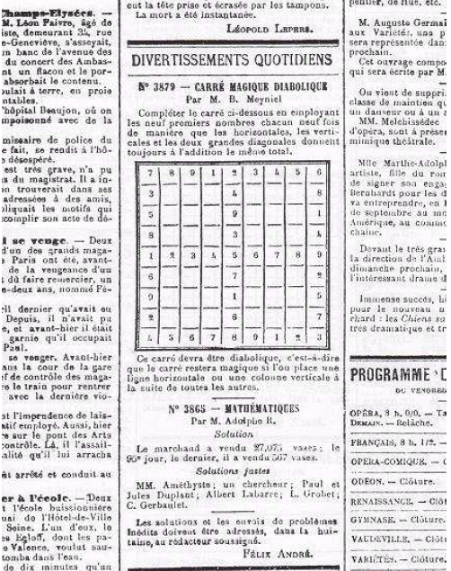
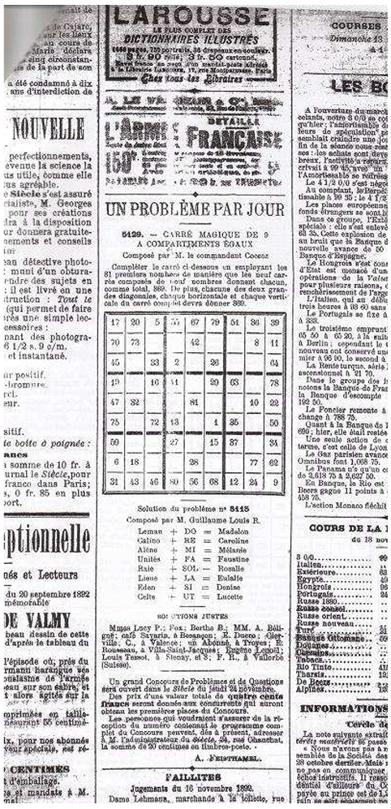
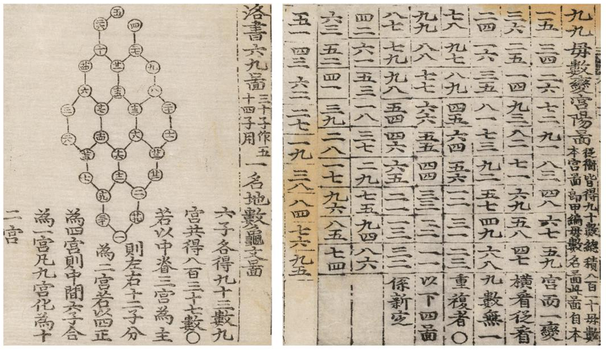
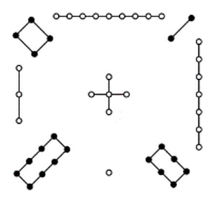

---
description: History of Sudoku
---

# 数独历史

数独演变到如今，中间确实存在不少响当当的人物在让数独更加大众化。下面我们来看看数独究竟是如何演变至今的。

## 宫规则：法国Le Siècle日报 

早在 19 世纪末期，法国的 Le Siècle 日报就发布了一篇填数字的游戏。这种填数字游戏看起来似乎跟目前的数独差不多，但区别也非常大。

<figure><figcaption>
该日报上的题
</figcaption></figure>

> 图源：[https://en.wikipedia.org/wiki/Sudoku](https://en.wikipedia.org/wiki/Sudoku)

如图所示，该题目并不包含宫的约束条件，并且它的规则也不同：它要求你在空格里填入 1 到 9，使得每一行、每一列以及两条对角线的填数之和相同。

该规则并没有任何限制额外的填数限制，但你可以看到提示数所在行列似乎填数本身就不重复。因此，这一点给后续产生的数独提供了一些创意。

很显然，从规则求和来看，它来自于一个叫做**幻方**（Magic Square）的阵列。幻方是一种类似的东西，它就刚好要求填数求和一致。但和前文提及的这种填数游戏不同，幻方是一整个盘面内没有要求重复性，而一整个盘面里数字之间不相同，也就是说填数的范围是从 1 到 $$n^2$$。如 6 阶的幻方填入的数字是 1 - 36；3 阶的幻方则是填入 1 到 9。

由于该日报发布的题目规则不同于幻方，因此这并不属于幻方。官方将其称为 Carré Magique Diabolique，英语翻译大概为 Diabolical Magic Square，直译过来是“恶魔般的幻方”。

> 这里 diabolical 有多种理解方式。它的意思是“恶魔一般的”，但也可以翻译为“特别困难的”，即类似于中文的“极难”；也可以翻译成“糟糕透了的”。如何翻译取决于你自己对这种填数游戏的理解。

而它的这个名字则是于 1895 年 7 月 6 号才被固定下来。

早在 1892 年 11 月 19 日，该日报就发布了一则带宫的版本：

<figure><figcaption>
带宫的版本
</figcaption></figure>

> 图源：[https://web.archive.org/web/20061210103525/http:/cboyer.club.fr/multimagie/SupplAncetresSudoku.pdf](https://web.archive.org/web/20061210103525/http:/cboyer.club.fr/multimagie/SupplAncetresSudoku.pdf)

但这看起来更不像数独了。因为它填入的数字并不是 1 到 9，而是一个两位数，但规则仍然是求和一致。

唯一和数独有联系的，可能只有这一个宫的约束性质。不过，这一点，确实为数独提供了一个基本的轮廓。这个填数游戏持续了好一阵子，不过大概在第一次世界大战发生的时间前后，就突然基本消失了。

这便是数独带有宫的、可通过文献找到的最早的记录。

## 不重复规则：欧拉的拉丁方和崔锡鼎的九数略 

另一种说法是来自于**拉丁方**（Latin Square）。也有翻译成拉丁方块和拉丁方阵的。这个东西于 1700 年左右就已经出现。

按照一般说法，拉丁方起源自一个叫做**欧拉**（Leonhard Euler）的数学家。实际上，他也不一定非得是数学家，他在别的领域也有研究。不过以本人来看，他创造的拉丁方是以字母作为填空的元素，而非数字。

然后经考证，似乎这个东西的发明另有其人。一位韩国的数学家**崔锡鼎**（Choi Seok-jeong） 似乎早于欧拉至少 67 年就制作了拉丁方的相似内容。韩国则把这个东西称为**九数略**（Gusuryak）。

<figure><figcaption>
九数略
</figcaption></figure>

> 图源：[https://web.archive.org/web/20180814135318/https://kyudb.snu.ac.kr/contents/content\_detail.do?code=A00074\&a\_code=A01\&b\_code=B02\&c\_code=C24\&num=74](https://web.archive.org/web/20180814135318/https://kyudb.snu.ac.kr/contents/content_detail.do?code=A00074\&a_code=A01\&b_code=B02\&c_code=C24\&num=74)

而在 2021 年，该内容得到证实。请注意图片的右半部分，它并未标记宫的界限，也就是说这也是一个没有宫的图案，但它却保证了每一个单元格填入的这个两位数字，上面的数字在整个盘面里是一个完整的 9 阶拉丁方规则，而下面也是一样。

另外，图片里提及的“洛书”则实指中国的河图洛书。长下面这样。

<figure><figcaption>
河图洛书
</figcaption></figure>

> 图源：[https://zh.wikipedia.org/zh-hans/%E6%B2%B3%E5%9C%96%E6%B4%9B%E6%9B%B8](https://zh.wikipedia.org/zh-hans/%E6%B2%B3%E5%9C%96%E6%B4%9B%E6%9B%B8)

从图形上来看，中国早已存在对幻方的研究。该图里线条连接的圆点数排布恰为一个 3 阶的幻方：

$$
\begin{matrix}
& & 4 & 9 & 2 & \rightarrow & 15\\
& & 3 & 5 & 7 & \rightarrow & 15\\
& & 8 & 1 & 6 & \rightarrow & 15\\
& \swarrow & \downarrow & \downarrow & \downarrow & \searrow \\
15 & & 15 & 15 & 15 & & 15
\end{matrix}
$$

这是两个广泛被认为是数独的历史文字。

也就是说，崔锡鼎的九数略来自于中国古代的河图洛书，但稍加改良将求和的规则改成了一种不重复的填充规则；而若干年后，欧拉也独立创造出了不重复规则的填充规则。他们互相是没有关系的。

总而言之，数独的宫规则和不重复规则来自于这样两种不同的填数谜题，最终归并到了一起。
