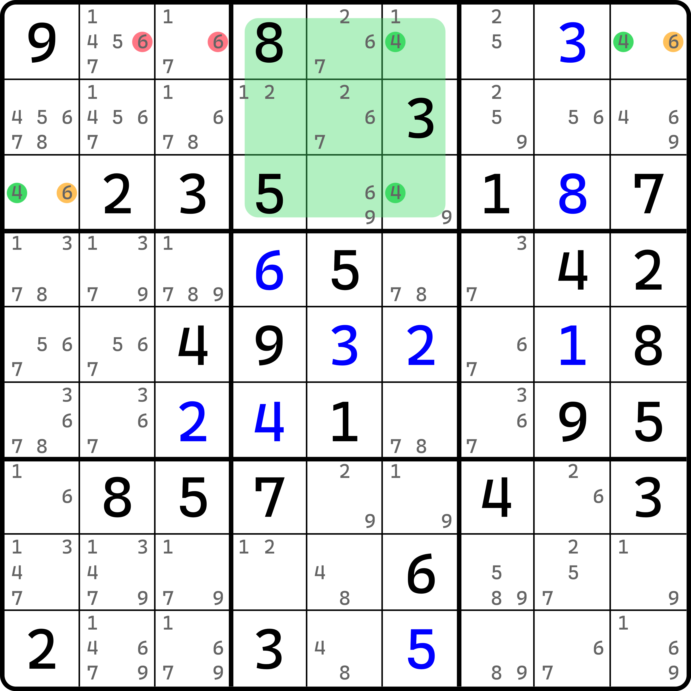
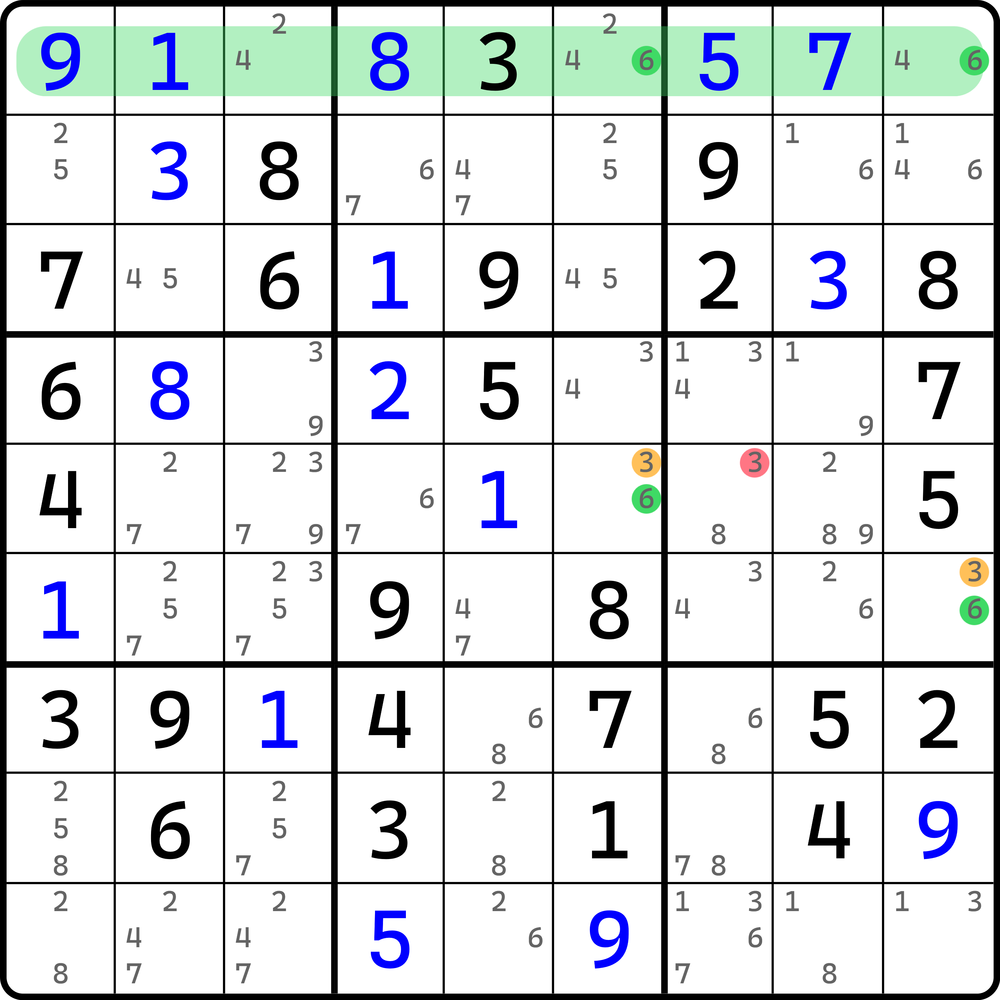
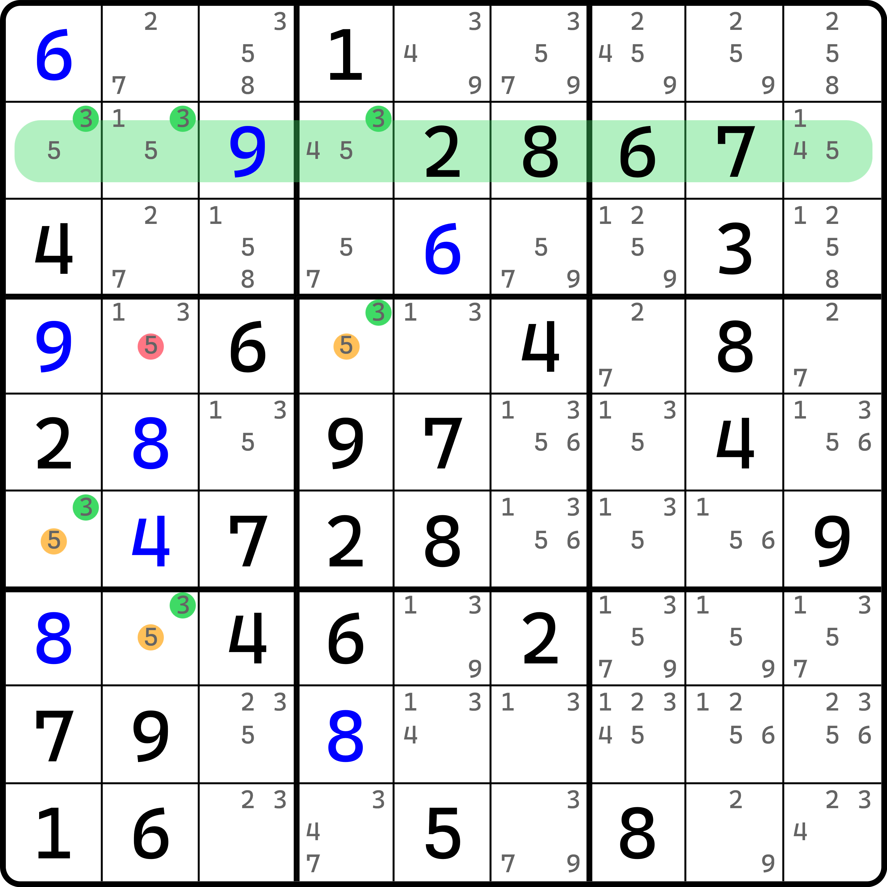
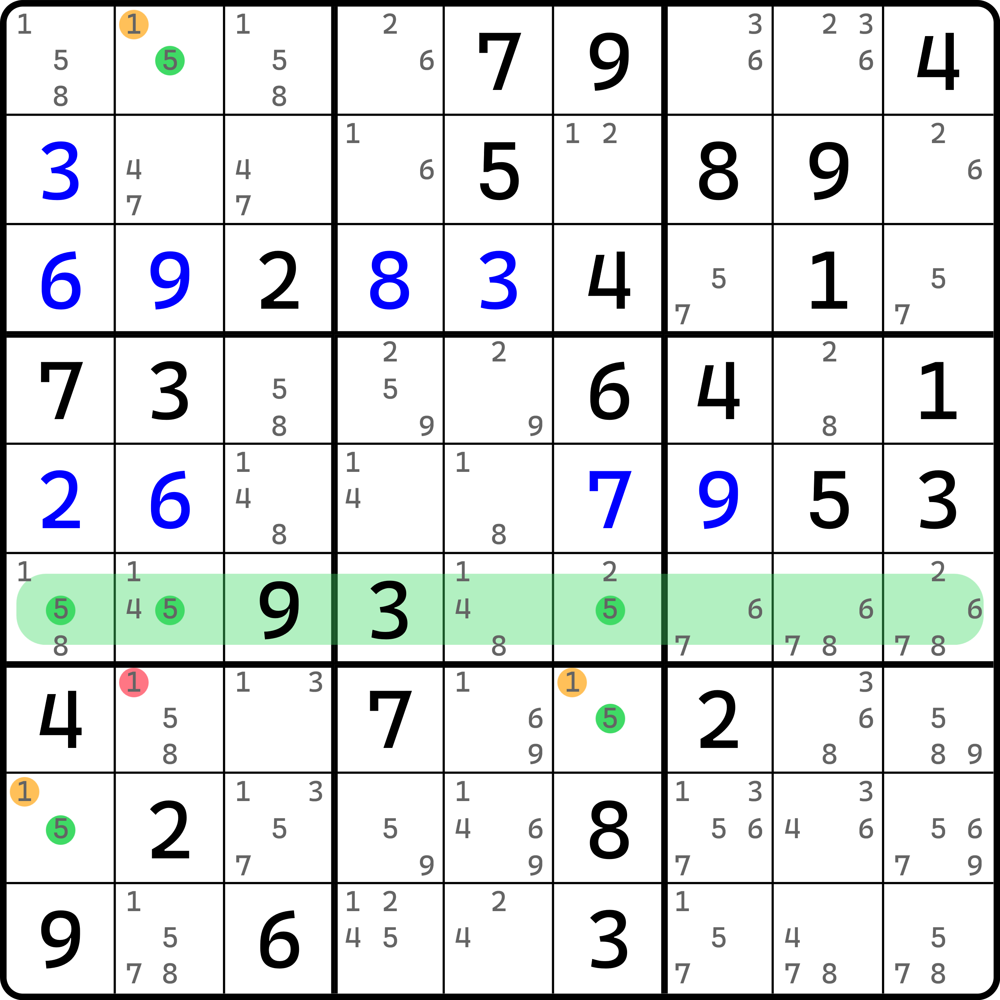

# W-Wing

前面的内容我们已经介绍过了 XY-Wing 的推理，以及规格的推广，和残缺模式。下面我们来介绍另外一个、从 XY-Wing 推广，但结构不太相同的技巧。

## 基本推理 

<figure><figcaption>
W-Wing 结构
</figcaption></figure>

如图所示。这个结构将原有的 XY-Wing 的拐点单元格改造成了一个区域的两个填数位置。这次我们和之前的假设完全一样，不过讨论 `b2` 的填数。

* 如果 `r1c6 = 4`，则因为 `r1c9 <> 4` 的关系，此时 `r1c9 = 6`；
* 如果 `r3c6 = 4`，则因为 `r3c1 <> 4` 的关系，此时 `r3c1 = 6`。

我们恰好发现，`r1c9` 和 `r3c6` 具有完全一样的候选数，所以在假设 `r1c6` 和 `r3c6` 的两种填数位置的情况时，最终结论那一边的单元格必定填的是相同的数字 6。

这能看出来什么呢？显然这两个情况里的结论必须有至少一个成立，因为他们都是走 `b2` 里所有数字 4 的全部填数位置派生出来的情况。而这两种情况必定指向了要么 `r1c9` 要么 `r3c1` 填 6 的结论。所以，`r1c23` 是不能填 6 的——这两个单元格但凡有一个是 6，都会同时让 `r1c9` 和 `r3c1` 这两个刚刚才得到必须至少有一个 6 的结论直接破掉，于是就矛盾了。

所以，`r1c23 <> 6` 是这个题的结论。

这个技巧的推理逻辑的整理来自于一个名为 Woods 的人，因此为了纪念他对这个数独技巧的贡献，就沿用了名字作为技巧名称，并由于它类似于 XY-Wing 的推理过程，所以将 XY-Wing 的“XY”部分剔除，改成 Woods，即 **Wood's Wing**。而一般在称呼此技巧时，我们用的是这个技巧的简称，即 **W-Wing**。

和之前 XY-Wing 也一样，因为它也不太好翻译，所以也没有中文名。中文环境下也使用的是 W-Wing 在称呼这个技巧。

下面我们再来看一个例子，不过就自己推理吧。如下图所示。

<figure><figcaption>
W-Wing，另一个例子
</figcaption></figure>

## 多分支 W-Wing（Multi-Branch W-Wing） 

下面我们来推广 W-Wing 的分支。

<figure><figcaption>
多分支 W-Wing
</figcaption></figure>

如图所示。和前面的例子几乎一致，只是 `r2` 这里用到的原本是两个数，现在改成了三个数。所以需要讨论三种情况：

* 如果 `r2c1 = 3`，则 `r6c1 = 5`；
* 如果 `r2c2 = 3`，则 `r7c2 = 5`；
* 如果 `r2c4 = 3`，则 `r4c4 = 5`。

显然，这三种情况必须有一个成立，所以 `r6c1`、`r7c2` 和 `r4c4` 里至少会有一个位置填 5。所以，`r4c2` 是不能填 5 的，否则会直接矛盾。因此，这个题的结论是 `r4c2 <> 5`。

我们把这个称为**多分支 W-Wing**（Multi-Branch W-Wing）。我们再来看一个例子，这个例子也希望你自己理解。如图所示。

<figure><figcaption>
多分支 W-Wing，另一个例子
</figcaption></figure>

至此，W-Wing 的内容就结束了。还算比较容易理解的，对吧？
