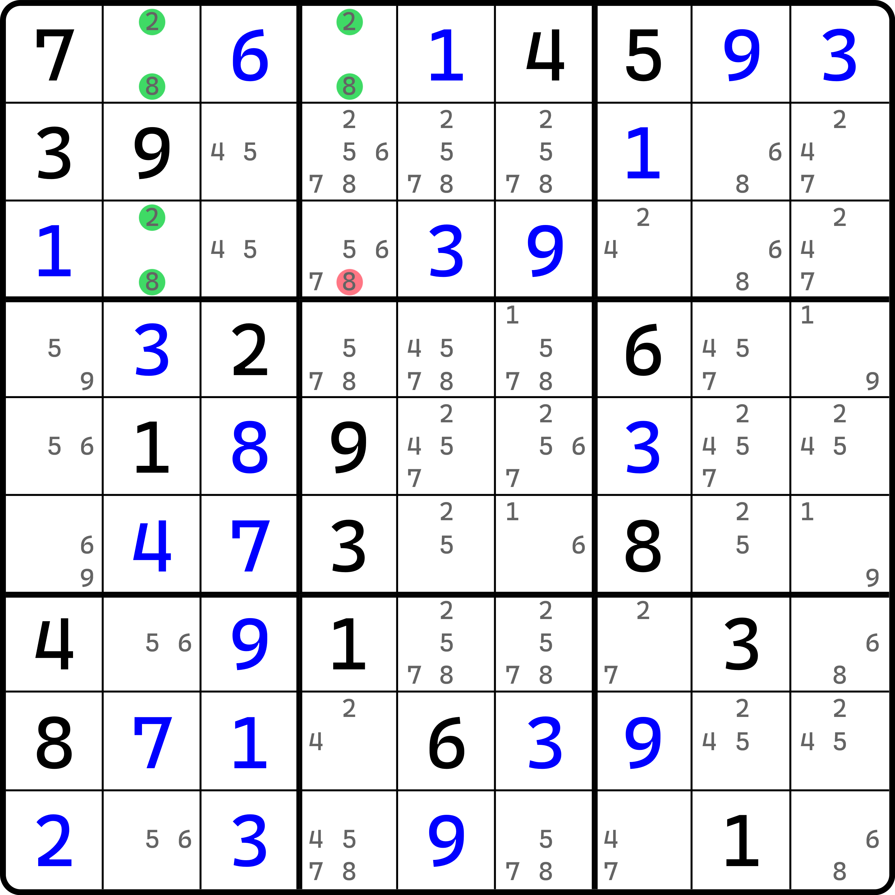
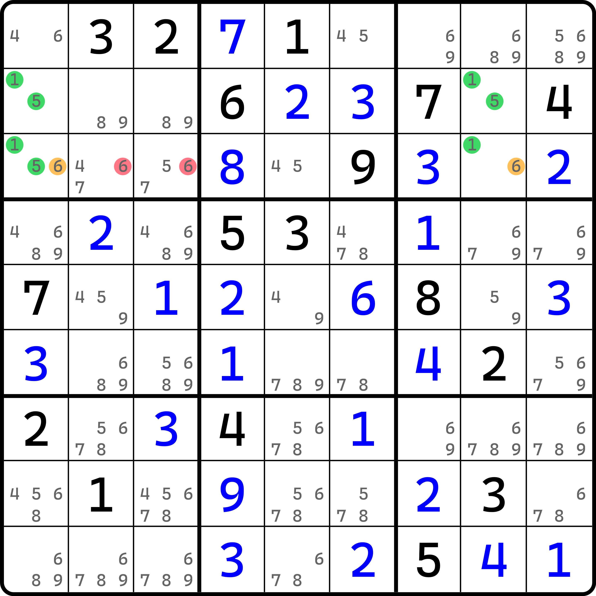
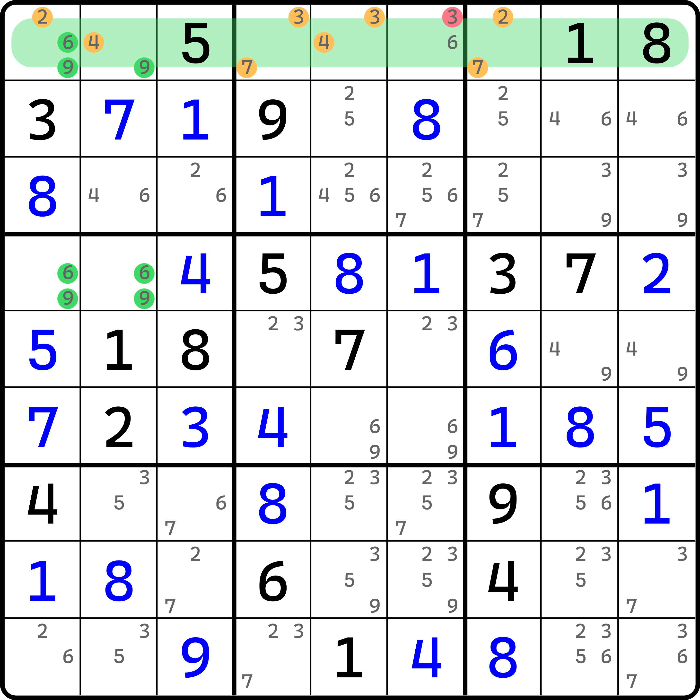
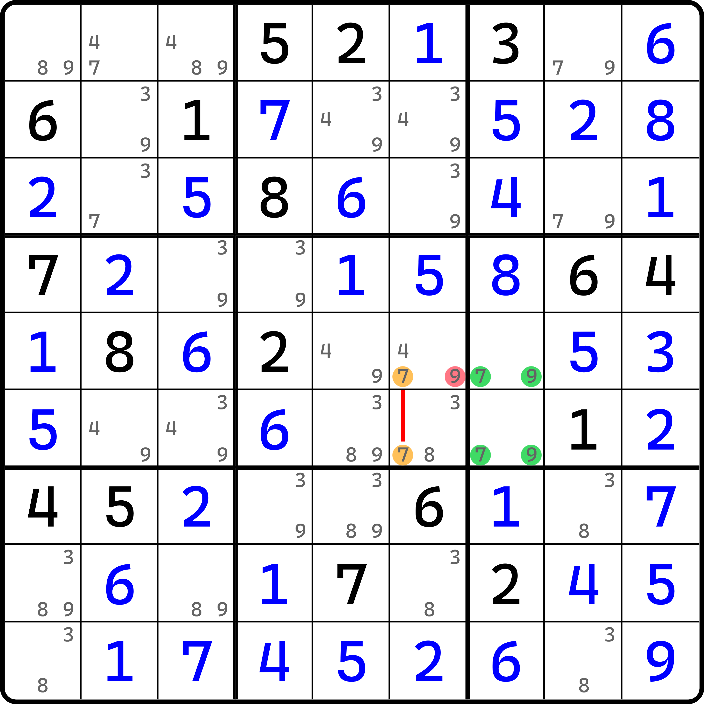
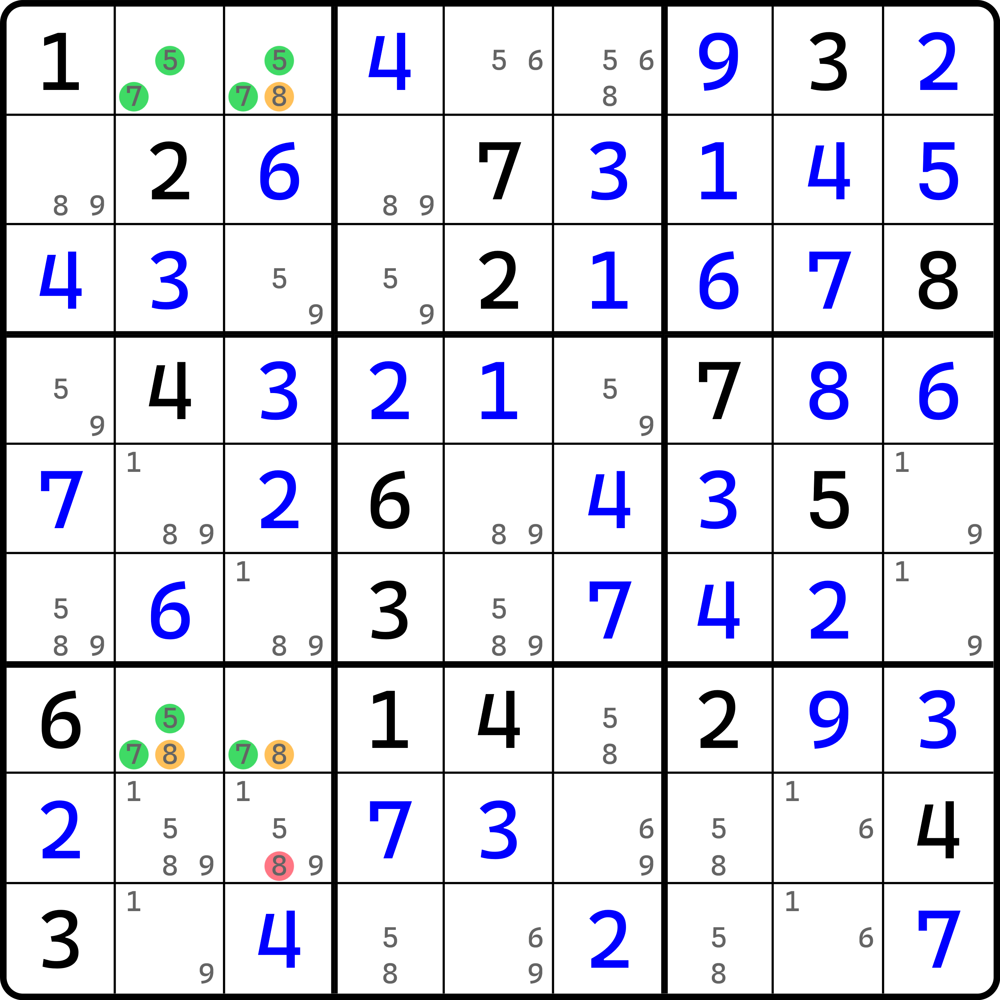
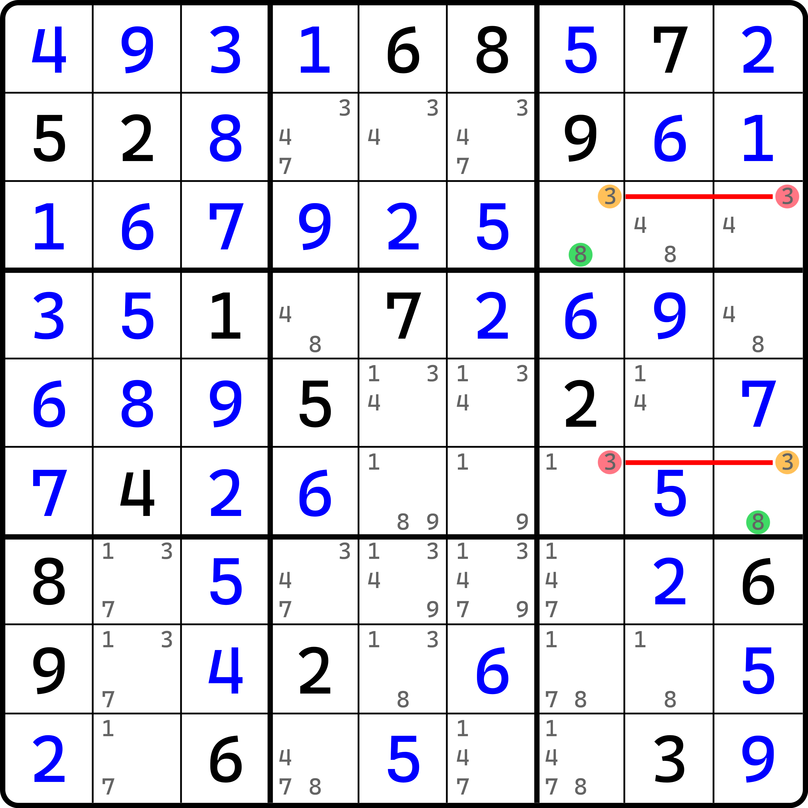
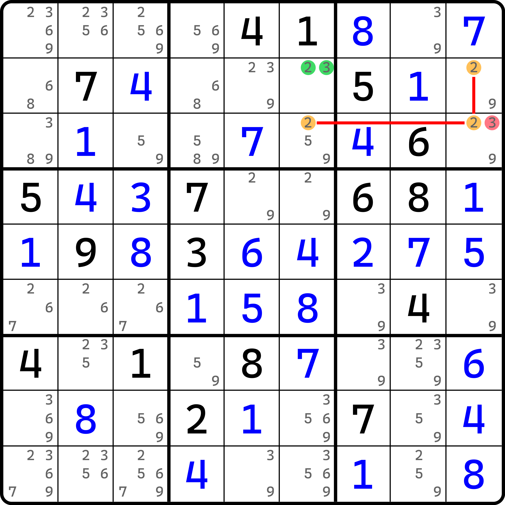

---
description: Incomplete Unique Rectangle
---

# 残缺唯一矩形

前面的内容我们介绍了唯一矩形的一些常见推理思路，搭配了区块、数组和共轭对三种不同的逻辑，产生了一共有 6 种不同的用法。

由于唯一矩形也拥有残缺状态，所以本文将对前面的类型展示各种残缺状态的唯一矩形。每一个例子都希望你自己推理，不过我也会给予一小部分提示文字或必要的信息帮助你理解它。

## 类型 1 

先来看残缺的类型 1（标准的类型）。这个类型在解释唯一矩形存在残缺为什么推理仍然有效的那一部分内容里已经展示过一个例子了，不过这里还是继续展示一下。

<figure><figcaption>
残缺类型 1
</figcaption></figure>

如图所示。可以明显发现，删数少了一个数。因为唯一矩形的基本推理需要三个格子都有两个候选数，显然他们是不能残缺的（不然就成唯一余数了），所以只能残缺到删数上去。

但是，我们之前说过，残缺不影响推理，因为这些缺少的候选数在唯一矩形里奏效的本质原因是，他们可以被补回去，毕竟唯一矩形是“形成了闭环”的，这使得它删除的候选数必定是之前遇到过的候选数、初盘肯定存在的候选数。

这题缺少了候选数 `r3c4(2)`，补回去后就是标准的类型。

## 类型 2 

<figure><figcaption>
残缺类型 2
</figcaption></figure>

如图所示。这题残缺的数字是 `r3c8(5)`。

## 类型 3 

<figure><figcaption>
残缺类型 3（显性数组）
</figcaption></figure>

如图所示。这题缺少的数字是 `r1c2(6)`。

## 类型 4 

<figure><figcaption>
残缺类型 4
</figcaption></figure>

如图所示。这题缺少的候选数是 `r6c6(9)`。和类型 1 一样，也是缺少一个删数。

不过这题稍微特殊一些，因为缺少了一个删数后，9 似乎看起来就只能有一处合理的摆放了，无法形成唯一矩形后续的“交换态”，就无法产生两种填法。实际上这些都不是问题，因为 9 是可以补回去的，所以补回去仍然有两个地方可填 9。它只是因为被我们提前删掉看起来不能交换而已。

## 类型 5 

<figure><figcaption>
残缺类型 5
</figcaption></figure>

如图所示。这题缺少的数字是 `r7c3(5)`。

## 类型 6 

类型 6 由于主要依赖的是共轭对，所以缺少的数字可以多一个。

<figure><figcaption>
残缺类型 6（面目全非版）
</figcaption></figure>

如图所示。这题缺少的数字是 `{r3c9, r6c7}(8)`。这题缺了两个数字仍然不影响推理，我们来看看为什么。

因为我们起始点假设的是 `r3c9(3)` 或 `r6c7(3)`，所以可以直接得到的是 `r3c7 = 8` 和 `r6c9 = 8` 的结果。而因为此时 3 在 `r36` 都是共轭对的关系，此时剩下的一处单元格（如果 `r3c9 = 3` 是假设，那么剩下的就是 `r6c7`，反之亦然）必然因为共轭对的关系填入 3。此时，3 和 8 就会构成唯一矩形的矛盾。

可以从这个推理过程之中看出，它实际上连缺少的 8 都用不到。真要说用到没有，其实也是用到了，但是是在后面产生唯一矩形的矛盾的时候才需要补回去；中间产生 3 和 8 填数的过程是完全用不到的。

这便是类型 6 的神奇之处。

## 隐性唯一矩形 

<figure><figcaption>
残缺隐性唯一矩形
</figcaption></figure>

如图所示。这个题也因为用到两个共轭对，所以少了两个候选数：`{r2c9, r3c6}(3)`。

我们也是和前面一样，先讨论共轭对的摆放。可以看到，由于共轭对是垂直的，所以它只有两种填法：

* `r3c9` 填 2；
* `r2c9` 和 `r3c6` 同时填 2。

如果是第一种情况，则可以直接因为占位而删除 `r3c9(3)`；而如果是第二种情况，则因为 `r2c6` 只有 2 和 3 的关系，所以它只能填 2，然后为了规避唯一矩形产生矛盾，所以仍然可以得到 `r3c9 <> 3`。

所以这个题的结论在残缺状态下仍然是可以得到的：`r3c9 <> 3`。
