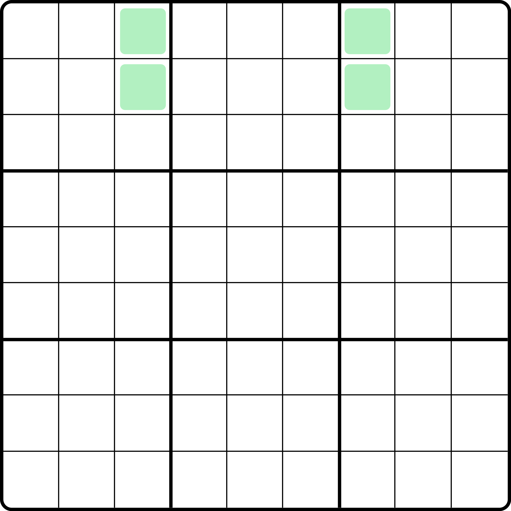
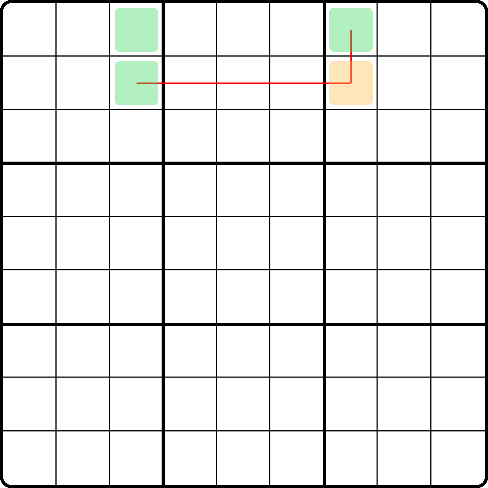
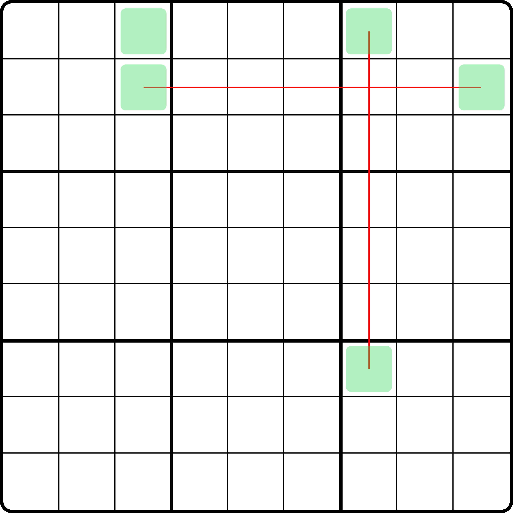
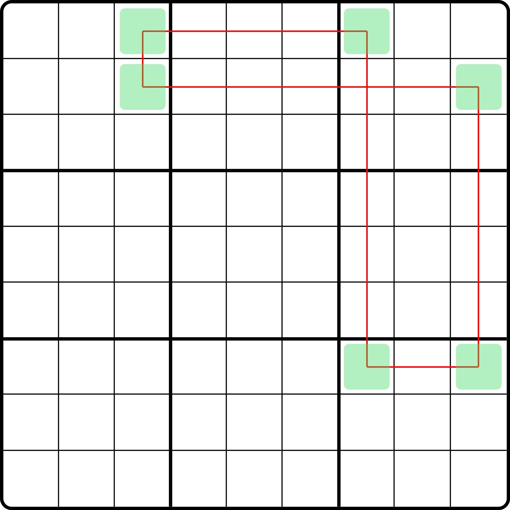
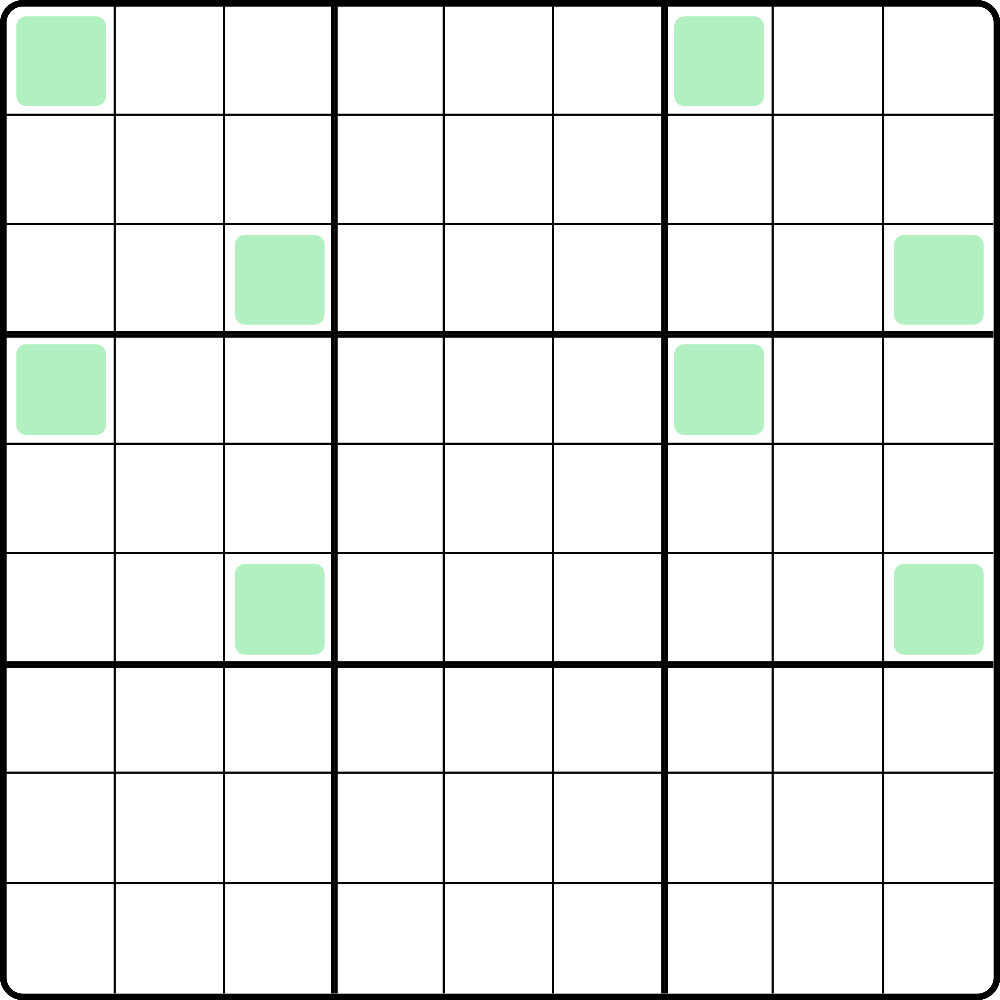
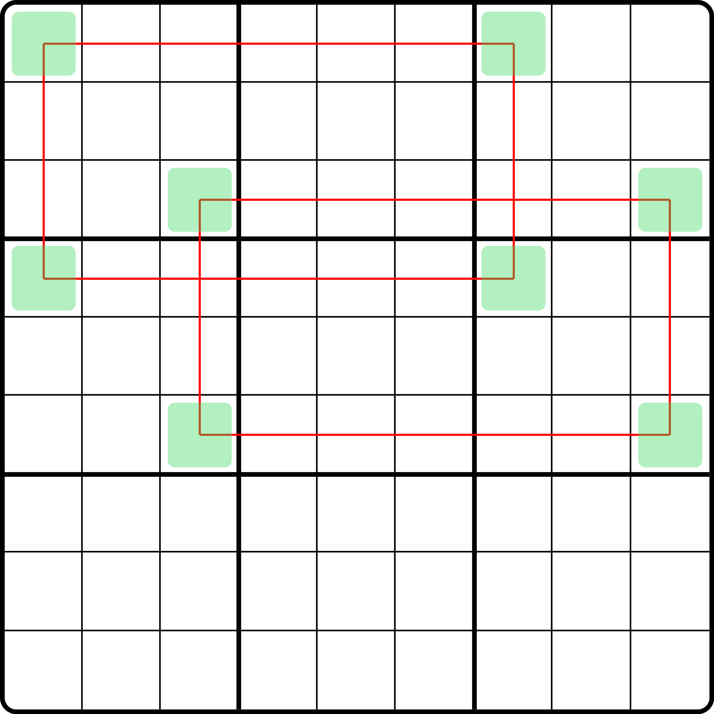
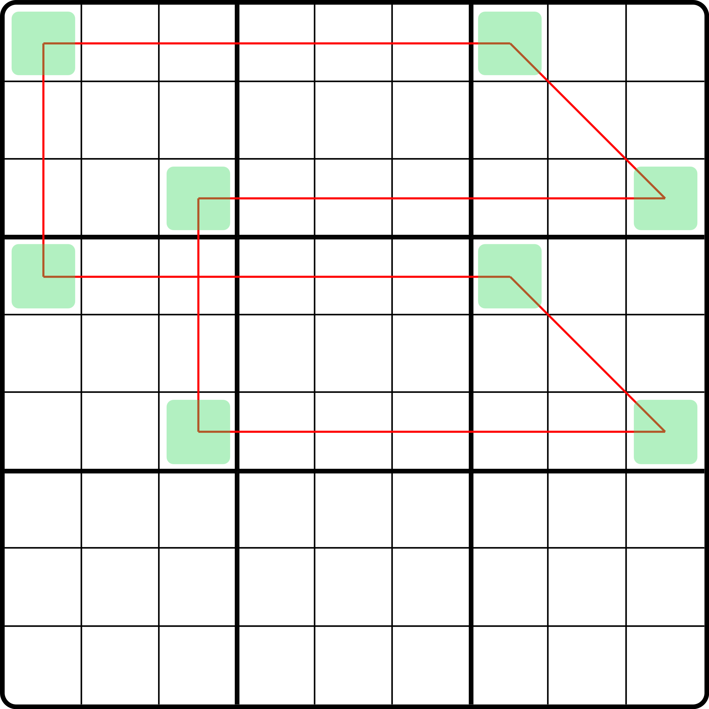
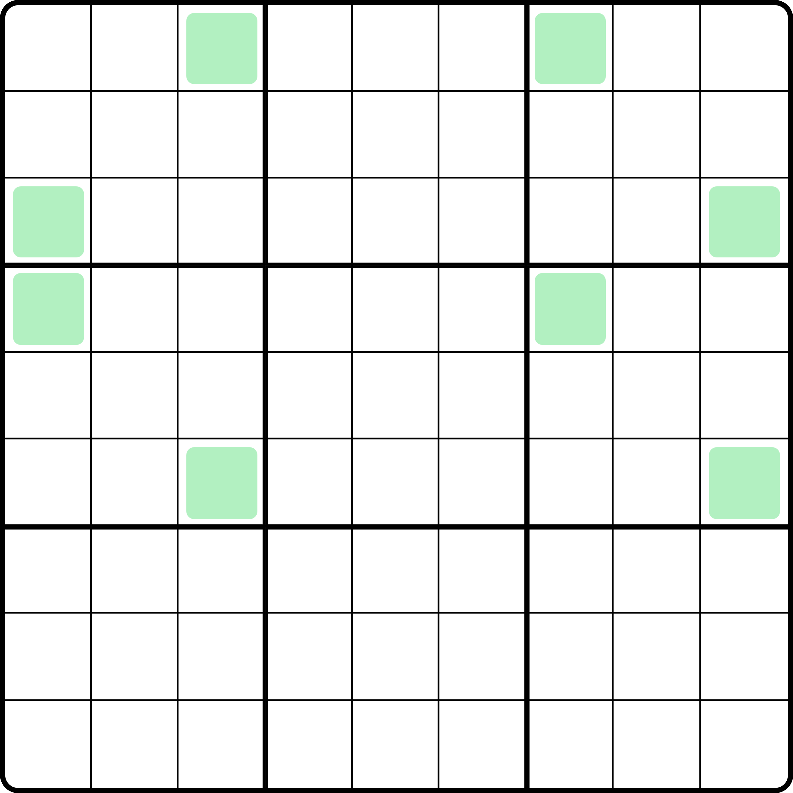
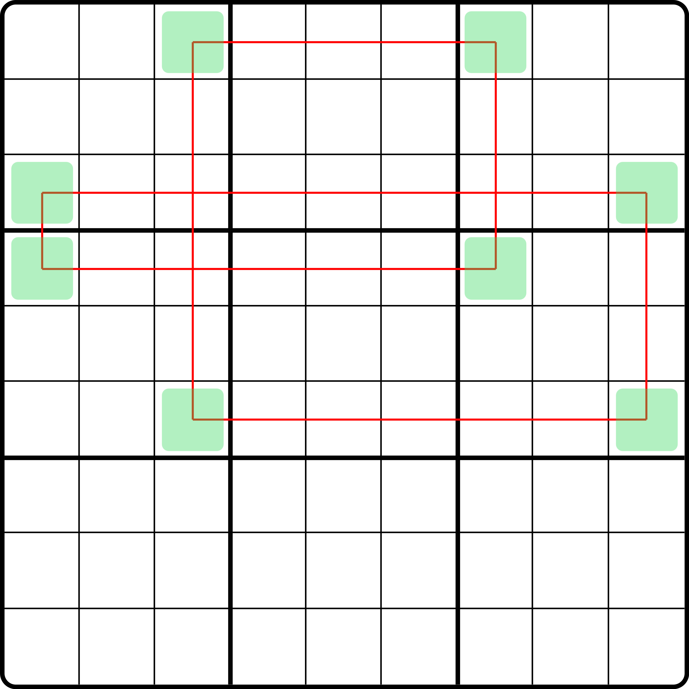
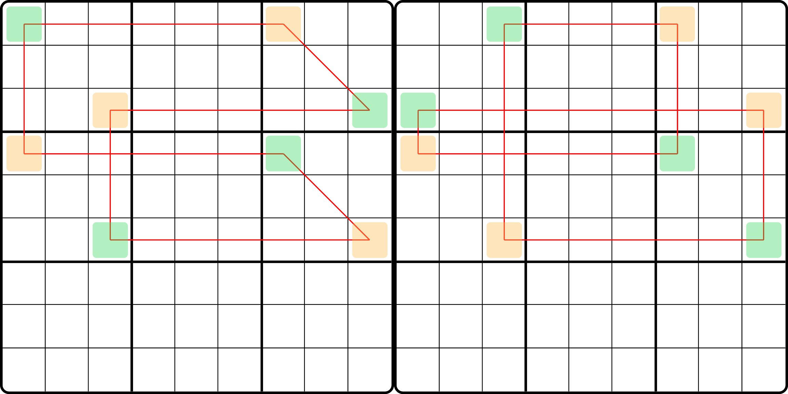

# 唯一环的形成条件

前面的内容我们简单说明了唯一环的四种基础类型。为了更好帮助你阅读后面规格推广的其他情况，我们这里给各位介绍一下唯一环的一些需要解答的、比较难思考的问题。

## 一些简单的思考 

前文我们给各位展示了四个类型。但是前三个例子都是在并排的三个宫里，而只有类型 4 的 6 个格子相隔会比较远一些。

这不免会让我们引起怀疑：这样的结构到底有什么形成条件？或者换句话，唯一环到底需要满足什么样的条件，环才能形成并引发矛盾，才能使用类型 1 到 4 的各种推理逻辑得到正确的结论。

首先，它得是偶数个单元格构成。这肯定是必需的。

其次，它需要让结构形成一个完整的闭环。所谓的闭环，指的是结构的所在行、列、宫不能有任何一个区域遗漏，即结构用到的格子分配到每一个出现的区域的时候，有一个或一些区域上只有一个单元格。这种摆明了就是放的时候填不同的数就会直接造成不同的影响。

第三，摆放的时候需要规避内部出现填数的矛盾。这看起来是一句废话。实际上唯一环要形成闭环，即使你用到的格子数是偶数个，它仍然会出现内部矛盾。

下面我们针对于这三点说明一下。

## 基础条件：闭环和行列宫数量均等 

先是一个基础条件。

**唯一环必须要使用偶数个单元格（假设有** $$2n$$ **个单元格），两两同行列宫相连形成闭环，且整体结构用到** $$n$$ **个行、**$$n$$ **个列和** $$n$$ **个宫。**

前面的部分比较好理解。重点是最后这部分必须 $$n$$ 个行列宫怎么来的。

你可以仔细对比前面介绍的题，就可以明显发现到，因为结构内部使用的是显性数对，所以一个区域下只能有两个单元格。

我们从唯一矩形的 4 个单元格入手思考。我们每次拓展两个新的单元格到结构里，不管形不形成闭环，但因为加的两个单元格本身会形成显性数对，所以它必须是单独的一个区域的两个格子，而不能是前面四个格子用到的行列宫。

一个唯一矩形用到 2 个行、2 个列和 2 个宫。当我们需要扩展结构时，我们需要拿掉唯一矩形的其中一个“角”，然后将其从外部拓展出两个单元格并嵌入结构里，最后再加一个格子构成闭环回路。

这里解释一下这个说法。所谓的“拿掉”，是为了去取消唯一矩形的闭环。拿掉哪一个无所谓，这里是讨论其理论构造，所以四个单元格拿掉哪一个其实都是一样的。如图所示：

<figure><figcaption>
示意图 1
</figcaption></figure>

然后，拿掉其中一个位置。比如这个 `r2c7`。

<figure><figcaption>
示意图 2
</figcaption></figure>

由于我们拿掉了其中的一个单元格，而它一定会有两个单元格和它成边，如图里画出来的这两条边的连接。

那么，我们此时要干嘛呢？构成更大的闭环。所以我们需要找两个单元格，一边连一个。对这个结构而言，因为 `r1c7` 和 `r2c3` 分别在 `c7` 和 `r2` 上都只有一个格子了，于是我们需要在这俩区域下追加新的单元格。

比如，我们把格子加在 `r7c7` 和 `r2c9` 上。

<figure><figcaption>
示意图 3
</figcaption></figure>

如图所示。好了。我们发现，因为补充的两个单元格他们互相虽然没有啥关系，但是他们摆在结构里就立刻规避了裸露出来的 `r1c7` 和 `r2c3`。此时，新添加的这两个单元格便需要闭环回去。

这很好加了。我们只需要找到 `r7c9` 即可。这一个单元格一旦加上去，两边的单元格都能形成闭环。于是，加上 `r7c9`。我们一共加上三个单元格，去掉原有的一个单元格，最终 6 个单元格就能形成新的闭环：

<figure><figcaption>
示意图 4
</figcaption></figure>

这样，唯一环就形成了。

而回顾一下刚才我们添加的逻辑。我们挖去了唯一矩形的其中一个角，然后加了三个格子。其中先加了两个格子在暴露出来的两个位置上，然后再加一个强行让新加入的两个单元格在结构里成为闭环。

所以总的步骤有三个：删除一个格子，多补充两个格子，最后再补充一个格子。删除一个格子会去掉一个行或列；而我们新加入的格子又会补回缺少行列的数量，最后形成闭环后，行列宫都会新增一个。注意，`r7c9` 这里和 `r7c7` 是刚好既在同一个行上，又在同一个宫里的。这里宫的计算别漏了。

所以，整个流程会新增一个行、一个列和一个宫。从原始唯一矩形入手我们就知道它本身使用的行列宫的数量就是一致的。那么每次新增加两个单元格，那么就会新增一个行、一个列和一个宫，数量仍然会保持一致。就这么一直延续下去，始终的行列宫数量都是一样的。

可以从补格子的逻辑上看出，这似乎只是一种补充方式。如果我们还在 `b123` 里选格子的话，那么补够 6 个单元格所导致的最终效果其实是一样的，不过这里就不赘述了。

这就是我想说的第一点。

## 特殊条件：无解规避 

在这个补充过程之中，我们难免会遇到一种构造。它只会在 8 个单元格或以上的时候存在，所以这个问题比较难以想到。

考虑一个 8 个单元格的闭环：

<figure><figcaption>
8 个单元格的闭环
</figcaption></figure>

如图所示。这只是 8 个单元格形成闭环的其中一种特殊摆放形式。不是说 8 个单元格必须摆成这样。这里要拿这个特殊摆放形式举例。

这个摆放你认为它形成闭环的方式是什么呢？还能只用行和列吗？似乎不行。如果只用行列连线的话，看起来就会有两个闭环了：

<figure><figcaption>
8 个单元格的闭环的连线（错误）
</figcaption></figure>

这肯定是不对的。因为两个闭环两两是相邻了，但它没有考虑到宫内连接的关系，因此被拆成了两个闭环。我们要用闭环，本质是为了让两两单元格相邻关联起来。图上这样并不会把所有 8 个单元格都关联起来——它只会一次关联 4 个。

所以正确的连法是什么样的呢？这里要用宫的连接方式了。当然，它也不是唯一的连法，这里画一种：

<figure><figcaption>
8 个单元格的闭环的连线（正确）
</figcaption></figure>

这样就可以两两相邻的单元格配对连线成闭环了，而且也满足前面的基础条件限制（8 个单元格，用到 4 个行、4 个列和 4 个宫）。

不过，说这个是干嘛呢？说这个是告诉各位，8 个单元格开始，这种结构会有一个特殊现象。我们尝试把其中一个宫里的两个单元格给扭转一下。例如 `b1`，我们把 `r1c1` 和 `r3c3` 改成 `r1c3` 和 `r3c1`。这样扭转一下。

<figure><figcaption>
扭转后的 8 个单元格
</figcaption></figure>

这样扭转不会改变用的行列宫的数量。因为它横纵并未发生变化；而扭转也不会超出宫的范畴，所以宫的数量也不变。不过，连线会稍微变一下。

<figure><figcaption>
扭转后的 8 个单元格的闭环连线
</figcaption></figure>

看起来甚至都不用宫的连接了。这似乎也没毛病。

所以，它同时也满足我们刚才的闭环，偶数个单元格以及出现行列宫数量均等这些条件。那么它是唯一环了吗？

不是。它不是唯一环。实际上，你在假设内部填数后会发现，这个结构在内部会直接出现矛盾。这点稍微麻烦一些，需要你手动尝试填数并得出矛盾。

尝试在盘面的这些单元格里按照我们找出的这个闭环按照两种不同的颜色进行交替涂色。如果我们能发现，图中仍存在一对单元格（两个单元格）同在一个行列宫里，却具有相同涂色时，我们就可以认为这种画法是无解的。

为了不牵扯到复杂的图论知识，这里我尽量不使用图论的说法来给各位解释。先举个例子。前面的两种结构下，按照我们给定的闭环路径进行两种颜色的交替涂色，我们可以看到，这两个结构里，后者确实会存在问题：

<figure><figcaption>
两种结构的涂色结果
</figcaption></figure>

如图所示。左图是之前的那个画法。我们发现，它怎么看都没有问题；但是右图却存在问题：虽然连线我们保证了交替涂色，但是在同一个宫里，却有相同的涂色。

如果你还没有明白涂色的本质含义的话，那我不妨说得更直白一些。这里的两种颜色的涂色就意味着唯一环里填入的那两种数字。交替涂色的本质也就是交替地填入唯一环用到的两种不同的数。涂色的不同意味着填数的不同；涂色相同也就意味着填数的一致。那么我们可以看出，左图在任何地方都没有任何问题，哪怕是在宫里尚未直接相连的部分（如 `b1` 里的两个单元格 `r1c1` 和 `r3c3`），涂色都是不同的。这不会造成冲突；但是右图会引发问题：交替涂色后，所有四个宫内，涂色都是完全一样的。

我们严格要求涂色不相同，哪怕宫里这种不在连接闭环上的路径也不允许有相同的涂色，主要是为了保证最终填数在任意的行列宫都不会造成填数的矛盾。而显然右图他不满足这一点，因此，右图并不能称为唯一环。

这便是为什么，扭转了一个宫的情况，唯一环就不再成立的原因。

这里我需要补充一句。可能细心的读者会察觉到一个问题。似乎我并未严格从某一个单元格开始假设，这是否会影响到最终填充颜色和矛盾的造成。其实是不影响的。这一点可以由唯一环本身的基础定义保证。它必须是偶数个单元格构成，这意味着相邻的单元格按照沿线涂色，那么必定只能不相同。所以你最终能涂出来的，只可能有两种情况：和我完全一样，以及和我上图给出的涂色完全相反（绿的变黄，黄的变绿）。

而颜色完全相反的情况，和颜色完全一致的情况显然是从同一个填法所派生出来的两种填数模式，因为本质上只是把数字给换了一下，但在假设期间，我们并不知道具体填的是多少，所以填哪一个数作为第一种情况都行，只要我们知道换一个颜色就表示的是第二种情况即可。

而很明显的是，由于唯一环是不区分方向的，所以你可以沿着路径顺时针走一圈，也可以逆时针走一圈；你也可以从绿色的单元格开始，也可以从黄色的单元格开始。但不论你怎么开始，最终映射出来的填数情况也只会从前文描述出来的这同一种填法派生而来。所以，你任意从哪里假设都没有问题。就哪怕右图这种导致矛盾的情况，也只可能会产生出两种配色方案，其中另外一种方案则和我图上这个的配色完全相反。别无其他情况。

当然，这里有一丢丢不严谨。唯一环要想这么假设，它显然需要依赖一个规则，就是唯一环必须只存在一种这种闭环的画法。但是不难看出，左图这种唯一环其实是有按中心对称的另外一种连接闭环回路的。这也暗示了唯一环并不一定总是只有唯一的一种连接路径。但这并不妨碍什么。还记得我们最开始提到的错误唯一环连接方法吗？错误的连接把唯一环拆解为了两个闭环，每一个闭环只用到了 4 个单元格。虽然画法并不正确，但它暗示了一个规则。如果想要一个唯一环正常成立，那么它的所有这样的画法用到的格子数量也都得是偶数个单元格构成的。比如 8 个单元格拆解开后可以得到两个 4 个单元格的闭环；但右图却不能这么拆解。右图甚至你压根都找不着这样的闭环，最少的却会用到 5 个单元格，比如从 `r1c3` 出发可以得到的闭环：`r1c3` -> `r1c7` -> `r4c7` -> `r4c1` -> `r3c1`，然后再从 `r3c1` 连回 `r1c3`（这里就不单独画出来图片了）。用到奇数个单元格意味着你按照前文的涂色方案就会立马不成立：因为是奇数个单元格，所以交替涂色会使得最终头尾两处涂色完全相同。而这个闭环的任意相邻两个单元格一定在同一个行列宫，所以涂色相同意味着同一个行列宫内填入了重复的数字。这必然会矛盾。

所以这便是更为底层的规则：**唯一环成立需要规避无解的话，还需要找出唯一环的所有内部的闭环（不一定用完全部的单元格，只需要满足相邻连接的单元格在同一个区域，然后形成闭环即可）。如果存在至少有一个闭环是奇数个单元格长度的的话，那么唯一环照样不成立**。

## 总结 

总之，唯一环要形成，需要满足如下的一些条件：

* 偶数个单元格；
* 两两相连成闭环（相连的格子必须同在一个行列宫里）；
  * 这一点有了之后就一定会是 $$n$$ 个行列宫，不用把它当成条件再说一遍
* 用两种颜色交替涂色的方式验证内部填数是否不矛盾。

下一讲内容我们来看更高规格的唯一环的情况。
