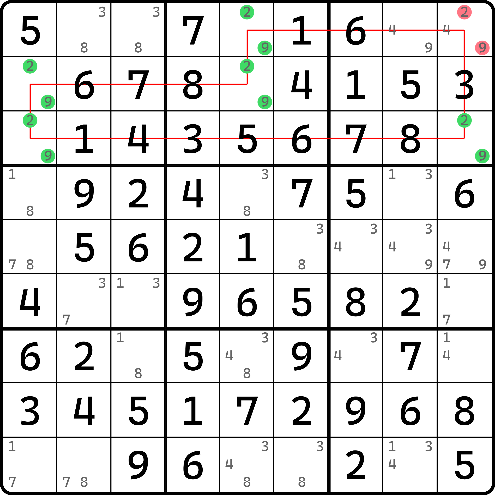
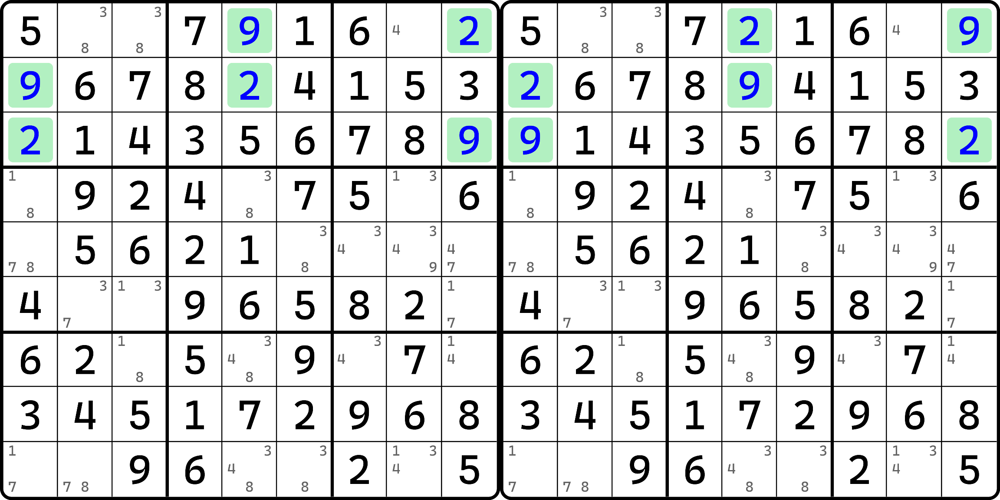
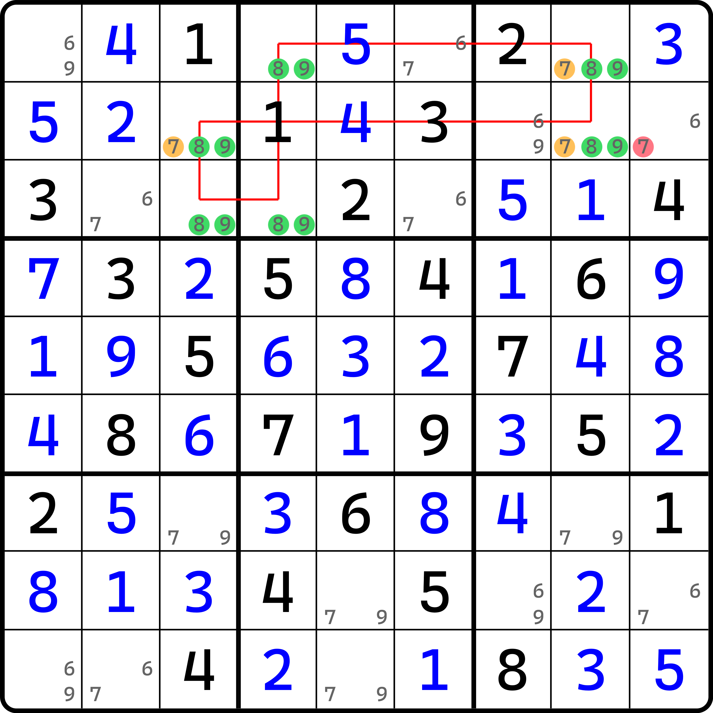
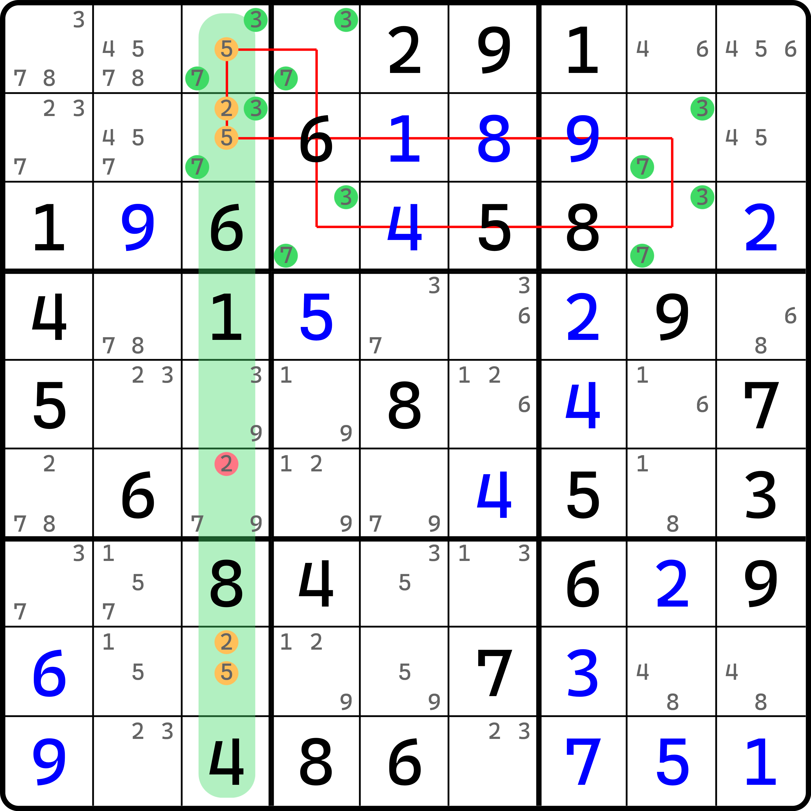
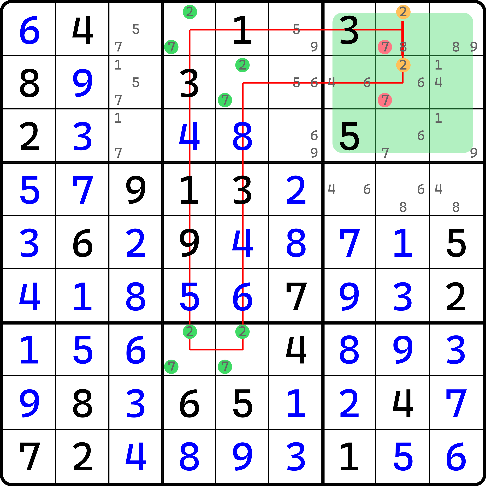

---
description: Reasoning of Unique Loop
---

# 唯一环的基本推理

## 类型 1 

<figure><figcaption>
类型 1
</figcaption></figure>

如图所示。我们把唯一矩形的结构从 4 个单元格拓展到 6 个单元格，但是思路没有多大的变化。

假设我们让其中的 `r1c9(4)` 不存在，则它也会只剩下 2 和 9，于是按照图中的环线按次序填数。可以看到，环线上每相邻的两个单元格都是同行、同列或者同宫的，因此相邻的单元格肯定不能填入相同的数字；其次，因为是 6 个单元格，是偶数个单元格，也就意味着我们填满全部的单元格后，2 和 9 会交替形成环状填数结构，而不会出现两个相邻单元格最终填数一样的情况。

这是这个推理的核心点。因为它会构成关于 2 和 9 的交替填数模式，所以它不会自动出现矛盾；正是因为这点，我们可以将这 6 个单元格里，所有填入 2 的位置都改成 9，而所有填 9 的位置又改成 2。这样我们就可以得到第二种填法。

和唯一矩形的思路一样，当我们填充了这些 2 和 9 后，由于结构的特殊性，所有用到的 9 个区域（即 `r123`、`c159` 和 `b123`）在未填写数字前，都有 2 和 9 的显性数对结构。因此内部填入 2 和 9 并不会改变本身显性数对所产生的结论（所在行列宫的别处都不能填 2 或 9）；而别处其他的空格也都不会因为 2 和 9 的填写而产生任何的影响。

这一点很重要，它和唯一矩形除了规格上不同，其他地方则完全一样。得到这一点后我们就可以知道，这个结构它也能形成和唯一矩形一样的两种填法，而不影响盘面任何其他的地方的候选数的变动，所以，这种结构也可以形成那种矛盾。就像这样：

<figure><figcaption>
产生矛盾的两种填法
</figcaption></figure>

于是，假设就并不成立。我们最初的假设是让 `r1c9(4)` 不存在（换言之就是 `r1c9` 只保留 2 或 9 两个候选数）。既然它不对，那么对的结论就自然是 `r1c9 <> 29` 了。所以，这便是这个技巧可以得到的结论。

我们把这个结构称为**唯一环**（Unique Loop，简称 UL），即唯一矩形从结构上的推广；而由于它和唯一矩形类型 1 非常相似，所以我们把这个结构称为唯一环的类型 1。

下面我们来看下类型 2、3、4。

## 类型 2 

<figure><figcaption>
类型 2
</figcaption></figure>

如图所示。因为本身唯一环结构用的格子就先天比唯一矩形要多，所以唯一环就不分所谓类型 2 还是类型 5 了，统统都归纳在类型 2 里。

假设橘色的三个候选数 7 全部从盘面里消失，则 6 个单元格将只剩下 8 和 9 两种候选数，因为前文对其简要说明过它是会矛盾的，所以这里我就省略过程了。

由于它会形成矛盾，所以三个橘色的 7 不能全部消失；换言之就是说至少有一个是正确的填数。那么，我们可以得到的是 `r2c9 <> 7` 的结论——只有这个位置进行假设填入会同时让三处 7 全部消失。

我们把这个用法称为唯一环的类型 2。

## 类型 3 

<figure><figcaption>
类型 3
</figcaption></figure>

如图所示。`r1c3(5)` 和 `r2c3(25)` 三个候选数不能同时从盘面里消失，否则会出现矛盾。所以我们只能拿出其中一个数，和 `r8c3` 搭配起来构成显性数对。

所以这个题的结论就是，`c3` 会形成显性数对，删除掉 `r6c3(2)`。

这个就是类型 3 的用法。

## 类型 4 

<figure><figcaption>
类型 4
</figcaption></figure>

如图所示。我们发现 `b3` 里存在关于 2 的共轭对，且恰好在结构用到的其中两个单元格上。

如果我们尝试往这两个单元格的其中任意一个填入 7，则沿着环线绕一圈得到 2 和 7 的填数。最终 `r12c8` 起始假设的另外一边因为 2 的共轭对的关系，必须填 2，于是就会出现矛盾。

所以这个题的结论就是 `r12c8 <> 7`。我们把这个称为类型 4。

鉴于结构的特殊性，唯一环也就不分什么类型 6 和隐性唯一环了。所以到这里就说完了唯一环的四种情况。
