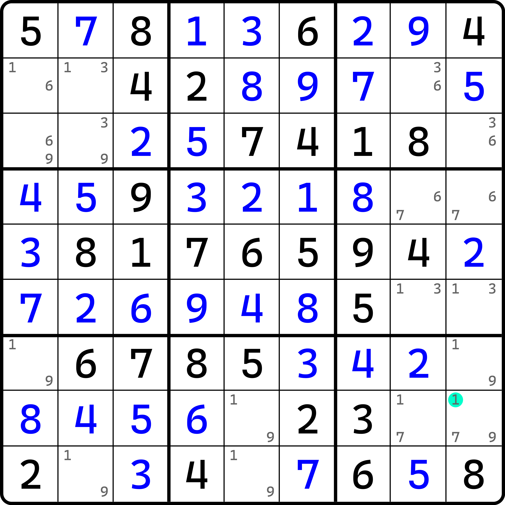
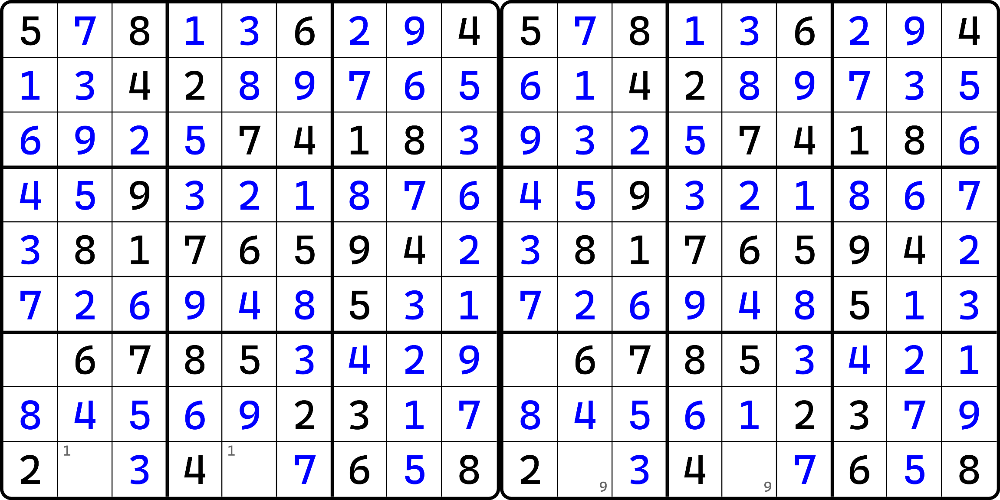
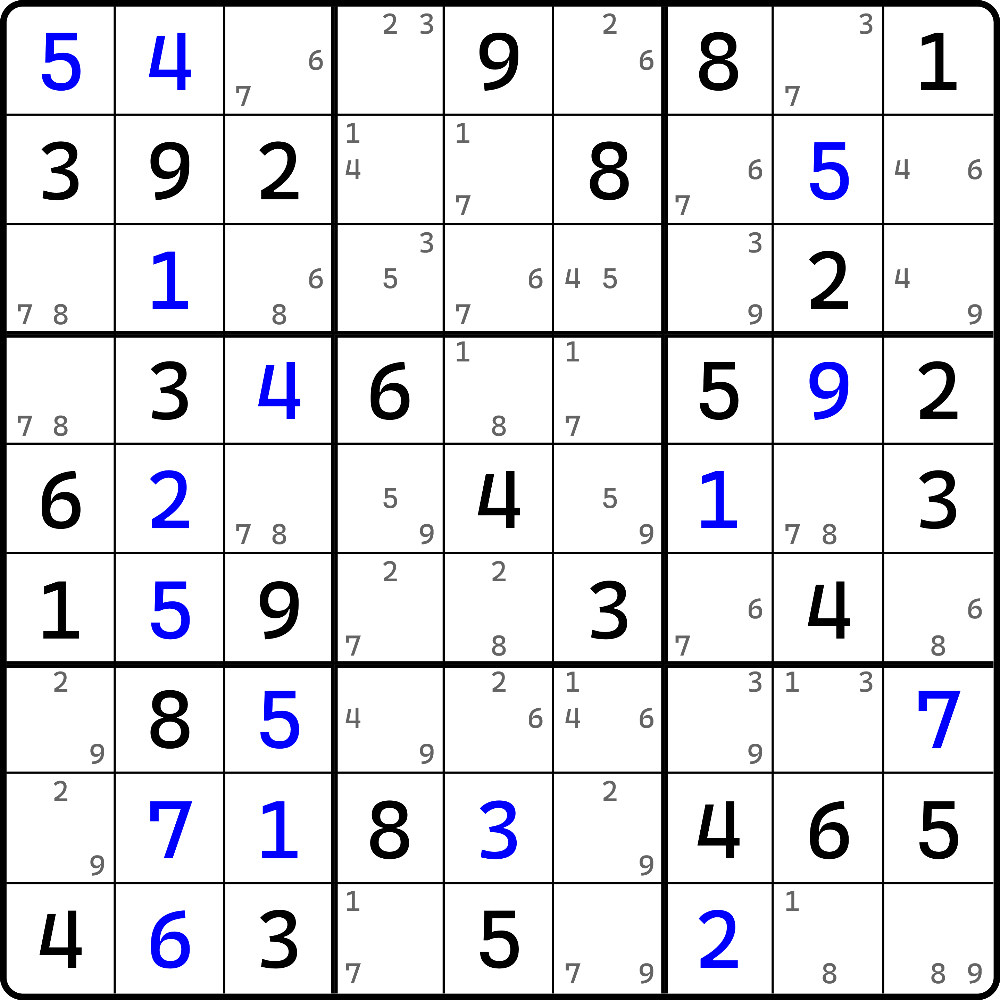
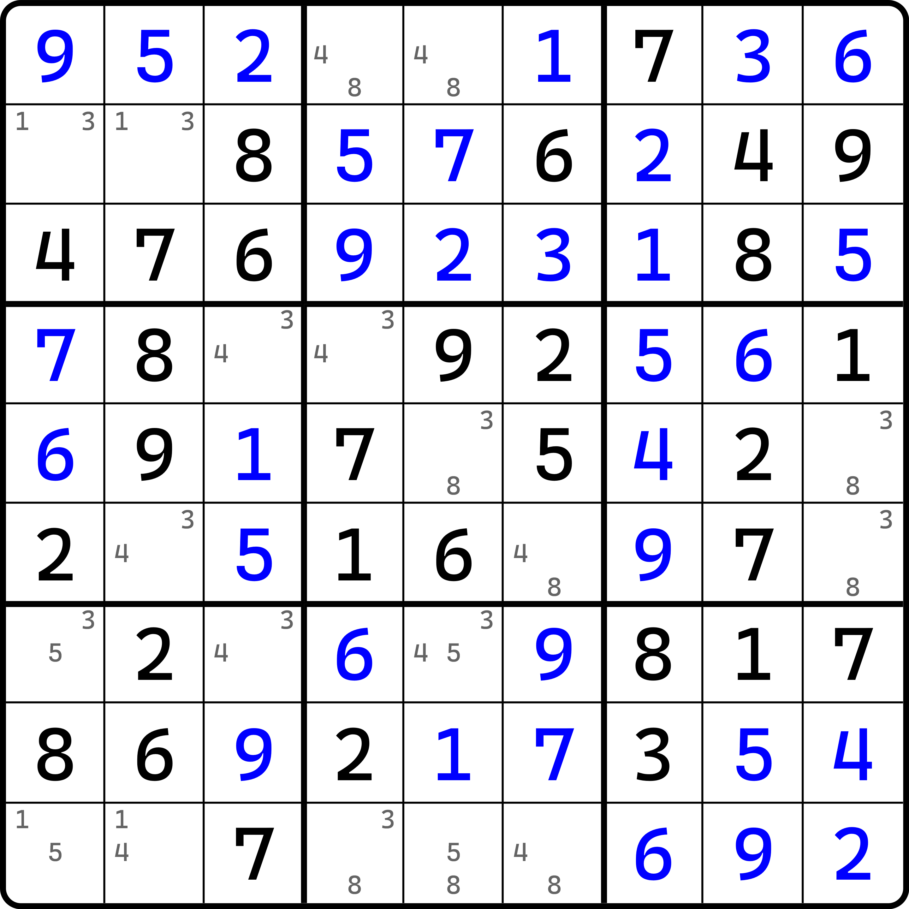

---
description: Reasoning of Bi-value Universal Grave
---

# 全双值格致死解法的基本推理

别被标题给吓着了。这个技巧的名字确实有些长，这是因为我没有找到一个合适的翻译这个技巧的、而且还能比较简单的名称。

我们还是先来看看这个技巧的推理逻辑吧。

## 推理过程 

<figure><figcaption>
类型 1 例子
</figcaption></figure>

如图所示。我们时不时在做题的时候会遇到这种匪夷所思的题目状态，导致我们无法进行下去。这样的盘面一般都具有如下的两个特征：

1. **所有空格都只有两个候选数**（不过有一个单元格会多一个候选数出来作为特例存在）；
2. **对于每一个候选数而言，他所在的行、列、宫，对于这个数字来说都会出现恰好两次**（不多也不少，而且还是每一个行、列、宫都是两次，不是“或”的关系，是“且”的关系，即对这个数而言，它所在的行、列、宫全都是共轭对）。当然，第二点的特例也存在。落在唯一的这个三个候选数的格子里，有一个数就会同时在行、列、宫上出现三次。

虽然我们还不知道为什么，但是很显然，这个特殊不满足条件的候选数肯定有猫腻。我们不妨假设它不存在。对于这个题来说，不满足的这个候选数是 `r8c9(1)`。

如果 `r8c9 <> 1`，那么所有候选数将全部满足前面两点提到的特征，没有任何特例。我们可以思考一下。由于第二点的出现，倘若我们给任何一个单元格填上一个数字，因为行、列、宫都出现两次的缘故，所以这个数只要填上一个，那么另外一端就必然不能填这个数。而结合第一点，我们又可以知道，因为另外一端不能填这个数，所以这个格子就只剩一个可填的数了。

结合这两点，我们就会引起牵一发而动全身的效果：填一个数，引起所在行列宫的另一端不填这个数，于是填另外的一个数；然后这个数又会引发它自己所在的行列宫的另一端不填这个数，于是又填别的数。这样两点连续交替循环着这么一直往下填写数字。

举个例子，`r2c1` 此时有两个候选数 1 和 6。我们填入 1 的话，盘面会引发前面的循环交替逻辑，一直往后填写数字的逻辑，并会产生一种盘面的填数效果，最终得到一个盘面；而我们如果填入 6 的话，因为这个单元格的填数和第一个情况的假设不一样，所以起点的引发交替填数的状态也会跟着变化，所以这么循环着填写，将会产生另外一种盘面的填数效果，最终产生另外一个盘面。

我们先不管这么做能不能填出来答案。但对于这样两个特征而言，它取决于我们选取的格子和数字。但很明显，最初我们假设 `r8c9 <> 1` 之后，所有数字近乎可以说是没有任何的区分，所以这两个填数状态所产生的盘面应该不会存在其中只有一个是合理填法，另外一个不合理的情况。要么它俩都合理，要么它俩都不合理。这里的合理说的是填数内部会不会引发违背数独规则的矛盾出现（如同行列宫出现两个相同的数字填数啥的）。

这一点很重要。因为一个题目只会有唯一解。换言之，每一个空格不管怎么去做，最终都只会存在一个正确的填数。既然如此，前文所描述的两个填法就不可能都合理：因为起始假设的数字本就不一样，产生的两个盘面就自然不可能都合理了（都合理的话，这题就俩答案了）。所以，既然不能都合理，那么就只可能都不合理了。

不合理意味着内部总会存在矛盾，所以既然两种填数模式都不对的话，那原假设 `r8c9 <> 1` 就根本不可能正确。如果你还是没明白，那你就顺着再理一遍逻辑：如果假设是对的，那么我们能得到这两种模式的填数都对的结果（因为他俩只可能都不对或都对）。但是都对意味着题目出现至少两个填法，这是违背数独唯一解的规则的，所以就矛盾了。

所以，原假设不成立。既然 `r8c9 <> 1` 是错的，那么它的对立面就肯定是 `r8c9 = 1` 了。所以这个题的结论就是 `r8c9 = 1`。

我们把这个推演的逻辑称为**全双值格致死解法**（Bi-value Universal Grave，简称 BUG）。从名字上可以看出，由于我们假设不填某一个候选数后，会引发全盘都是两个候选数的状态，进而出现矛盾（致死）的现象。另外，技巧名里的**双值格**（Bi-value Cell）是一个术语，指的是单元格只有两个候选数的情况。换言之，前面两点可以通过术语改一下描述变为这样：

1. 所有空格都是双值格；
2. 所有候选数所在行、列、宫均存在跟这个数绑定的共轭对。

这样就简单不少了。

## 问题解答 

下面针对于前面的推理解答一些常见问题。

### 问题 1：我还是想看看怎么矛盾的 

当有些时候你无法只凭借理论得到你想要的答案时，你就会提出这种问题。显然你并不相信前面的理论是合理的。那么我们来看看为什么会引发矛盾。

<figure><figcaption>
前面两种填法引发的矛盾
</figcaption></figure>

如图所示。这是前面那个题。我尝试去掉了 `r8c9(1)` 后，填入了 7 和 9 并产生了这样两个盘面。很显然，在假设期间，我并未针对于题目具体哪一个单元格作为起始点假设作限制，所以前面举例用的是 `r2c1` 来说的，不过这里我们还是拿 `r8c9` 来作为起始点假设会稍微好理解一点。

很明显我们可以发现到的是，`r9` 此时不论是哪一个情况，都无法继续填入合理数字——因为 `r9` 的 1 和 9 总是会出现矛盾（要么填不进去，要么就是填两次）；更有甚者（点名 `r7c1`）甚至都没有合理的候选数可填了——本该填 1 或 9 的，但因为列上已经出现这个数，所以这个空格此时没有任何正常的候选数。

这便是我想说明的点。两个盘面的假设过程是被我们初始时控制了的。我只是单纯要求你必须假设的两个填法的起始单元格一致。这个点也很重要。因为假设一致才能控制变量。如果起点都不一样，你很难（甚至可以说不能）得到“两个情况都对或者都不对”这个说法是否成立。

### 问题 2：为什么特例的那个候选数在行列宫必须都出现三次？ 

可能你已经发现，最后余下的那个特例（也就是最终正确的那个候选数），它在所在的行、列、宫上均出现了三次。这个“且”的关系非常奇怪。为什么这个技巧会存在这么个现象？

其实你自己思考片刻也能想出答案。如果我们把他去掉，它才能引发前面这一大堆描述，才能产生矛盾的话，这个数还真就必须出现三次。因为把它从盘面里去掉的话，相当于让这个数字所在的行、列、宫都同时少出现一次。要使得全盘所有候选数均出现两次，显然它的初始存在的状态就必须都出现三次才行。如果其中有一个区域不是三次的话，当我们去掉它时，就不能保证这个数在这个区域上还剩下两次可填位置的这么一个说法，于是，这个技巧就不能正常使用了。

### 问题 3：我想看看不满足这个技巧推演的盘面长啥样 

是的。我觉得你凭空很难想出这种盘面的长相。下面我带你看看，什么样的盘面不能使用这个技巧。

<figure><figcaption>
第一个不能用这个技巧的例子
</figcaption></figure>

这是第一个例子。可以看出在，这个题确实满足第一点要求。但第二点似乎并不满足：数字 9 在 `r7` 上出现了三次，但出现的位置并没有正常落在**三值格**（Tri-value Cell）上，即 `r7c6`。

很显然的是，因为这种摆放的特殊性，它并不满足第二点。数字 9 在行上出现了三次，但对于 `r7c1` 来说，数字 9 在列和宫里却只出现了两个 9。但它行上却有三个，而并不是最初所说的全都两个。

如果我们还是继续使用这个技巧会如何？会发现我们推演不下去——我们甚至都不知道假设的那个数、从盘面里消失的那个候选数到底是哪一个。就哪怕我们认定这个 `r7c1(9)` 是我们要去掉的数，那么我们尝试让它从盘面里消失，那么此时 `c1` 会只有一个 9，这不就直接成排除法了么。然后？然后还推理啥啊，直接填数就完事了。根本就遇不到后续我们想要造成的“两种牵一发动全身”的填数模式。

这是一个例子。我们再来看一个例子。

<figure><figcaption>
第二个不能用这个技巧的例子
</figcaption></figure>

如图所示。这个题看起来正常了不少，`r7` 上数字 3 确实出现了三次，而也确实存在三值格 `r7c5`。似乎看起来这个多出来的 3 一定会在 `r7c5` 上。其实不然。可以看到，在 `c5` 上，数字 3 仍然就只出现了两次，并没有出现三次，还是两次。

所以总体来说，只要不满足前文两点的任意一点的，都无法使用这个技巧进行推理。当然，这个题实际上也确实比较特殊一些：`r9` 有关于数字 3 的行排除技巧的结论，然后？然后这个题后面就可以一直直观技巧做下去。

那么，看起来似乎这个技巧的形成条件非常苛刻，是否这个技巧的使用在平时做题之中并不常见呢？其实并不是。这非常反直觉。实际上，这个技巧在你完成一些难度较大的题的时候，反而比较常见。当你做到一个题卡住的时候、发现双值格非常多的时候，不妨停下来看看，是不是这个题可以用到这个技巧。而且，这个技巧有个特殊之处——因为我们最终得到的结果是确定的填数，因此在结论得到之后，后续就不存在任何候选数技巧了，全是直观技巧。

> 当然，这个说法仅限这种直接可以出数的情况。后面我们要介绍一些例子，由于它也利用了唯一解，所以它和唯一矩形这些技巧一样，也具有其他的类型。在那些类型下，这一点是不一定的。
