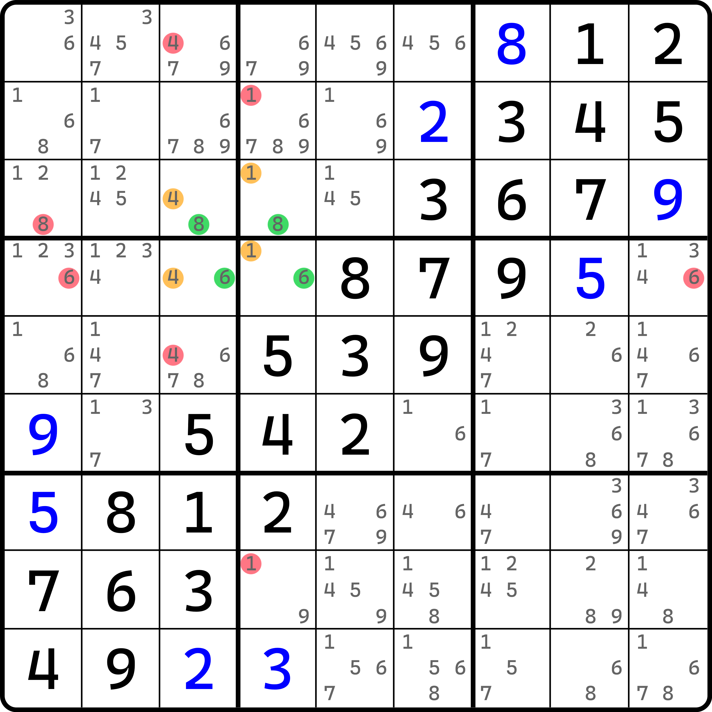
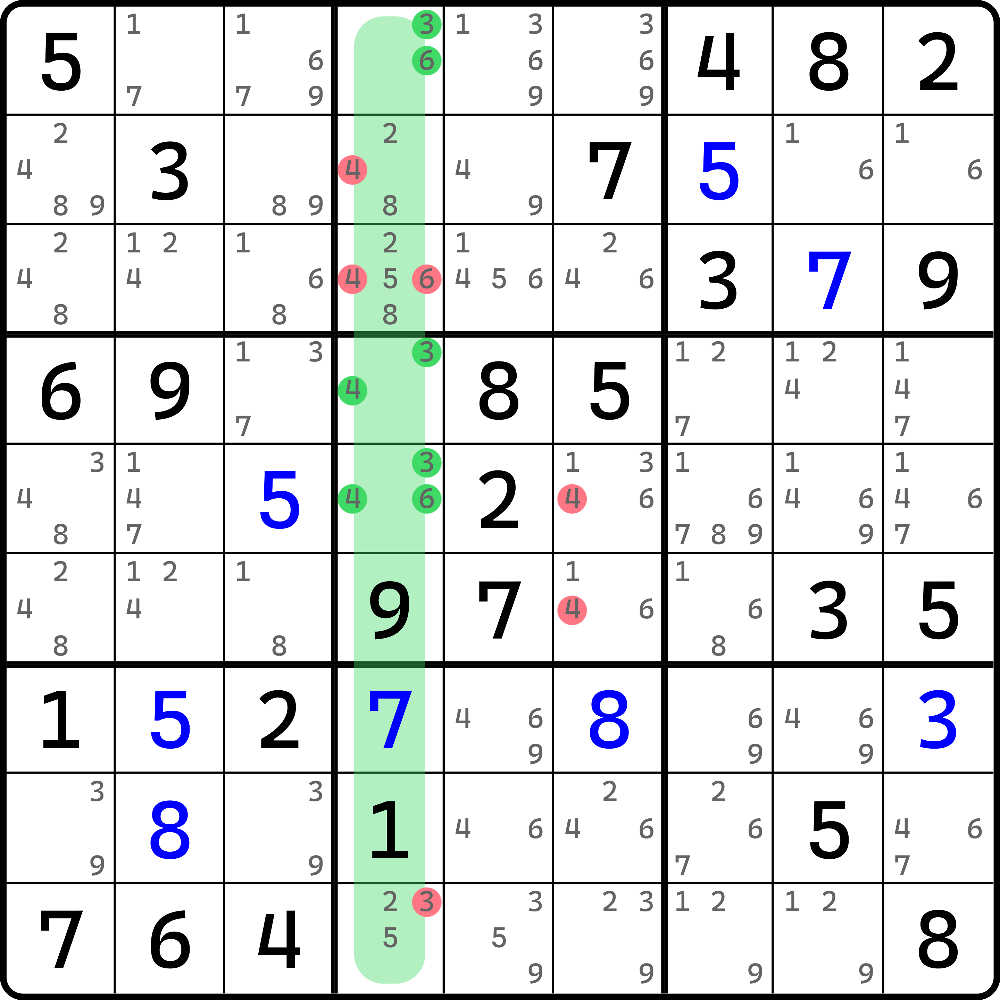
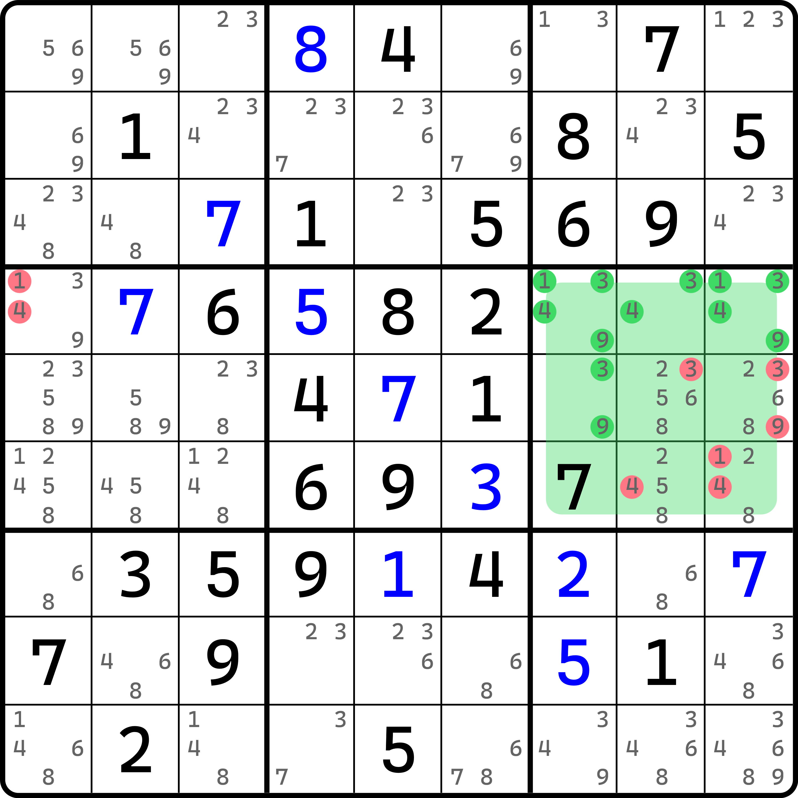
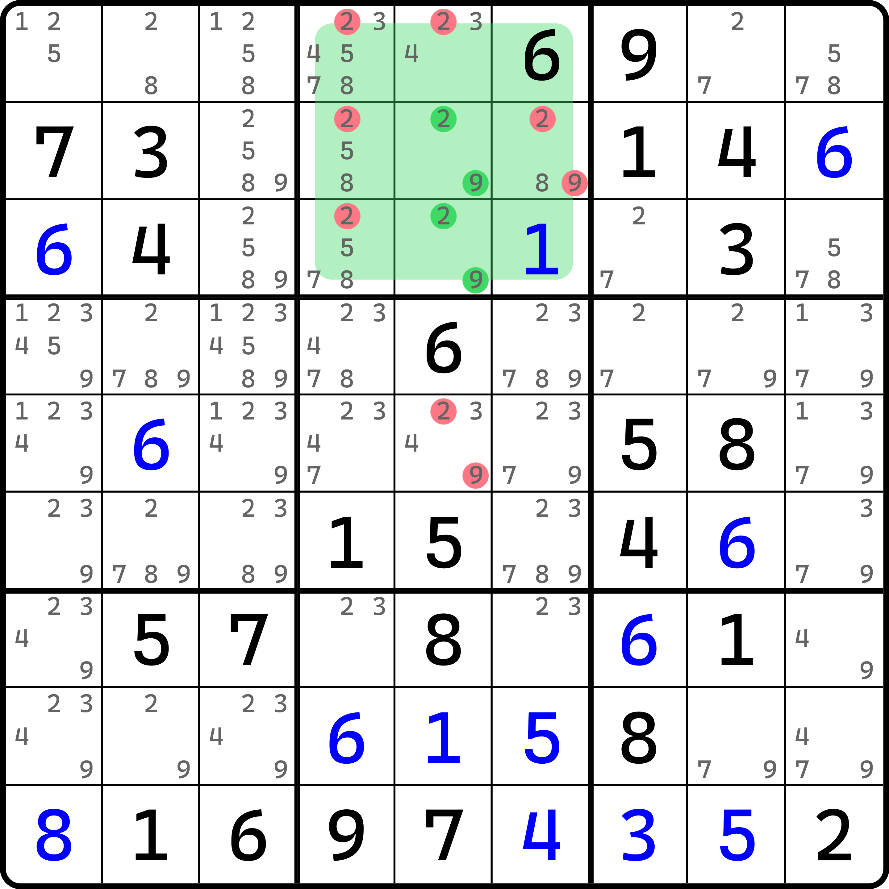
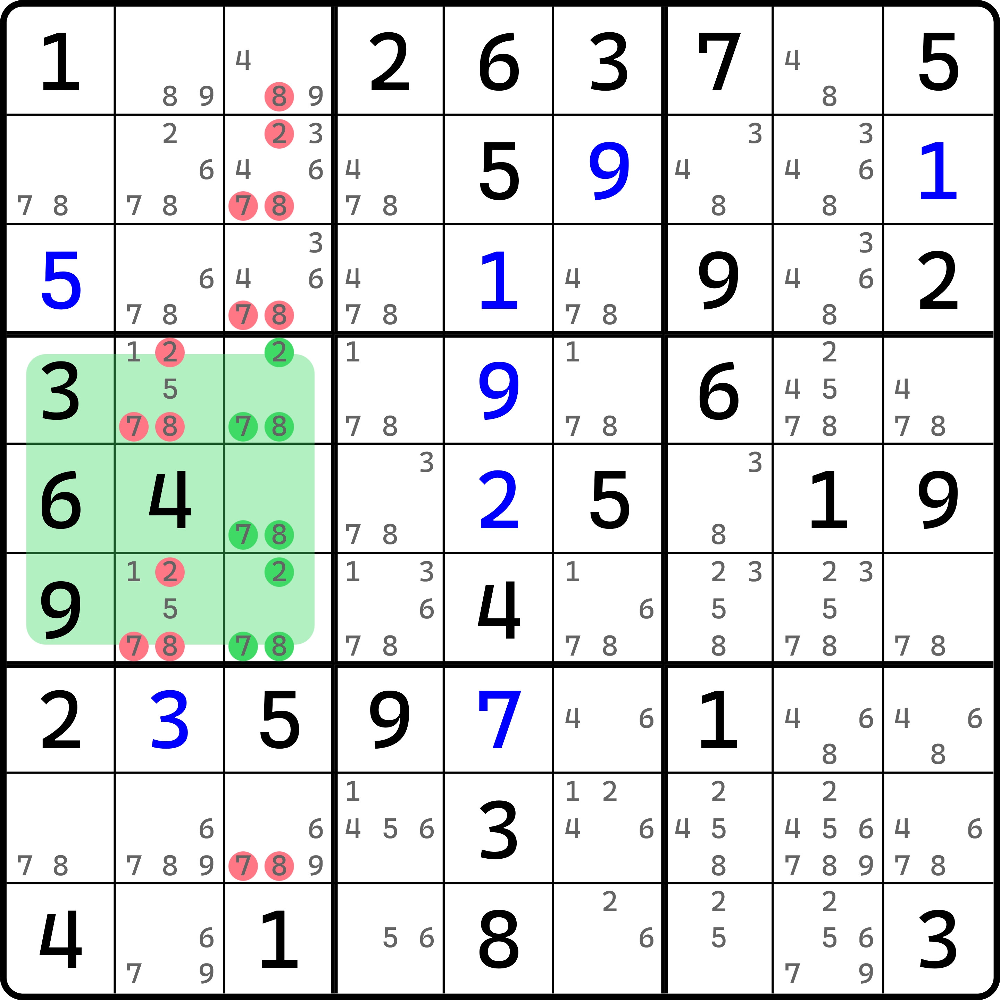

# 跨区数组（DDS）

为了衔接后续的内容，又可以把内容按难度合理拆分，这里加上一个短篇过渡的内容。

## 跨区数组的定义 

前面我们学到了融合待定数组的技巧。这个技巧的推理方式是使用一个宫，以及一个和他有交集的行列。取出这两个区域里的若干单元格，让单元格内的所有数字在所有这些格子里的填数分布都不会出现两次。但，我们并没有强调一个点（虽然之前其实也在用）。这一个点会在这篇内容里放大。

先来看一个例子。

<figure><figcaption>
跨区数组例子
</figcaption></figure>

如图所示。我们选取四个单元格 `r34c34`。我们发现，里面出现的数字有 1、4、6、8 四种，但是他们在四个单元格里的分布和之前融合待定数组完全一样，没有任何一个数字可以填两次，都只能最多填一次。

只是这个例子比较特殊的点在于，这个例子并不是一个宫和一个行列，而是两行两列。我们发现，四种数字要填入到四个单元格里，按理说这一点在之前数组的内容里有所提及：如果单元格数和里面出现的数字种类数完全一样的话，那它就是数组。数组的结论就是，按数组所在的区域进行删数。

可这个直接当数组看似乎并无不妥，只是出现的位置并不是数组那样全都在同一个区域里，这唯一有所不同的地方。不过，在我们之前介绍了融合待定数组的内容后，我们清楚地知道，因为里面的数字并不会出现两次，所以每一个数都有机会往里面填入。而四个单元格又保证了填入的数字必须得 4 个，所以 1、4、6、8 每一个数都会填入一次，这样才有了和数组一样的结论。

那么删数呢？因为我们论证这种结构的合理性具有“每一种数字都能填一次”的规则，所以删数理应会按数字为单位进行删数。比如说，这里的数字 1 肯定只能填在 `r34c4` 之中，因此 `c4` 里的其他单元格都不能填 1，所以有 `r8c4 <> 1` 的结论；而 4、6、8 其他三种数字同理。

我们把这种像是数组又不在同一个区域的结构称为**跨区数组**（Distributed Disjoint Subset，简称 DDS）。从跨区数组的名称里可以看出，它指的是数字在结构里不会填多次，即“同一个数字不会跨区出现多次”。

> 另外，这个题里和结构中心对称的 `r67c67` 四个单元格也是一个跨区数组。你可以自己看看然后找下删数有哪些。因为完全对称，所以我就不展示新的配图了。

另外，跨区数组和数组所满足的规则近乎一样，只是因为跨区数组的数字会出现在不同的区域，所以可能会存在跨区的效果，因此跨区数组的成立条件会比普通数组多一点。

如果一个结构是跨区数组，则它需要满足如下两点：

* 单元格数量和里面出现的数字种类数要一样多；
* 所有出现的数字，在这个结构里最多只能填一个。

对于第二点来说，这是比较关键的一点。由于普通数组里，第二点是客观成立的，所以这看起来就像是一句废话。但是回顾你之前学习数组的时候，这一句话也并不是废话。只有不能重复填入相同数字，才能保证数字都会出现一次。

可以从这两点看出，之前介绍过的融合待定数组也是满足跨区数组的定义的。实际上，融合待定数组确实属于跨区数组的其中一种情况。

## 跨区数组和普通数组的“孽缘” 

### 区块数组（Semi-Locked Subset） 

在学数组的时候，我们并未提及这种删数模式。实际上在早期的教程里，我是把他放在和数组的内容一起说的，因为它不难学会，也确实符合数组的介绍内容（只是个删数层面的推广罢了）；但是新写的教程，我反复思考了很久，考虑到内容体系化的说法，最终还是决定放在了这里进行讲解。

回到之前数组的篇章中来。既然我们说到了跨区数组和它的删数规则，那么我们就可以将数组的删数逻辑进行严格推广。

<figure><figcaption>
区块三数组
</figcaption></figure>

如图所示。这是一个很稀松平常的显性三数组。但是删数有些奇怪，数字 4 删了两个区域，一个是 `c4` 里的标准删数，一个是 `b5` 里。

数字 3、6 不用多说，主要是 4 的删数较为奇怪。但是仔细观察就不难发现，虽然这个数组是长在 `c4` 里的，但是实际上 4 也只出现在了 `r45c4` 之中。这说明了 4 在这三个单元格里只可能填在 `r45c4` 里。

还记得刚才才说过的定义吗？跨区数组的第二点。第二点说，因为我们知道所有的数字都只能最多在里面填一个，而因为数字种类数和单元格数一样多，所以每一个数都有填入的机会。那么 4 也不例外。而此时，4 的位置又恰好只可能在 `b5` 之中。这说明了，`b5` 里填 4 的机会会被这个三数组所占据。说人话就是，因为 4 必须填在 `r45c4` 里，而这两个单元格恰好同一个宫，因此，`r56c6 <> 4` 的结论是成立的。

这便是数组内部带有区块的特殊删数模式。我们把这种显性数组称为**区块数组**（Semi-Locked Subset）；这个例子是三数组，所以细致一点也可以叫**区块三数组**（Semi-Locked Triple）。我们再来看一个例子。

<figure><figcaption>
区块四数组
</figcaption></figure>

这个例子是一个显性四数组，不过数字 1 和 4 都只存在于区块的范畴里，所以它也可以使用区块的逻辑在两头（两个区域同时）进行删数。不过细节就不解释了。

这个叫**区块四数组**（Semi-Locked Quadruple）。

### 死锁数组（Locked Subset） 

再极端一些。既然数组的其中一个或一些数字卡在区块的范畴里，我们叫区块数组的话，那么所有数字都卡在区块的范畴里呢？

<figure><figcaption>
死锁数对
</figcaption></figure>

叫**死锁数组**（Locked Subset）。所有的例子我都不用解释了。相信你能看到这里，基本就能说明你是看得懂的。上面这个规格的叫**死锁数对**（Locked Pair）。下面我们来看个**死锁三数组**（Locked Triple）。

<figure><figcaption>
死锁三数组
</figcaption></figure>

因为区块最多三个格子，所以死锁数组最大规格也就到 3 结束。

好了。跨区数组的内容就到这里。下一节我们继续延续跨区数组的推理思路。
