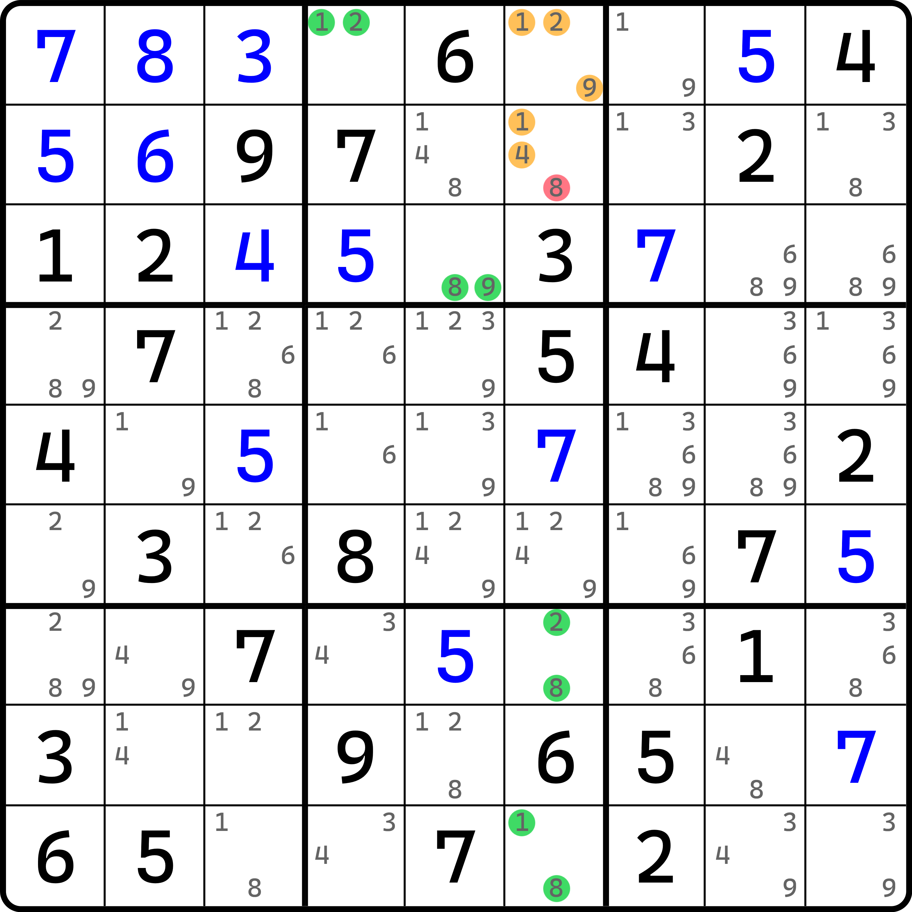

# 均衡数组

从使用技巧的角度来说，其实这个技巧并不算有任何用的技巧；但对于整合教程而言，本技巧仍然具有一定程度上不可替代的作用。所以才有了这样的技巧。

## 均衡数对（Aligned Pair Exclusion） 

<figure><figcaption>
均衡数对
</figcaption></figure>

如图所示。请着重假设 `r12c6` 两个单元格。这两个单元格各有三个候选数，所以我们需要对两个单元格的所有可能填写的情况进行排列组合。显然，因为一边三个候选数，所以一共有 9 个情况。我们依次进行列举。

<table><thead><tr><th width="88.466552734375" align="center">`r1c6` 填数</th><th width="91.39990234375" align="center">`r2c6` 填数</th><th width="108.5333251953125" align="center">填数是否合理</th><th>原因</th></tr></thead><tbody><tr><td align="center">1</td><td align="center">1</td><td align="center">❌</td><td>重复</td></tr><tr><td align="center">1</td><td align="center">4</td><td align="center">⭕</td><td></td></tr><tr><td align="center">1</td><td align="center">8</td><td align="center">❌</td><td>导致 <code>r9c6</code> 无数可填</td></tr><tr><td align="center">2</td><td align="center">1</td><td align="center">❌</td><td>导致 <code>r1c4</code> 无数可填</td></tr><tr><td align="center">2</td><td align="center">4</td><td align="center">⭕</td><td></td></tr><tr><td align="center">2</td><td align="center">8</td><td align="center">❌</td><td>导致 <code>r7c6</code> 无数可填</td></tr><tr><td align="center">9</td><td align="center">1</td><td align="center">⭕</td><td></td></tr><tr><td align="center">9</td><td align="center">4</td><td align="center">⭕</td><td></td></tr><tr><td align="center">9</td><td align="center">8</td><td align="center">❌</td><td>导致 <code>r3c5</code> 无数可填</td></tr></tbody></table>

在进行了排列操作后，我们发现所有 9 个情况里，组合 (1, 1)、(1, 8)、(2, 1)、(2, 8) 和 (9, 8) 五种组合是错误的填数组合；而很容易地看出，当 `r2c6` 填入 8 时，它能对应的全部组合情况均是错误的。所以，我们可以认为，`r2c6` 不能填 8。所以这个题的结论就是 `r2c6 <> 8`。

我们把这个技巧称为**均衡数组**（Aligned Exclusion）。而这个例子又是两个单元格的情况，所以我们针对于这种情况称为**均衡数对**（Aligned Pair Exclusion，简称 APE）。
