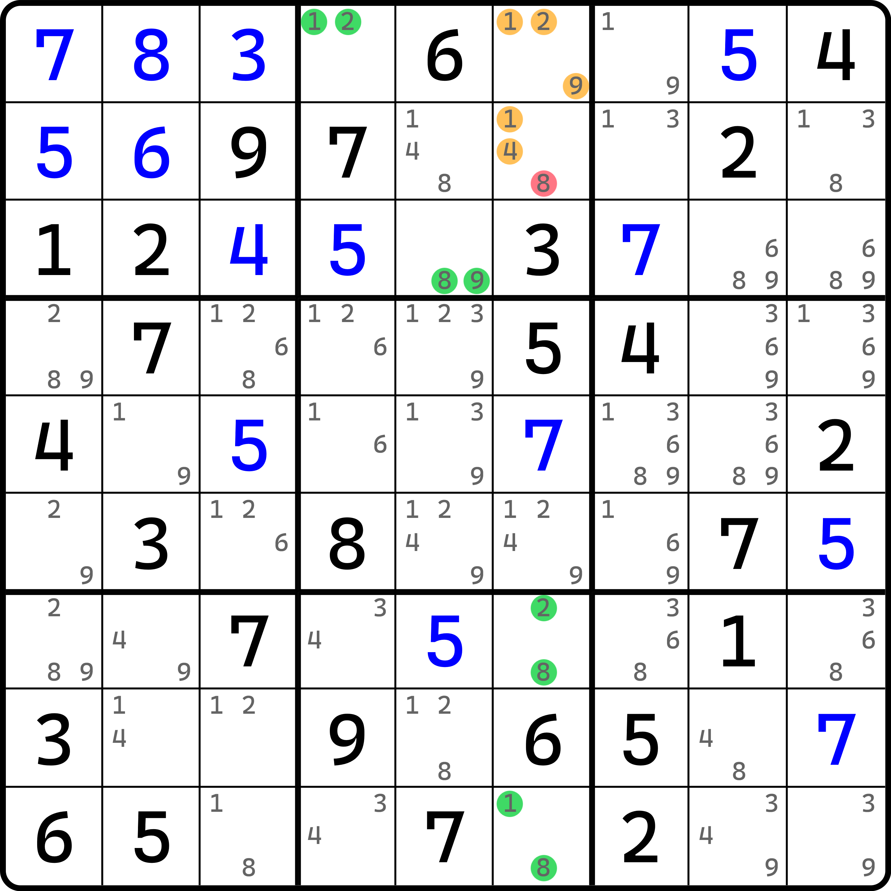
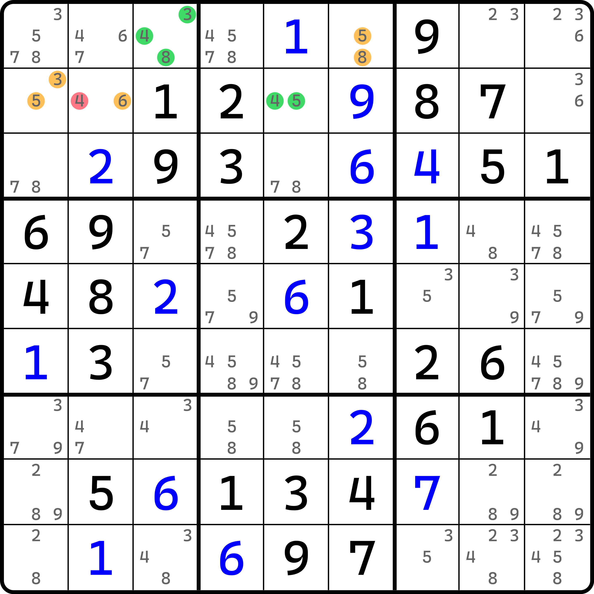
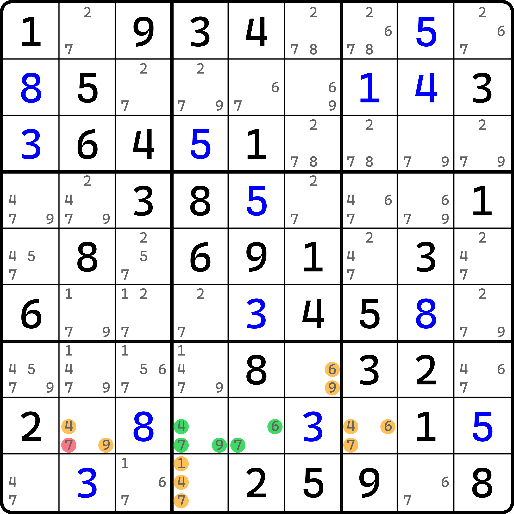

# 均衡数组

从使用技巧的角度来说，其实这个技巧并不算有任何用的技巧；但对于整合教程而言，本技巧仍然具有一定程度上不可替代的作用。所以才有了这样的技巧。

## 均衡数对（Aligned Pair Exclusion） 

<figure><figcaption>
均衡数对
</figcaption></figure>

如图所示。请着重假设 `r12c6` 两个单元格。这两个单元格各有三个候选数，所以我们需要对两个单元格的所有可能填写的情况进行排列组合。显然，因为一边三个候选数，所以一共有 9 个情况。我们依次进行列举。

<table><thead><tr><th width="94.3331298828125" align="center">r1c6 填数</th><th width="95.13323974609375" align="center">r2c6 填数</th><th width="115.466552734375" align="center">填数是否合理</th><th>原因</th></tr></thead><tbody><tr><td align="center"><strong>1</strong></td><td align="center"><strong>1</strong></td><td align="center">❌</td><td>重复</td></tr><tr><td align="center">1</td><td align="center">4</td><td align="center">⭕</td><td></td></tr><tr><td align="center"><strong>1</strong></td><td align="center"><strong>8</strong></td><td align="center">❌</td><td>导致 <code>r9c6</code> 无数可填</td></tr><tr><td align="center"><strong>2</strong></td><td align="center"><strong>1</strong></td><td align="center">❌</td><td>导致 <code>r1c4</code> 无数可填</td></tr><tr><td align="center">2</td><td align="center">4</td><td align="center">⭕</td><td></td></tr><tr><td align="center"><strong>2</strong></td><td align="center"><strong>8</strong></td><td align="center">❌</td><td>导致 <code>r7c6</code> 无数可填</td></tr><tr><td align="center">9</td><td align="center">1</td><td align="center">⭕</td><td></td></tr><tr><td align="center">9</td><td align="center">4</td><td align="center">⭕</td><td></td></tr><tr><td align="center"><strong>9</strong></td><td align="center"><strong>8</strong></td><td align="center">❌</td><td>导致 <code>r3c5</code> 无数可填</td></tr></tbody></table>

在进行了排列操作后，我们发现所有 9 个情况里，组合 (1, 1)、(1, 8)、(2, 1)、(2, 8) 和 (9, 8) 五种组合是错误的填数组合；而很容易地看出，当 `r2c6` 填入 8 时，它能对应的全部组合情况均是错误的。所以，我们可以认为，`r2c6` 不能填 8。所以这个题的结论就是 `r2c6 <> 8`。

我们把这个技巧称为**均衡数组**（Aligned Exclusion）。而这个例子又是两个单元格的情况，所以我们针对于这种情况称为**均衡数对**（Aligned Pair Exclusion，简称 APE）。

另外在数学上，我们把上述这种排列组合的行为称为**笛卡尔积**（Cartesian Product），即两个或多个集合里的元素全部逐一进行排列组合，不论这些集合互相在逻辑、理解和概念上是否有关联，组合起来就完事了。笛卡尔积在生活中的应用非常多，例如说纸牌的各种牌型是花色（4 个）和点数（13 个）的笛卡尔积的结果。

## 均衡三数组（Aligned Triple Exclusion） 

在均衡数对的基础上，我们还可以把结构推广为三个单元格的排列。

<figure><figcaption>
均衡三数组
</figcaption></figure>

如图所示。我们针对于 `r1c6`、`r2c12` 三个单元格进行排列。我们可以很容易地发现，因为三个单元格均为双值格，所以假设起来一共有 8 个情况。假设如下：

<table><thead><tr><th width="89.00006103515625" align="center">r1c6 填数</th><th width="86.13323974609375" align="center">r2c1 填数</th><th width="91.06683349609375" align="center">r2c2 填数</th><th width="114.5999755859375" align="center">填数是否合理</th><th>原因</th></tr></thead><tbody><tr><td align="center"><strong>5</strong></td><td align="center">3</td><td align="center"><strong>4</strong></td><td align="center">❌</td><td>导致 <code>r2c5</code> 无数可填</td></tr><tr><td align="center">5</td><td align="center">3</td><td align="center">6</td><td align="center">⭕</td><td></td></tr><tr><td align="center"><strong>5</strong></td><td align="center"><strong>5</strong></td><td align="center"><strong>4</strong></td><td align="center">❌</td><td>导致 <code>r2c5</code> 无数可填</td></tr><tr><td align="center">5</td><td align="center">5</td><td align="center">6</td><td align="center">⭕</td><td></td></tr><tr><td align="center">8</td><td align="center"><strong>3</strong></td><td align="center"><strong>4</strong></td><td align="center">❌</td><td>导致 <code>r1c3</code> 无数可填</td></tr><tr><td align="center">8</td><td align="center">3</td><td align="center">6</td><td align="center">⭕</td><td></td></tr><tr><td align="center">8</td><td align="center"><strong>5</strong></td><td align="center"><strong>4</strong></td><td align="center">❌</td><td>导致 <code>r2c5</code> 无数可填</td></tr><tr><td align="center">8</td><td align="center">5</td><td align="center">6</td><td align="center">⭕</td><td></td></tr></tbody></table>

和前文一样，我们作笛卡尔积后可得到 8 个情况里的其中四个是错误的。并且，我们还发现，错误的四个组合下，`r2c2` 单元格填入 4 时所拥有的、`r1c6` 和 `r2c1` 的所有排列情况均会造成矛盾。因此，这个题的结论是 `r2c2 <> 4`。

我们把这个情况称为**均衡三数组**（Aligned Triple Exclusion，简称 ATE）。

## 均衡四数组（Aligned Quadruple Exclusion） 

这个结构还有更高的规格，而且可以从结构看出，它似乎并不受任何形式的制约（如必须在同行列宫之类的）。所以，理论上均衡数组的规格可以超过 4。但是，假设的情况也相对应地增大；而且这还是随着空格里候选数的数量，不断求乘积得到的，所以增大的幅度会非常大。不论是对人类思考这种排列情况而言，还是对于电脑进行死板地排列组合而言，也都是不小的工作量。因此，本教程就到四数组就结束。

<figure><figcaption>
均衡四数组
</figcaption></figure>

如图所示。本题需要假设的单元格是 `r7c6`、`r8c27` 和 `r9c4` 一共 4 个单元格。

笛卡尔积假设的情况就全部略过了（不然表格都很长，一共有 54 项）。总之，在假设之后，我们发现，假设 `r8c2 = 7` 时，其他三个单元格的全部 18 种组合都会引发矛盾。所以，这个假设是错误的，故这个题的结论是 `r8c2 <> 7`。

我们把这个规格称为**均衡四数组**（Aligned Quadruple Exclusion，简称 AQE）。

至此，我们就把均衡数组的内容全部讲完了。虽然它看起来仍旧很暴力，但它的本质逻辑“笛卡尔积”并不是一个很难以理解的东西。
