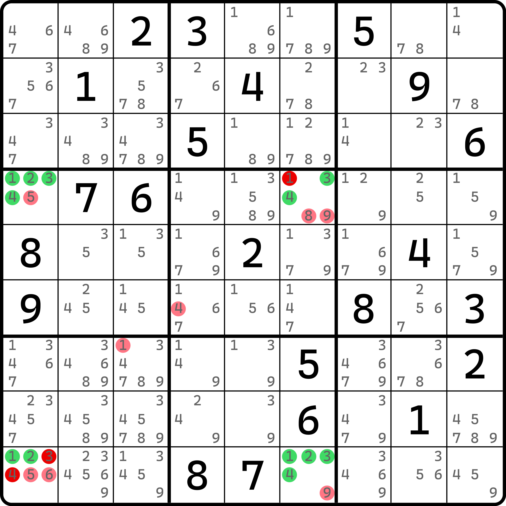

# 烟花数组的各种用法

前面我们理解了烟花数组的基本推理后，我们来看实际的例子。

## 烟花三数组（Firework Triple） 

<figure><figcaption>
烟花三数组
</figcaption></figure>

如图所示。本题的构造几乎就是照着之前的结构构造出来的。在题目刚开始还没填一个数就可以来到这里。

首先，观察 `r1c19` 和 `r9c9` 三个单元格。这一次用的是 `r1` 和 `c9` 两个区域；然后数字 1、2、3 在 `b2` 和 `b8` 里都有提示数的制约，所以显然 `r1c456` 以及 `r456c9` 都填不了 1、2、3。虽然这一点和之前结构长得不太一样，但这里不让填的条件也是照样满足的。

然后，我们试着再次使用之前的烟花数组的逻辑去证明它是否是跨区数组，可以发现它仍然成立。先是可以得到这三个单元格不能填 1、2、3 以外的其他候选数。这是很容易可以得到的。不过，上一节我们没有讨论 `r1c9` 这个交叉点的情况（之前那个结构示意图里交叉点的单元格是 `r1c1`，当时它是只有 1、2、3 三种候选数而没有别的候选数的）。那么我们这里主要针对于这个单元格证明一下。实际上也不难。

如果我们允许 `r1c9` 填入不是 1、2、3 的一个数进去，那么我们可以得到的是，`r1c178` 是数字 1、2、3 唯三可以填在 `r1` 的位置。同理，`r239c9` 也是数字 1、2、3 唯三可以填在 `c9` 里的位置。显然，`r1c1` 和 `r9c9` 会填写进去一个 1、2、3 的数字，不管它是多少吧，这都不重要，因为他们不会造成矛盾。主要矛盾点还是在 `r78c1` 和 `r23c9` 这四个单元格。这四个单元格要填 1、2、3 三种数字的其中任意的数，而这四个单元格同处于一个宫里，所以无论如何肯定都会至少有一个数填两次，这就直接矛盾了。所以“`r1c9` 不能是 1、2、3 以外的填数”就说清楚了。

刚才我们是知道了这三个单元格只能填入 1、2、3 里的数，下面接着是需要证明他们是跨区数组。证明跨区数组的部分这里就省略了，不过可以简单提醒一下，证明的方式是假设其中 `r1c1` 和 `r9c9` 填入重复的数字，只要证明这两个重复的数字会造成题目出现矛盾就行。

总之，我们能够得到跨区数组的结论。那么这个题的结论就变得非常显而易见了。只不过这里要额外说明的是，图中还额外标注了删数 `r2c7 <> 2` 和 `r3c8 <> 1` 的结论。这两个删数是怎么来的呢？因为跨区三数组。因为 `r1c19` 和 `r9c9` 是跨区数组，而且 `r1` 和 `c9` 可以填入 1、2、3 的位置也非常有限，所以我们不妨再次使用之前欠一数组假设为字母的逻辑来看这个技巧，我们就可以得到这样的字母填充情况：

<figure><figcaption>
烟花三数组，字母假设视角
</figcaption></figure>

如图所示。假设我们让 `r1c1` 填 $$a$$、`r1c9` 填 $$c$$、`r9c9` 填 $$b$$ 的话（其中 $$abc$$ 是数字 1、2、3 且互相都不相等），那么 `r1c78` 也能填 1、2、3 的位置就会选取其中一个单元格填 $$b$$（因为 `r1` 能填 $$b$$ 的位置也就它俩了，而 $$a$$ 和 $$c$$ 都被填了）；同理，`c9` 里只有 `r23c9` 可以填 $$a$$ 了，所以它俩有一个是 $$a$$。

当我们得到这一点后，我们可以发现这里还会有一个额外的三数组的出现。其中 `r23c9` 取一个单元格填 $$a$$，`r1c78` 取一个单元格填 $$b$$，配合原有的假设 `r1c9` 填 $$c$$，这样就是一个三数组。

既然这里也有一个数组，所以结论自然就是，这一宫里其他单元格都不能是 1、2、3。对于这个题自然就是 `r23c78 <> 123` 了。当然，这里剩余的候选数不多了，所以实际上就能删俩（图中那俩）。

我们把这个就称为**烟花三数组**（Firework Triple），属于是最基础的烟花数组的使用方式。下面我们再来看一个例子，不过这个例子就不像图中删那么多了。

<figure><figcaption>
另一个烟花三数组的例子
</figcaption></figure>

如图所示。这个例子就自己理解了。不过这里同时给你两个视角，一个是原来的数组的视角，一个是假设了字母的视角，可以帮助你推理和理解它的假设过程。

## 烟花数对（Firework Pair） 

说完了标准版本，下面我们来看一个怪东西。

<figure><figcaption>
烟花数对
</figcaption></figure>

如图所示。这个题看似是烟花数组，但实际上压根就没用到三种数字，它甚至会少一个数字的使用，所以之前的推理过程可能需要重新审视一下了。

倒也不是完全重新推翻再来推理一遍，至少很容易可以看出数字 1 和 9 满足之前烟花数组的那种数字的摆放逻辑。只是之前是 1、2、3 三种数字都满足烟花数组的那个摆放占位逻辑，这次就只有 1 和 9 而已；然后，因为它不同于之前的推理，所以我们还需要额外补充外援。这个题额外用到了 `r1c5` 和 `r5c9` 两个单元格。这两个单元格比较特殊，他们都恰好只有候选数 1 和 9，这会帮我们大忙。

我们来看一下这个的推理过程。首先，因为 `r1c5` 和 `r5c9` 均只可以填入 1 和 9 两种数字，所以这两个单元格的可能填入的数字组合只有两种：

* 它俩填一样的数（都是 1 或者都是 9）；
* 它俩填不一样的数（1 和 9 各一个）。

之所以没有让各位读者继续深究它内部填 1 和 9 的四种排列情况，是因为这反而没有必要。

### 情况 1：r1c5 和 r5c9 填相同数字 

先来看第一种情况。假设 `r1c5` 和 `r5c9` 填入相同的数字（比如假设都填 $$a$$），则请关注 `c1` 和 `r9` 这两个区域。我们发现，数字 $$a$$ 此时因为假设的关系显然不能填在 `r1c1` 和 `r9c9` 上。但是，我们为了确保数字 $$a$$ 又必须同时在 `r9` 和 `c1` 里都出现，此时 $$a$$ 能在 `c1` 里填的位置就只剩下 `r789c1` 了，而 `r9` 里剩下的只有 `r9c123` 了，而总体这五个单元格都恰好位于同一个宫 `b7`，这个“位于同一个宫”和之前烟花数组的逻辑比较相似。

既然同一个宫，那么就说明这个数就不能填两次；而我们又强制需要 `r9` 和 `c1` 又都得填上 $$a$$，这就说明只有让 `r9c1` 填 $$a$$ 才能同时满足既两个区域都能有 $$a$$ 又不会引发重复填数的矛盾，所以此时就有 `r9c1` 填 $$a$$ 的结果。

接着，既然 $$a$$ 确定了位置，那么 $$b$$ 的位置呢？此时我们要保证的是，`r9` 和 `c1` 都需要有 $$b$$ 的出现，但此时 $$b$$ 能够确定的位置有哪里呢？刚才假设用过的 `r78c1` 和 `r9c23` 这四个单元格，外带 `r1c1` 和 `r9c9` 这两个单元格，一共六个单元格。这六个单元格是可以填 $$b$$ 的、这两个区域里全部可能的位置了。

这六个单元格要放两个 $$b$$，又要规避填数时造成显然违背数独规则的重复填数的情况，那么我们不妨把这六个单元格进行下面四个部分的拆分，然后两两排列起来看看是否存在矛盾：

* `r1c1` 这一个单元格；
* `r9c9` 这一个单元格；
* `r78c1` 这两个单元格的其中一个单元格；
* `r9c23` 这两个单元格的其中一个单元格。

拆分成这四部分的意思是，最终数字 $$b$$ 因为要填入两个，所以最终会落入到其中的两个部分里去。在众多的假设中，我们会发现这么一个现象。先不论对不对，只要 `r1c1` 填 $$b$$，而最初因为 `r1c5` 被假设为 $$a$$，所以此时 `r1` 上会有固定的两个单元格 `r1c15` 构成关于 1 和 9 的数对结构（因为 $$a$$ 和 $$b$$ 就是 1 和 9）；同理，如果让 `r9c9` 填 $$b$$，则 `c9` 上也会出现固定的两个单元格 `r59c9` 形成 1 和 9 的数对。

我们渐渐地往这个方向上去看，会发现一个非常巧合的点。最终不论你怎么假设，`r1c1` 和 `r9c9` 肯定会有至少一个单元格填 $$b$$。因为能不让他们都不填 $$b$$ 的情况只有一种：`r78c1` 和 `r9c23` 这两部分同时填 $$b$$。但是很显然这并不成立，因为这四个单元格同在 `b7` 之中，显然是不能重复填的，所以就直接矛盾了。

所以，我们比较巧合地得到了 `r1c15` 或者 `r59c9` 肯定会有一个是关于 1 和 9 的数对结构。

### 情况 2：r1c5 和 r5c9 填不同数字 

第二点一旦填上去就会发现问题。既然我们假设成不同数字了，而这两个单元格又恰好只能是 1 和 9，所以此时 `r1c5` 和 `r5c9` 直接形成关于 1 和 9 的跨区数对结构。

### 总结 

两种情况均可导向数对结构的结论，只不过最终产生的数对结构一共有三种：

1. `r1c15` 是数对；
2. `r59c9` 是数对；
3. `r1c5` 和 `r5c9` 是跨区数对。

他们最终都会影响到 `r1c9` 这个单元格。所以这个题的结论就是 `r1c9 <> 9`。1 也可以删，只是这个题没有候选数 1 的结论罢了。

我们把这个结构称为**烟花数对**（Firework Pair）。逻辑上真是一层套一层的，真要从零开始假设起来确实有些恶心，不过从大体上可以看出是借助了之前烟花数组的推理思路。

### 不太重要但有伏笔的结论 

在前面的例子里，我们主要尝试的是假设 `r1c5` 和 `r5c9` 两个单元格的填数是否相同来决定最终的结论的。不过，如果我们只单独去看 `r19c1` 和 `r9c9` 三个单元格的话，实际上也是有个结论的，也就是 `r1c1` 和 `r9c9` 是不能同时既不是 1 也不是 9 的。原因其实很好知道：一旦他俩既不是 1 也不是 9 之后，对于 `c1` 和 `r9` 而言，1 和 9 的填数位置就会全部被挤入到 `b7` 之中，因为要保证同时 `c1` 和 `r9` 均要填入 1 和 9，所以就无论如何都放不下这两个数了，所以就引发了矛盾。

这个结论其实并不算特别高级，实际上看起来也没多大用，但请记住它，它为稍后的四数组的推理埋下了伏笔。

## 烟花四数组（Firework Quadruple） 

下面我们来看四数组的版本。所谓**烟花四数组**（Firework Quadruple），它其实是两个烟花数对叠加在一起的用法。

<figure><figcaption>
烟花四数组
</figcaption></figure>

如图所示。可能你看到这个结构似乎有一点头绪，但又不是很多。

### 结论 1：r4c1 和 r9c6 只能是 1、2、3、4 

我们先来看数字 1、2 的填数情况。

<figure><figcaption>
1 和 2 的情况
</figcaption></figure>

如图所示。很明显的是，`c1` 和 `r9` 里可填 1 和 2 的只有 7 个单元格：`r4789c1` 和 `r9c236`。

看起来无法继续了。这里我们要借用一下前面的伏笔结论。因为 1 和 2 只能放在这 7 个单元格之中，所以为了确保 1 和 2 都能够放下到 `c1` 和 `r9` 之中，`r4c1` 和 `r9c6` 至少有一个单元格要填 1 或者 2 的其中一个数。我们先记住它。然后来看 3 和 4。

<figure><figcaption>
3 和 4 的情况
</figcaption></figure>

如图所示。很显然数字 3 和 4 也具备类似的结论：`r4c1` 和 `r9c6` 里必须至少有一个单元格是 3 或 4 的其中一个数。

欸不对等会儿。这都不能说恰好了，未免也有点太巧了。两个结论都用的是完全一样的两个单元格 `r4c1` 和 `r9c6`，唯一不同的是用的区域是不同的，一个是 `c1` 和 `r9`，一个则是 `r4` 和 `c6`。

因为我们知道，`r4c1` 和 `r9c6` 既要满足至少一个 1 或 2，又要满足至少一个 3 或 4，那么干脆我们就让它俩一个填 1 或 2，一个填 3 或 4，两个单元格就直接用完了。这便得到了 `r4c1 <> 5` 和 `r9c6 <> 9` 的初始结论，因为填了 1、2、3、4 就没机会填其他数字了嘛。

### 结论 2：r49c16 是跨区四数组 

接着我们还可以得到一个结论。由于我们让 `r4c1` 和 `r9c6` 填上了两个数字，那么此时我们不妨假设成字母表示起来会方便一些。假设 `r4c1` 填 $$a$$，`r9c6` 填 $$c$$，其中 $$a$$ 是 1 或 2 的其一，$$c$$ 是 3 或 4 的其一。那么，为了确保数字 $$b$$（1 或 2 里另外一个不是 $$a$$ 的数）能够填到 `c1` 和 `r9` 里，但由于可填的位置只剩下 `r789c1` 和 `r9c23` 这五个单元格了，要保证 $$b$$ 又得同时在两个区域里出现，那么我们只能安排 $$b$$ 填在 `r9c1` 上才满足题意了，这是唯一的机会。所以我们就有 `r9c1` 填 $$b$$ 的结果。

同理，我们再次观察 `r4` 和 `c6`。为了确保数字 $$d$$（3 或 4 里另外一个不是 $$c$$ 的数）能够填到这两个区域里去，此时因为只有 `r4c456` 和 `r56c6` 这五个单元格可以填，所以要保证两个区域都有这个数，我们只能安排它填在 `r4c6` 上了。所以，`r4c6` 填 $$d$$。

好了，现在我们列举一下前面的假设。其中：

* `r4c1` 填 $$a$$；
* `r4c6` 填 $$d$$；
* `r9c1` 填 $$b$$；
* `r9c6` 填 $$c$$。

欸，四个数都不一样。是的，这样我们就得到了一个新鲜的结论：`r49c16` 构成跨区四数组结构，关于数字 1、2、3、4，而且根据字母假设的情况，`r4c6` 只能是 3 或 4，`r9c1` 只能是 1 或 2。所以图中可以看出，删数还多出来了 `r4c6 <> 189, r9c1 <> 3456` 这一些。

不过这里要尤其注意一个比较容易忘掉的地方。我们只是知道了 `r4c1` 和 `r9c6` 必须有一个填 1 或 2，有一个填 3 或 4，但并未提及具体哪一个是什么数。前面给的这个假设模式其实只是它的其中一个情况。它的另外一个情况则是让 `r4c1` 填 $$c$$，而 `r9c6` 则填 $$a$$。此时四个单元格的填数是这样的：

* `r4c1` 填 $$c$$；
* `r4c6` 填 $$d$$；
* `r9c1` 填 $$b$$；
* `r9c6` 填 $$a$$。

也就是说，另外的这一种填数模式仍然会构成跨区四数组。

### 结论 3：b7 有 1 和 2 的数对，b5 有 3 和 4 的数对 

我们接着深入讨论一下。由于我们刚才第一种假设了 `r4c1` 和 `r9c6` 的填数分别是 $$a$$ 和 $$c$$，而让 `r9c1` 填了 $$b$$，所以，数字 $$a$$ 只是在 `c1` 里有了归属，`r9` 我们却并未提及。不过也很好说。`r9` 此时只剩下 `r9c23` 可以填 $$a$$ 了，所以这两个单元格里肯定有一个 $$a$$。

同理，我们还可以得到 $$c$$ 在 `r4c45` 里必须填一个的结论，思路也是完全一样的。

所以！所以我们就有了新结论：`r9c23` 里拿出一个单元格，配合 `r9c1` 会构成一个关于 1 和 2 的数对结构，而 `r4c45` 里其中一个单元格会配合 `r4c6` 构成关于 3 和 4 的数对结构，于是 `b5` 和 `b7` 里因为分别存在这样的数对，所以图中还剩下的删数 `r6c4 <> 4, r7c3 <> 1` 就是这么来的。

另外，其实第二种假设仍然具有这样的结论，不过我这里就不带着再假设一次了。

总之，两种均可得到数对的结论，因此额外的删数是成立的。只不过这里要注意的是，因为位置的不同，虽然我们能知道 `b57` 均有数对的存在，但实际上最终他们位置关系和摆放其实稍微有一点不同，所以删数的范围在 `b57` 里只有 `r56c45` 这四个单元格，以及 `r78c23` 这四个单元格。侧边上诸如 `r56c6` 和 `r78c1` 这些位置都是不能参与删数的，因为他们最终可能有一个情况会用到这些格子。

### 总结 

我相信你肯定看累了前面的文字。这里再给各位列一下前面字母假设的排列情况，方便各位对照两种模式的最终效果。

<figure><figcaption>
两种最终填数情况（字母假设版）
</figcaption></figure>

如图所示。这是最终两种假设的情况。要说清楚的是，尤其 `b5` 和 `b7` 的填数情况分布，数字 $$a$$ 和 $$b$$ 这一对和 $$c$$ 和 $$d$$ 这一对在两种填数模式下，甚至连最终填数位置都有所不同，所以我们只能知道有数对的形成，但最终其实并不能保证 $$a$$ 和 $$c$$ 具体的位置。因此，数对的删数范围是前文所说的 `r56c45` 以及 `r89c23` 这个范围。

至此，我们就把烟花数组的内容全部介绍完了。另外，基础候选数技巧的内容也在这里结束。下一篇内容将会在新的板块里展开。
