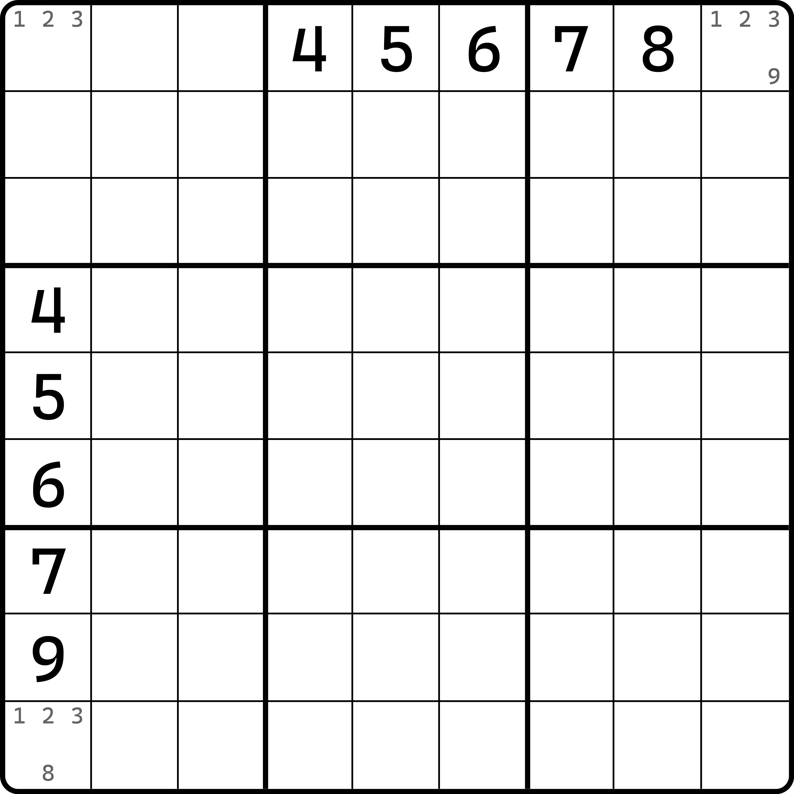
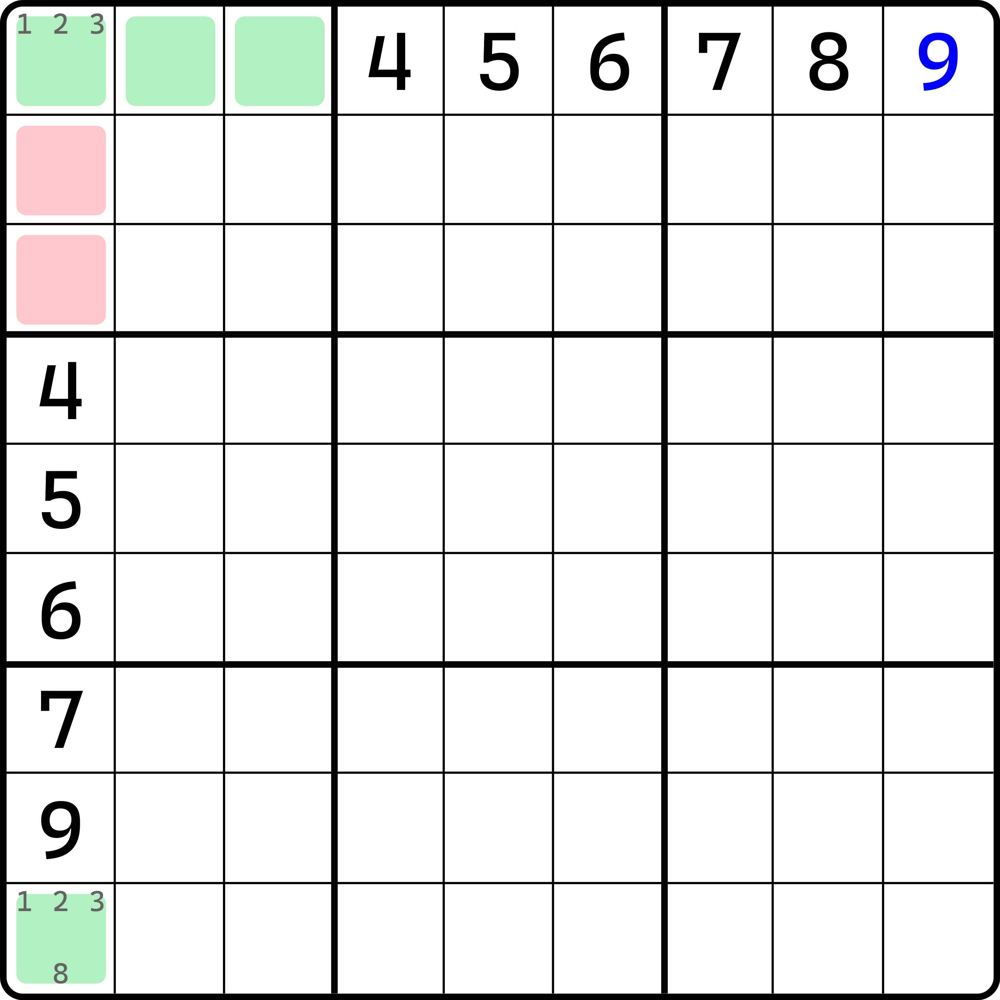
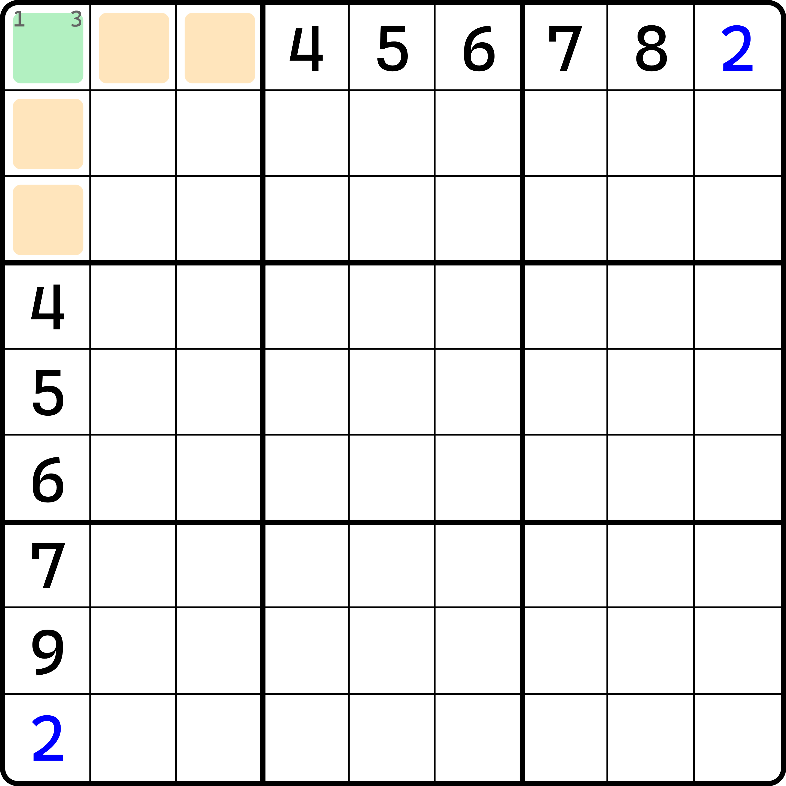

# 烟花数组的基本推理

鉴于这个技巧难度较大，所以我们将分两部分来介绍。

## 基础结构 

下面我们来看这个技巧的通用结构。

<figure><figcaption>
烟花数组结构
</figcaption></figure>

如图所示。这看起来有些奇怪。实际上我们用到的单元格只有 `r1c1`、`r1c9` 和 `r9c1` 三个单元格。

我们先思考一个问题。`r1c9` 和 `r9c1` 能填什么数？看起来 1、2、3、8、9 在候选数列表里，而且这也是直接就在盘面里形成的候选数，应该不可以删除吧？实际上，`r1c9` 和 `r9c1` 只能填 1、2、3，而且 `r1c1`、`r1c9` 和 `r9c1` 三个单元格将构成跨区数组。

这个结论是怎么得到的呢？我们慢慢来说。

## 证明三个单元格只能是 1、2、3 

第一点其实比较好得到。如果你看不出来，我们就尝试随意假设一下即可。比如，我们假设右上角 `r1c9 = 9`，看看会如何。

<figure><figcaption>
r1c9=9的矛盾
</figcaption></figure>

如图所示。如果我们允许 `r1c9 = 9` 后，因为 `r1` 此时只有三处空格，所以 `r1c123` 直接形成死锁三数组结构，于是 `r23c1 <> 123`。

但是很遗憾的是，`c1` 需要三个单元格填 1、2、3，但此时在形成死锁三数组后我们只能有 `r19c1` 两个单元格填 1、2、3，是找不出第三个可以放的位置的。所以矛盾了。

同理，`r9c1 = 8` 也会形成这样的矛盾，不过这里就省略了，因为是完全一样的逻辑。

因此，我们就这样得到了 `r1c9` 和 `r9c1` 不填 8、9 的结论；反过来说，实际上 `r1c9` 和 `r9c1`  这个结构例子里长相会比较特殊一些，所以看起来似乎只能有一个多出来的候选数；但是在做题里，只要不是 1、2、3，就可以直接删除。证明思路是完全一样的，毕竟一旦填了不是 1、2、3 的数，另外一侧（比如对于 `r1` 来说，`c1` 就叫另一侧；反之亦然）就一定填不满三个单元格放 1、2、3。所以跟它里面有多少个不是 1、2、3 的候选数没有任何关系，只要不是就可以删除。

> 实际上，这个例子里的 `r1c1` 这个 `r1` 和 `c1` 交叉点的单元格是因为结构“画风”导致无法填入 1、2、3 以外的其他候选数的。实际上，如果它如果在实际例题里是可以存在其他候选数，且仍然能证明得到可以去掉的。不过这里就不证明了，一来是示意图没有这些数，二来是实际例题我会放在下一篇内容里介绍，这里就不展开说明了，就算卖个关子。

## 证明三个单元格是跨区数组 

前面的证明相对容易，下面我们来看如何进一步得出他们是三数组的结论。

因为我们是证明跨区数组，所以我们需要保证里面所有出现的数字 1、2、3，每一个数都能且仅能出现一次。那么我们只需要证明“同一个数字一旦放两次就会矛盾”即可。而且，因为这个例子里数字 1、2、3 仅为代号，换言之，证明 1 出现两次能形成矛盾，那么 2 和 3 也就一定也会如此。所以我们只需要证明其中任意一个数即可。

我们拿数字 2 举例。如果让 2 要放两次，显然它只能放在 `r1c9` 和 `r9c1` 之中。于是我们这么试试：

<figure><figcaption>
r1c9=r9c1时的矛盾
</figcaption></figure>

如图所示。当我们要证明这一点时，我们尝试将数字 2 都填入。于是，`r1c1` 此时就只有候选数 1 和 3 了。不过，针对于 `r1c23` 和 `r23c1` 而言会形成矛盾。因为 `r1c23` 此时为确保 1 和 3 能在 `r1` 内填入，所以 `r1c23` 里会有一个单元格是 1 或 3；而 `r23c1` 为确保 `c1` 也能填入 1 和 3，所以也会有一个单元格是 1 或 3。换言之，`r1c23` 和 `r23c1` 四个单元格的其中两个单元格会填入一样的数字。

你还是没明白？那就按之前欠一数组的方式来进行字母的假设吧。假设 `r1c1` 填 $$a$$，那么 `r1c23` 的其中一个就得填 $$b$$，与此同时 `r23c1` 其中一个也得填 $$b$$。其中 $$a$$ 和 $$b$$ 是 1 或 3，且 $$a \ne b$$。但是，因为四个单元格整体都在 `b1` 之中，所以又不被允许填入相同的数字。但这四个单元格会同时填俩 $$b$$ 进去，所以矛盾了。

所以，对于数字 2 而言，是不能填两次的。而 1 和 3 完全同理，所以无需重复证明。于是我们知道了，数字 1、2、3 一定在三个单元格里只能各自填一个。

有人问，能不能存在某个数不填的情况。那肯定是不能的。因为有一个数不填，那势必就会有一个数填两次，才能让三个单元格都填上数；而某个数填两次会矛盾的点已经被证明了，所以显然是不行的。

## 结论 

当我们得到跨区数组时，这个技巧的内容就结束了。虽然我们有两大特性可以得到，但实际上这个技巧的主要结论使用，主要还是利用这个技巧是跨区数组的特性。

这个技巧利用的是一个整行和整列两个区域，并交于同一个单元格；另外，利用这个单元格的所在宫，我们还可以得到一些特殊结论和矛盾。我们把这个结构称为**烟花**（Firework）或**烟花数组**（Firework Subset），指的是图中构成跨区数组的 `r1c19` 和 `r9c1` 这三个单元格。

可以看出，烟花技巧的本质在于使用三个单元格，所以烟花数组的规格默认都是 3。后续我们会介绍一些特殊例子，他们不一定是三个单元格构成，但也都是从三个单元格派生出来的用法，本质也离不开三数组的这种模式。

下一节我们将继续针对结构展开说明它的一些用法。
