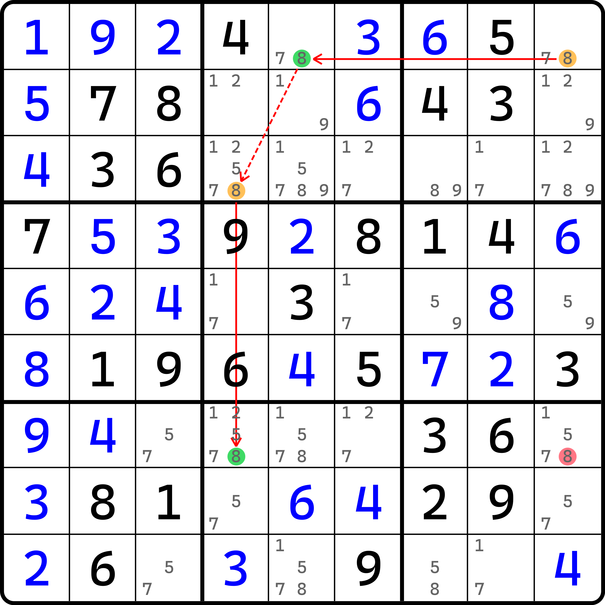

# 双强链

欢迎各位来到新板块。这个板块就纯粹是帮助各位研究和解决难题而量身定制的了。这个板块的内容在平时做题时几乎都遇不到，因为它的概念理解较为晦涩，其次也不常见于题目之中。

当然，刚开始的内容其实也都还能接受；到后面就会越来越难了。

## 摩天楼（Skyscraper） <a href="#skyscraper" id="skyscraper"></a>

先让我们从最基础的学起。

<figure><figcaption><p>摩天楼</p></figcaption></figure>

如图所示。这个图看着是不是有点像之前学过的孪生退化二阶鱼？是的，这从结构上来看确实是完全一样的。不过这次我们教各位看的是另外一个视角，而不是从鱼的角度来理解它。

我们注意，`r39` 两行均有关于 4 的共轭对，这意味着这两行只能填两个 4，且整体必须填到 `r3c48` 和 `r9c47` 四个单元格之中。

我们不妨让 `r3c8(4)` 成为我们此次推理的开端。假设 `r3c8(4)` 的填数情况一共就只有两种：`r3c8 = 4` 和 `r3c8 <> 4`。我们都来看看。

* 如果 `r3c8 = 4`，则好像没啥可延续的推理过程，我们先放一边；
* 如果 `r3c8 <> 4`，则由于 `r3` 存在共轭对，所以 4 此时只能填 `r3c4` 上。于是有 `r9c4 <> 4`，然后由于 `r9` 又恰好有共轭对，所以 `r9c7 = 4`。

对于 `r3c8 = 4` 我们还没有看到令人惊艳的地方；但是对于 `r3c8 <> 4` 而言，我们发现两个共轭对居然因为假设 `r3c8 <> 4` 而形成了完整的思路链条，从 `r3c8 <> 4` 一路推到 `r9c4 = 4`。

这还不是推理的终点。因为我们必须要找出结论，而这个推理过程我们明显发现到一个问题是，因为初始假设的两种情况是互斥的，而且它俩也恰好是 `r3c8` 的所有可能的情况。要注意 `r3c8 <> 4` 意味着 `r3c8` 可以填入除了 4 以外的任意一个数，所以对于这个题里 6 和 9 都是可能填入的。但是我们在假设时并没有关心它最终填了几，而是整体算作了一个情况。不管是 6 还是 9，“不等于 4”就可以使得逻辑可以直接顺推下去，那么我们就不需要关心它具体是几。

总之就是，“等于 4”和“不等于 4”两者联立起来，那就是所有的情况。而最终，我们要么得到 `r3c8` 填 4，要么 `r9c7` 填 4。这样想下去，对于例子里 `r1c7` 和 `r7c8` 而言，这两个单元格不论如何都是填不了 4 的。这一点和之前 XY-Wing、W-Wing 等技巧的最终删数确定的逻辑是完全一样的，我们这里再用一遍：如果 `r1c7` 填了 4，会同时造成 `r3c8` 和 `r9c7` 都填不了 4。我们刚刚才得到这两个单元格必须有 4 的填入，所以它直接就引发矛盾了。

所以，这个题的结论就是 `{r1c7, r7c8} <> 4`。

我们把这个推理过程（借用四个相同数字、两个共轭对，初始假设一个单元格的某个候选数是正确填数和错误填数两种情况进行推理，联立并得到结果的推理过程）称为**双强链**（Two-Strong-Link Chain）。双强链按照两个共轭对摆放的方式又可以细分为三种，这是第一种情况，叫**摩天楼**（Skyscraper），共轭对摆放是“平行”的：两个共轭对同时都是行上或者列上的。因为两个共轭对的摆放是平行的，所以我们可以把它俩“竖起来”，看起来就像是两座大厦一高一矮耸立在地面上，所以才取了“摩天楼”这个名字。

## 链理论的引入 <a href="#brief-introduction-to-chain-theory" id="brief-introduction-to-chain-theory"></a>

### 链的术语 <a href="#terms-of-chain" id="terms-of-chain"></a>

为了衔接后续的内容，我们不得不从这里开始介绍链的理论。

仔细观察刚才的题目，两个共轭对之间夹了一个 `c4`，它只需要满足数字 4 不重复填到 `c4` 上即可。对于 `r3c8 <> 4` 这个情况而言，我们顺次推理的逻辑列举起来是这样的：

```
r3c8 <> 4 -> r3c4 = 4 -> r9c4 <> 4 -> r9c7 = 4
```

我们把这个思路链条称为一条**链**（Chain）。其中，链的开端是 `r3c8 <> 4`，结尾是 `r9c7 = 4`。我们把 `r3c8 <> 4` 称为**链头**（Head），而 `r9c7 = 4` 称为**链尾**（Tail）。每一个假设的单位是一个个“填 4”和“不填 4”的结论，我们把这些单位称为一个链的**节点**（Node），并把假设填入的节点称为**真**（True），把不填入的节点称为**假**（False）。

在链理论里，共轭对这种必须往两头填一个进去（用术语来说就是，两端必有一个候选数为真）的情况称为两个节点有**强链关系**（Strong Inference），简称**强关系**，而对于 `c4` 这种，从 `r3c4 = 4` 得到 `r9c4 <> 4` 这种用于辅助的逻辑称为两个节点有**弱链关系**（Weak Inference），简称**弱关系**。可以从这个说法里看出，因为 `r3c8 <> 4` 到 `r9c7 = 4` 一共就用了两个强关系，所以这个结构才叫双强链，即有两个强关系的链。

最后，我们把链头和链尾影响并能造成删数的位置称为**交集**（Intersection）。

> 从英文名可以看出，inference 其实是推断的意思，而不是关系的意思。关系和推断形式上最接近的单词是 reference，所以单词并不一样。这其实是翻译失误。但是，后来因为它确实比起“推断”一词来说更容易理解，所以就将错就错沿用下来了。

### 链的文本表述 <a href="#text-notation-of-chain" id="text-notation-of-chain"></a>

想要用文本形式描述上面的整条链，我们需要使用两个额外的符号：强链记号和弱链记号。

强链记号用 `==` 或 `=` 表示，弱链记号则用 `--` 或 `-` 表示。例如前面列举的四个节点，我们整合成链的写法的话，是这样的：

```
r3c8(4) == r3c4(4) -- r9c4(4) == r9c7(4) => {r1c7, r7c8} <> 4
```

其中，我们将节点的真假性弱化，直接改成候选数的表示形式；然后借用强弱链的记号直接连接每一个节点即可。最后使用推出符号 `=>` 表示结论导出的过程，整个链就写完了。

### 链的箭头画法

可以看出，前面的配图使用的是一些涂色块来描述其中的共轭对，也就是强链关系的部分，以及弱链关系的部分。不过，这个画法并不常用。在规范的画图里，我们一般会使用箭头来描述一个强弱关系。其中，实线箭头表示强链关系，虚线箭头则表示弱链关系；然后使用两种不同的配色来区分节点推导过程之中的真假性。

例如上面的例子，我们的规范画法应该是这样的：

<figure><figcaption><p>链的规范画法</p></figcaption></figure>

如图所示。比如这个画法我们把橘色节点表示为假，绿色节点表示为真；然后使用实线箭头表示强关系，虚线箭头表示弱关系，箭头方向则表示的是推理序列。当然，配色不一定和图上一样，例如一款叫 HoDoKu 的软件，假设为假的节点则用的是蓝色而不是橘色来表示的：

<figure><figcaption><p>HoDoKu 软件的配色方案</p></figcaption></figure>

为了不给各位增添学习负担，链理论需要提前先学习到的部分就到这里就结束。下面我们继续后面的内容。

## 链理论的进一步剖析 <a href="#further-steps-to-chain-theory" id="further-steps-to-chain-theory"></a>

刚才我们已经初步了解了链的基本内容。下面我们来看看链的一些细节上需要注意的地方，以及更接近于原理的内容。

### 链关系的交替性 <a href="#alternating-inferences" id="alternating-inferences"></a>

从前面的内容里可以看出，链的强弱关系因为节点的真假性是需要交替出现的。链理论规定了一点：**节点必须以为假开头，进行交替推理，并以节点为真结束**。对比前面的例子，例子里的用法是满足这个说法的。

那么，我们再来重新审视一下链的强弱关系。因为节点必须以假开头，那么前面的例子用到了两个强关系和一个弱关系，一共四个候选数（四个节点），那么他们的真假性呈现为“假 -> 真 -> 假 -> 真”的过程。因为链需要以节点为真结束，所以这期间必须由偶数个节点构成（因为链头是假）。所以，我们就有这样的一个结论：

**链的长度（Length）被定义为链的强弱关系的使用总次数，所以链的长度总是一个奇数；而因为节点数一定比链的长度大一个单位，所以链的节点数总是一个偶数。**

这是第一个可以得到的结论。比如之前的例子里，链的长度为 3，节点数为 4。

我们继续。因为链头在规定上是必须为假的，所以第一个链关系必定是强关系（从不填得到填就必须要有一个共轭对的依托才行），然后弱关系，这么交替着来。而又因为最终是得到链尾为真，所以它的前一个节点也是为假的，所以也是一个强关系。因此我们还有一个结论：

**链的头尾必须都是强关系。**

这便是第二个可以得到的结论。

最后，我们还能通过前面的描述规范化定义出强弱关系：

* **强关系：当一个节点为假时可得到另一个节点为真，就称为两个节点有强关系；**
* **弱关系：当一个节点为真时可得到另一个节点为假，就称为两个节点有弱关系。**

这便是规范化之后的定义方式。

不过这里要多啰嗦一句。在例子里 `c4` 里的两处 4，客观来说其实也是共轭对。虽然按照定义来看，它也符合强关系的定义，但实际上我们在推理时候并未使用共轭对的特性，所以可以看出，强弱关系的定义只是形式上对称的定义，而对称的定义并不意味着两个定义没有交集。比如说这里的 `r39c4(4)` 从定义上就客观同时满足强关系和弱关系的定义，只不过我们用的是弱关系，毕竟链需要强弱交替。但是，如果你在网上看到诸如“‘强-强-强’的链也是成立的”这种说法，那它就是错误的说法，因为它违背了链交替推导的本质逻辑。

总之，链因为需要交替的推理过程，所以链还有一种叫法，叫**交替推理链**（Alternating Inference Chain，简称 AIC）。不过这里我们就不用了，就叫链就行。

### 链头尾的可同真性 <a href="#strong-inferences-between-head-and-tail" id="strong-inferences-between-head-and-tail"></a>

前面的内容我们都只是单纯只对其中有思路链条的那一个情况进行了说明和理论知识的补充，但在完整的推理过程时，我们是假设了某一个候选数为真和假两种情况的。只是有一种情况（假设为真）似乎看不出可以进行下一步的行为，因此我们直接让它“夭折”在了初始的状态下。

但是，因为要联立两种情况，我们才能得到最终的结论。而结论的形成，依赖的是链头和链尾有一个为真这么一个说法。那么，你有没有想过这么一个问题：链头和链尾是否可以同时为真？

这个问题看起来似乎没有什么营养。不过你自己思考一下，其实可以发现异样。

按道理来说，假设某个候选数 $$A$$ 为假，则顺次推理 $$B$$、$$C$$、$$D$$，并最终得到 $$D$$ 为真；然后还含有另一个夭折了的情况：假设 $$A$$ 为真。在两种情况联立后，我们可以得到 $$A$$ 为真或者 $$D$$ 为真的结论。按道理说，初始假设的 $$A$$ 为假和为真其实是两种互斥的状态，所以 $$A$$ 为真或 $$D$$ 为真这个推理才产生的效果应该也是互斥的才对。如果 $$A$$ 和 $$D$$ 从答案上体现出来他们同时都为真，这算哪门子情况？

很遗憾的是，链头和链尾确实是可以同时为真的。那么我们刚才的说法哪里有问题呢？错误出在“所以 $$A$$ 为真或 $$D$$ 为真这个推理才产生的效果应该也是互斥的才对”这个说法。为什么呢？因为 $$D$$ 的真假性并不一定非得要 $$A$$ 来决定，它可以由其他位置来决定；可能 $$D$$ 客观而言（比如说答案上）它确实是为真的，但这不代表它为真是一定是由 $$A$$ 来决定的。我举一个例子你就明白了。你感冒了就会流鼻涕，但这不代表你流鼻涕就一定是由你感冒引起的。万一你有鼻炎呢？

正所谓相关性不代表因果性。两个事件具有顺推的影响，但这不代表结果的形成一定由初始的条件引起。这是最为通俗的解释。而从数学的角度来说，由 $$A$$ 到 $$D$$ 和由 $$D$$ 到 $$A$$ 是互为逆命题的，而互为逆命题的两个命题逻辑上没有直接关联（等价性等等），所以不能混为一谈。对于命题与逻辑，我们将在之后进行详细说明，这里就不展开了。

我们现在来看看一个反例，即链的头尾确实同为真的情况。

<figure><figcaption><p>同为真的反例</p></figcaption></figure>

如图所示。这个链的头尾分别是 `r5c6(2)` 和 `r9c4(2)`。但是很明显看到答案里，这两个单元格就是都填的 2。

## 双线风筝（Two-String Kite） <a href="#two-string-kite" id="two-string-kite"></a>

在我们将原理进一步剖析后，我们回过头来看链，是不是会觉得更加有趣了点呢？

<figure><figcaption><p>双线风筝</p></figcaption></figure>

如图所示。链的表示如下：

```
r1c9(8) == r1c5(8) -- r3c4(8) == r7c4(8) => r7c9 <> 8
```

同样地，我们也是按照假设 `r1c9(8)` 的两种情况得到最终删数。

只不过，这次因为强链关系是垂直摆放的（一个行一个列），所以我们把这种情况的双强链称为双线风筝。你把 `r7c9(8)` 和链头以及链尾连起来，你就会发现它非常像是一个风筝，拉了两条线上去。

## 多宝鱼（Turbot Fish） <a href="#turbot-fish" id="turbot-fish"></a>

既然强链关系平行的介绍过了，垂直的也介绍过了，那是不是存在既不平行也不垂直的情况呢？答案肯定是有的。只要其中一个强链放在宫里，那么它连接的时候就是斜着的，这样就既不平行也不垂直了。

<figure><figcaption><p>多宝鱼</p></figcaption></figure>

如图所示。链的表示如下：

```
r2c7(7) == r1c9(7) -- r5c9(7) == r5c2(7) => r2c2 <> 7
```

这个链也不需要过多解释。就自己看了。

我们把这种强链关系既不平行也不垂直的情况称为**多宝鱼**（Turbot Fish），跟双线风筝一样，也是跟形状有关。

至此我们就把双强链的内容说完了。
