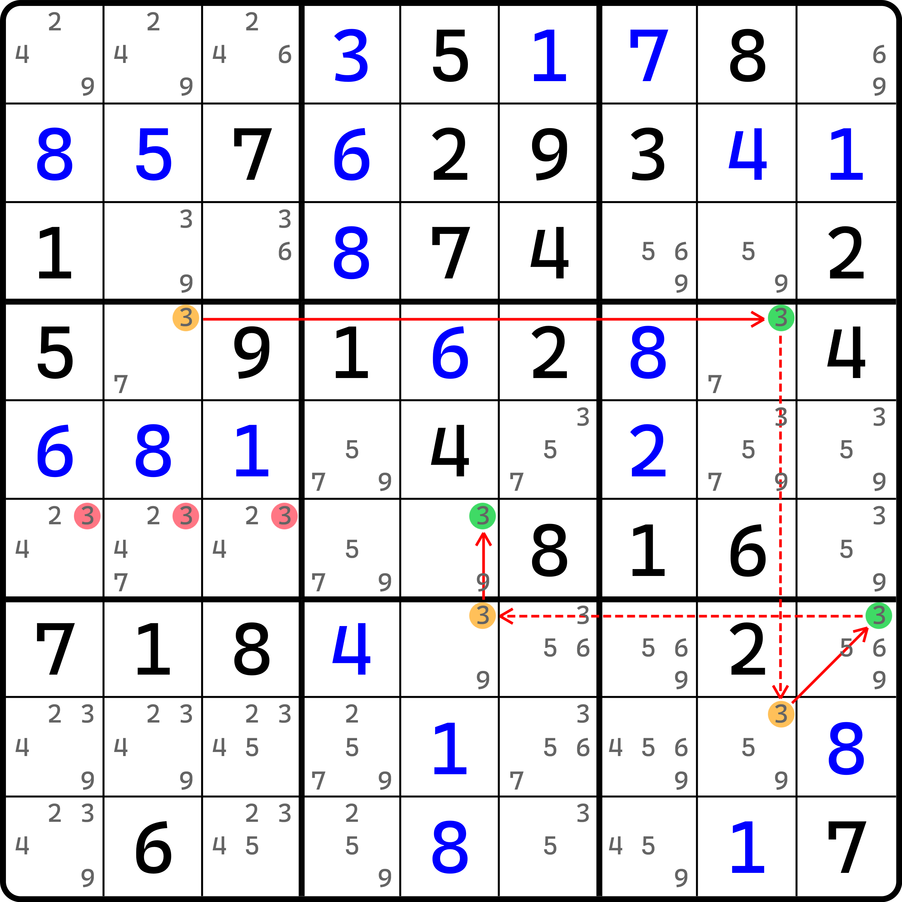
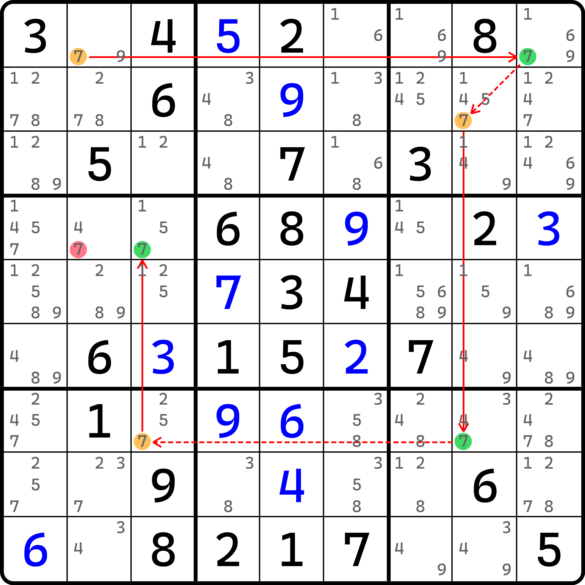
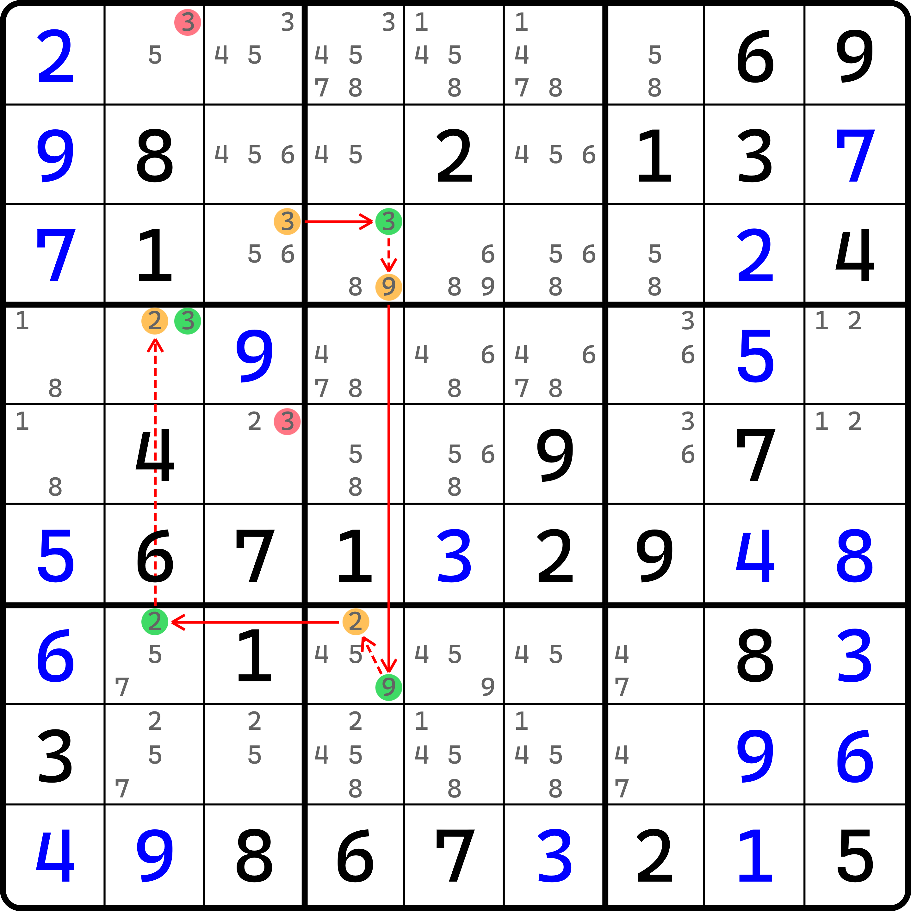
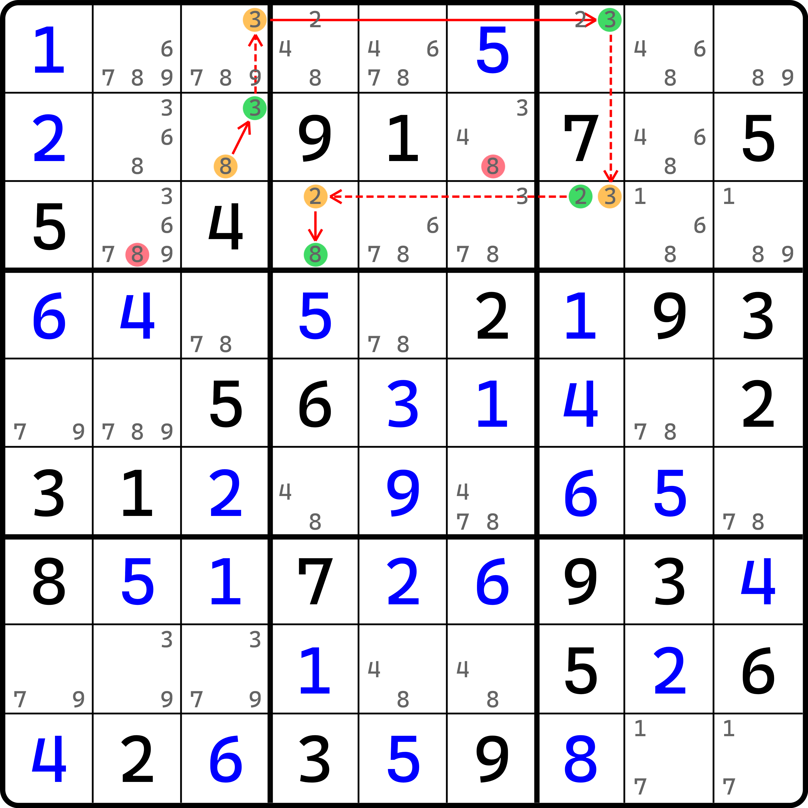

# 同数链和异数链的定义

之前我们学习了链的一些基础的定义和推理逻辑，这里我们再次回顾一下。

1. **链的开头和结尾都必须是强链关系；**
2. **链头应固定为假，并得到链尾为真；**
3. **链节点的真假性应交替出现，而对于强弱关系而言，则也是交替的；**
4. **链的长度一定是一个奇数，而链的节点数则一定是一个偶数；**
5. **链的头尾至少有一个为真。**

然后回顾一下强弱关系的定义：

* **强链关系：如果一个节点设为假可得到另一个节点为真时，则我们认为他俩有强链关系；**
* **弱链关系：如果一个节点设为真可得到另一个节点为假时，则我们认为他俩有弱链关系。**

下面我们带着这些内容，继续看后面的知识点。

## 同数链（X-Chain） <a href="#x-chain" id="x-chain"></a>

<figure><figcaption><p>同数链</p></figcaption></figure>

如图所示。这也是一条链，不过它比之前我们学到的双强链多了一个强链。它的长度达到了 5。不过推理还是挺容易的。

首先针对于候选数 `r4c2(3)` 讨论两种真假性情况：

* 如果 `r4c2 = 3`，则暂时无需考虑后续逻辑；
* 如果 `r4c2 <> 3`，则可根据 `r4`、`b9` 和 `c5` 三个共轭对，并最终真假交替得到 `r6c5 = 3` 的结论。

两种情况下至少有一个成立，所以 `r4c2` 和 `r6c5` 将有至少一个单元格填的是 3。所以，`r6c123 <> 3` 是这个题的结论（他们三个之中有一个是 3 就会破坏掉我们刚刚得到的结论）。

还是和之前一样，写一下链的文本表达：

```
r4c2(3) == r4c8(3) -- r8c8(3) == r7c9(3) -- r7c5(3) == r6c5(3) => r6c123 <> 3
```

可以看到，前面介绍的这个链所有的节点均用的是同一个数字（这不废话么）。我们把这种链称为**同数链**、**单数链**或**单链**（X-Chain），表示所有的节点均指向同一种数字；英文名 X-Chain 的 X 在这里表示的是未知数 $$x$$。比如说这里你可以认为 $$x = 3$$。

我们再来看一个例子。

<figure><figcaption><p>同数链，另一个例子</p></figcaption></figure>

如图所示。这个链表示如下：

```
r1c2(7) == r1c9(7) -- r2c8(7) == r7c8(7) -- r7c3(7) == r4c3(7) => r4c2 <> 7
```

因为推理完全一样，所以就不重复说明了，这里就自己理解了。

## 异数强弱关系的引入 <a href="#introduction-to-inferences-between-different-digits" id="introduction-to-inferences-between-different-digits"></a>

如果链只能用于同一种数字，那好像就没啥意义了。下面我们将强弱关系的推导稍微推广一下。

### 异数强链关系 <a href="#strong-inference" id="strong-inference"></a>

我们想象一下这种情况。假设一个单元格是双值格（只有两个候选数）。如果我们假设其中某一个候选数为假，那么另外一个候选数就必须为真。因为这个单元格必须要填一个数字进去。当其中一个候选数为假时，意味着这个单元格将会变为唯一余数，因此剩下的另外一个候选数必须为真。

也就是说，如果一个单元格是双值格时，我们仍然可以得到一个节点为假推到另一个节点为真的情况。而这是符合我们之前学习的强弱关系的定义的，确切来说是强关系的这一部分。

是的。我们可以参考这个规则推广一下强链的用法，以让它可以用于不同数字之间进行推理，避免链的推理过程过于单调。

### 异数弱链关系 <a href="#weak-inference" id="weak-inference"></a>

既然强链关系可用于不同数字之间，那么自然弱链关系也可以。

回顾一下弱链关系在同数状态下的用法。我们之前似乎并未特别针对于弱链的论证进行复杂的阐述，这是因为它是普通存在于题目之中的：两个相同的数字，一个填了另一个在同一个行列宫的肯定就不能填了，不管这个行列宫里有多少个相同的这个数的填数位置，2 个也好，更多个也好，这都不重要。

那么对于不同数字之间的弱链关系其实也是类似的，只不过因为是不同数字之间的论证，所以就不能看同行列宫的状态了，而是单元格内的状态。只要相同的一个单元格里，任取一个候选数填入（为真），则这个单元格就永远不可能再填别的数字了。所以这样也就客观存在弱链关系。

所以，总结一下：

* 强链关系
  * 同数：同一个行列宫里只有两处可填位置；
  * 异数：同一个单元格里只有两个候选数。
* 弱链关系
  * 同数：同一个行列宫里的任意两个相同的数字；
  * 异数：同一个单元格里的任意两个候选数。

借用这一点，我们就可以轻松地构造出不同数字之间的强弱关系，并将其用于链技巧里。

## 异数链（Multidigit Chain） <a href="#multidigit-chain" id="multidigit-chain"></a>

<figure><figcaption><p>异数链</p></figcaption></figure>

如图所示。链的记号如下：

```
r3c3(3) == r3c4(4) -- r3c4(9) == r7c4(9) -- r7c4(2) == r7c2(2) -- r4c2(2) == r4c2(3) => {r1c2, r5c3} <> 3
```

我们试着推理一下。

* 如果 `r3c3 = 3`；
* 如果 `r3c3 <> 3`，则因为共轭对的关系有 `r3c4 = 3`，于是同一个单元格里 `r3c4 <> 9`。接着往后一直推理可以到 `r4c2 <> 2`。而因为 `r4c2` 是双值格，所以此时 `r4c2` 变为唯一余数，故有 `r4c2 = 3` 的结论。

所以，`r3c3` 和 `r4c2` 里至少有一个单元格是填 3 的。所以这个题的结论是 `{r1c2, r5c3} <> 3`。

我们就把这种利用了不同数字之间的强弱关系的链称为**异数链**、**多数链**或**多链**（Multidigit Chain）。

我们再来看一个例子。

<figure><figcaption><p>异数链，另一个例子</p></figcaption></figure>

如图所示。链表示如下（这是最后一次用这个表示）：

```
r2c3(8) == r2c3(3) -- r1c3(3) == r1c7(3) -- r3c7(3) == r3c7(2) -- r3c4(2) == r3c4(8) => {r2c6, r3c2} <> 8
```

这个例子也希望你能自己看。

## 尤里卡链记法 <a href="#eureka-notation" id="eureka-notation"></a>

之前我们都用的是完整版的文本描述在表达这些链。显然看起来他们之后只会越来越长。所以我们这里介绍给各位一种简化的写法规范，以便后续描述的时候更为方便和精简一些。

首先，空格全都是不必要的。为了紧凑表述他们，链表达里的所有空格都可以去掉；当然也可以不去掉，这取决于你自己。

其次，我们使用的坐标表示方式是形如 `r2c3(8)` 这样单元格坐标加括号加数字的模式。在链的紧凑写法下，数字 8 是可以提前到坐标之前的，记作 `8r2c3` 或 `(8)r2c3`。这种写法本身并没有简化书写，但它可以配合强弱关系的简化模式。

然后，如果一个强弱链关系发生在一个单元格之中时，单元格坐标就不用展开写，而是将强弱链关系的记号 `==` 和 `--` （以及 `=` 和 `-`）直接写进小括号里。比如 `r2c3(3)==r2c3(8)` 可记为 `r2c3(3==8)` 或者 `r2c3(3=8)`。不过我们在这种简写模式下一般会把括号写在坐标的左边，即 `(3==8)r2c3` 或 `(3=8)r2c3`。

总体通过这四点的简化，链的文本就会显得更为紧凑。比如前面这个例子里的简化写法就是这样的：

```
(8=3)r2c3-3r1c3=3r1c7-(3=2)r3c7-(2=8)r3c4
```

这样就简单不少了。我们把这种简化后的链的文本格式称为**尤里卡链记法**（Eureka Notation）。是的，不用怀疑，这种只用于简化链书写格式的方式，它居然还有一个名字。

至此我们就介绍了定义的部分。之后我们将对这个异数链的内容继续进行展开介绍。
