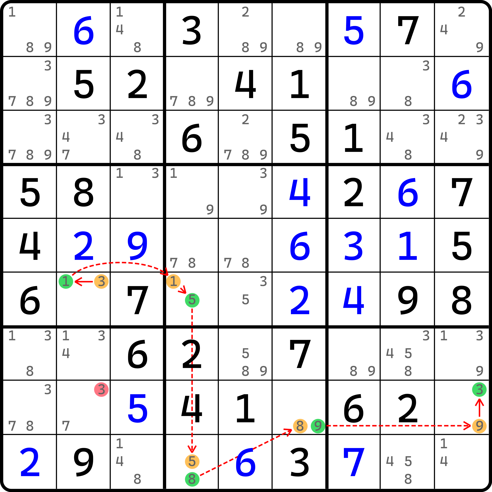
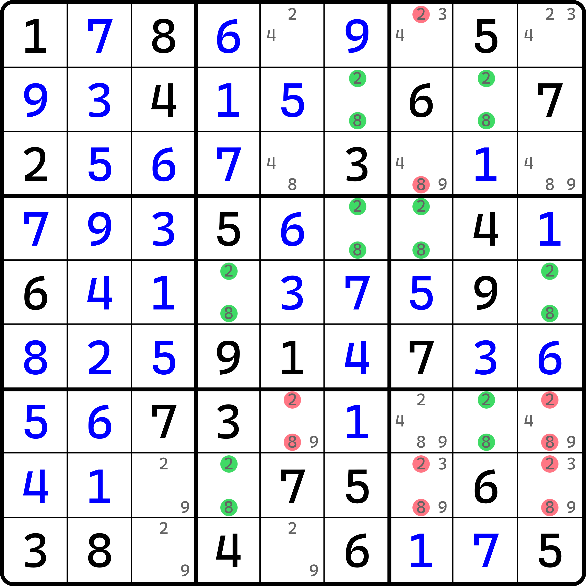
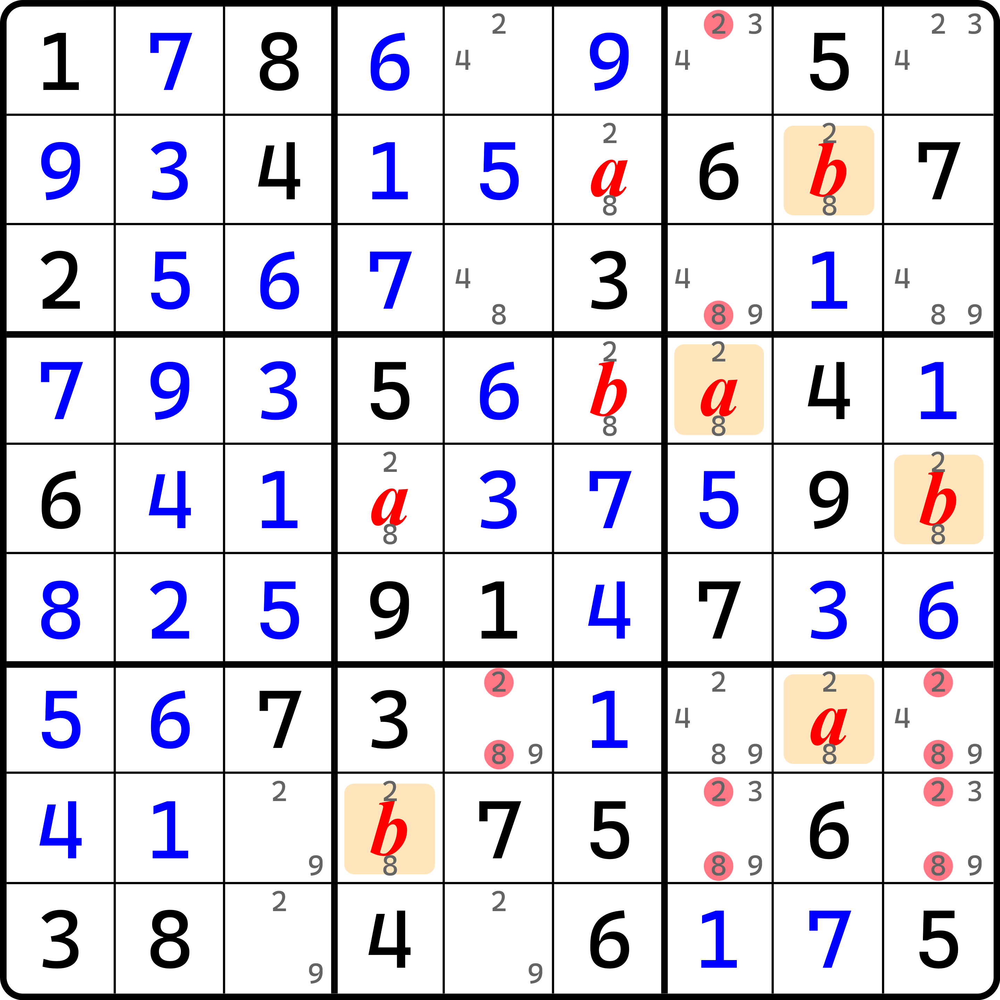
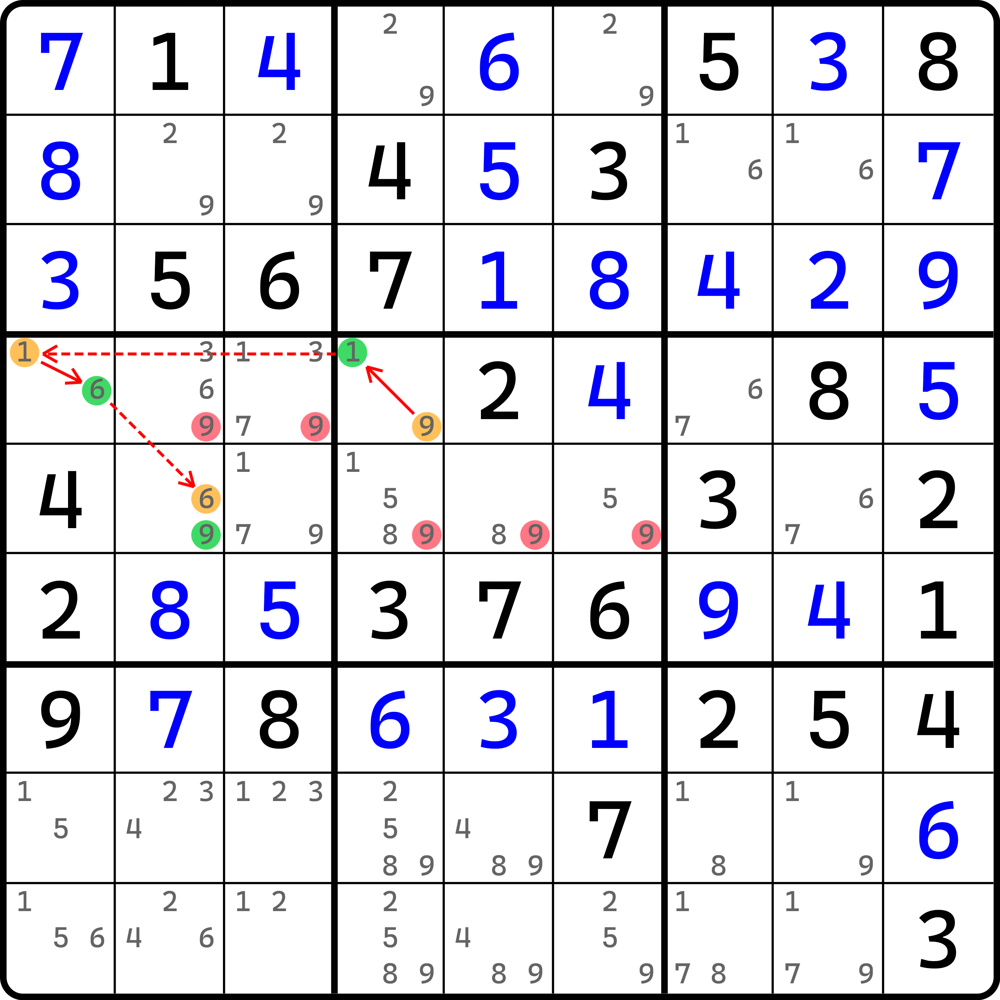

# 有技巧名的异数链

之前我们介绍了一些常见的异数链，下面我们来对异数链继续展开进行说明。

## 双值格链（XY-Chain） <a href="#xy-chain" id="xy-chain"></a>

<figure><figcaption><p>双值格链</p></figcaption></figure>

如图所示。链表示如下（删数部分以后就省略不写了）：

```
(3=1)r6c2-(1=5)r6c4-(5=8)r9c4-(8=9)r8c6-(9=3)r8c9
```

可以看到，这是一个非常巧妙的链——它的所有强链关系均落在了单元格里。我们把这种链称为**双值格链**（XY-Chain）。

## 远程数对（Remote Pair） <a href="#remote-pair" id="remote-pair"></a>

### 基本推理 <a href="#reasoning-of-remote-pair" id="reasoning-of-remote-pair"></a>

<figure><figcaption><p>远程数对</p></figcaption></figure>

如图所示。由于这个技巧比较特殊，所以请暂且允许我省略掉所有的强弱链的箭头。链的写法如下：

```
(2=8)r7c8-(8=2)r2c8-(2=8)r2c6-(8=2)r4c6-(2=8)r4c7-(8=2)r5c9-(2=8)r5c4-(8=2)r8c4
```

如果你只看文本表示的话，你会发现它其实就是特殊一些的双值格链。不过这未免也太特殊了点，所有的双值格居然用的是完全相同的两种数字，这使得链的强链永远都是 2 和 8 两种数字在交替进行。

最后，因为头尾都是 2，所以……欸不对啊。怎么图上删数会这么多？不应该只有 `{r7c5, r8c79} <> 2` 吗？

这就要提及这个技巧的一些特殊性质了。

### 特殊性质 <a href="#features-of-remote-pair" id="features-of-remote-pair"></a>

这个技巧叫**远程数对**（Remote Pair）。听名字就可以看出，它其实跟数对这个技巧有一定的关系。由于它只涉及全盘若干完全一样的双值格，所以我们甚至可以采用之前欠一数组和烟花数组那样的字母假设来看这个技巧。于是我们就有了这样的结果：

<figure><figcaption><p>远程数对，但是代数视角</p></figcaption></figure>

我们从起头的单元格 `r7c8` 开始假设字母，并顺着链用到的单元格逐个进行交替字母的填充。其中 $$a$$ 和 $$b$$ 都是 2 和 8 里的数，不过 $$a \ne b$$。

于是我们就会在这若干个单元格里得到几组不同的跨区数对：

* `r2c8` 和 `r4c7` 是跨区数对；
* `r5c9` 和 `r7c8` 是跨区数对；
* `r7c8` 和 `r8c4` 是跨区数对。

这里并未全部列举。比如 `r4c7` 和 `r8c4` 也是跨区数对，之类的。不过，我们拥有这几组跨区数对后，删数自然就能新增不少。

* `r2c8` 和 `r4c7`：掌管 `r13c7 <> 28`；
* `r5c9` 和 `r7c8`：掌管 `r78c9 <> 28`；
* `r7c8` 和 `r8c4`：掌管 `{r7c5, r8c79} <> 28`。

所以把他们全部放一起，就有了图中的这些位置的删数，这就是远程数对的一大非常重要的特征：**按链的次序，以单元格为单位假设其字母** $$a$$ **和** $$b$$ **交替填入，就会产生若干跨区数对。这些跨区数对不一定都有用，但最终全部产生的删数联立起来就是这个技巧的删数了。**

不过，它还有一些其他的结论，例如**远程数对可以拆解为两条同数链**、**远程数对存在两种不同的连接方式**之类的。不过因为没有什么实质性的影响删数和推理的信息，就留给各位自己私下理解了，这里就不细致阐述了。

## XY-Wing 和 W-Wing 的链视角

在早期的内容里，我们对 wing 的各种结构进行了介绍。实际上，XY-Wing 和 W-Wing 这两种技巧都是可以改成链的理解方式来进行理解的。

比如，这是一个 XY-Wing：

<figure><figcaption><p>XY-Wing，但是链画法</p></figcaption></figure>

如图所示。其实就是把拐点 `r4c1` 的两种分支情况，其中一个给反了个方向，并纳入链的假设，就这么简单。

再来看看 W-Wing。

<figure><figcaption><p>W-Wing，但是链画法</p></figcaption></figure>

如图所示。这是 W-Wing 的画法。也是讨论的 `c3` 改造成了强链关系。大体上跟 XY-Wing 的改法差不多。

下一节我们将继续针对异数链进行介绍。
