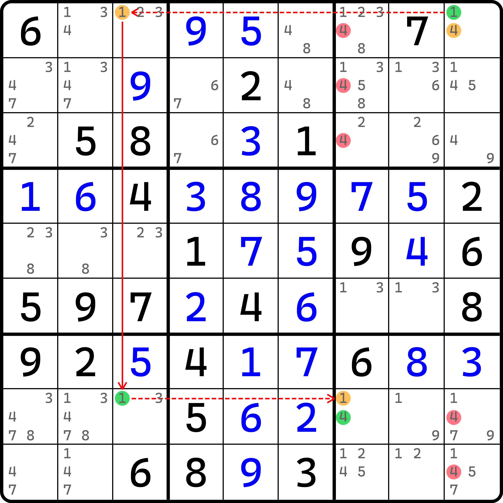

# 鱼的基本推理

二阶鱼我们先来看鱼的基本推理过程。

## 二阶鱼（X-Wing） 

<figure><figcaption></figcaption></figure>

如图所示，我们可以看到，数字 6 在 `r1` 和 `r8` 里都只有同样两个列的地方填。

这说明什么呢？我们把四个单元格的坐标提出来：`r18c26`。那么，按照数独的最终填数过程，我们要保证同行列不能填重复的数字，所以两个 6 的分布只能是互不相干的两列上，那么就有这两种情况：

1. 要么左上角和右下角填 6：`r1c2` 和 `r8c6`；
2. 要么右上角和左下角填 6：`r1c6` 和 `r8c2`。

这里要补充说一下。因为 `r18` 都缺 6，所以最终 `r1` 要填一个 6 进去，而 `r8` 也得填一个，所以最终在这两行里必须是有两个 6 的填入的。所以，只可能是上面这两个情况，而不可能存在只填一个 6 或甚至 6 一个都不填的情况。

搞清楚这一点后，我们来看分布。如果我们是第一个情况，那么 `c2` 里填 6 的机会会落在 `r1c2` 上，而 `c6` 里填 6 的机会会落在 `r8c6` 上。而如果是第二个情况，`c2` 里填 6 的机会会落在 `r8c2` 上，而 `c6` 里填 6 的机会就会落在 `r1c6` 上。

这稍微有点绕，但是还是比较清晰的。因为填 6 的全局就只有这两种情况，而不论是哪种情况，`c2` 和 `c6` 都会出现 6 的填入。即使我们分不清楚具体 `r18c26` 里的 6 的具体分布，但这并不重要。我们只需要知道的是，`c2` 肯定有 6，`c6` 也肯定会有 6 就行了。

因为 `c2` 里必须有 6 填在 `r18c2` 的其一，所以 `c2` 的其他位置都没有任何可能（与其说是“可能”，还不如说是“机会”，没有任何机会）填入 6。所以，`c2` 的任何其他空格都可以删除候选数 6；而对于 `c6` 也是一样：`c6` 里填 6 的位置一定会落在 `r18c6` 的其一，所以别处都不能填。

所以，这个题的结论是 `{r37c6, r9c26} <> 6`。

我们把这个推理过程称为**二阶鱼**（X-Wing）。鱼的本质推理就是在假设某一个单一的数字在某几个行或列里的排列情况。

另外，因为鱼早期也叫链列，所以二阶鱼早期也叫**二链列**。

我们再来看一个例子，希望这一次你能自己推理它。

<figure><figcaption>
二阶鱼 练习题
</figcaption></figure>

稍微提示一下。刚才我们是横着看的，这回我们得竖着看。

## 三阶鱼（Swordfish） 

刚才我们学习的是二阶鱼。鱼和数组一样，也有规格一说，所以二阶鱼指的是规格为 2 的鱼。下面我们来看，鱼在规格为 3 的时候，都长啥样。

<figure><figcaption>
三阶鱼
</figcaption></figure>

如图所示。我们可以看到，`r368` 三行里填入 4 的位置刚好在三个不同的列里。这一点和前面二阶鱼的效果一致。

按照数独规则，`r3` 要填一个 4，`r6` 也要填一个 4，而 `r8` 也得填一个 4，所以这三行一共要填进去三个数字 4。

由于我们刚才说过，整体来看，整个三行填 4 的机会全部分在三个不同的列 `c567` 里，所以不论你怎么去安排 4 的位置，为了确保数字 4 不会在行和列上重复出现，只能安排一个列里填一个 4。这样三个列都有 4，才不会造成冲突，也是唯一能让 4 正常填进去的情况。

既然每一列都要有个 4，那么 `c567` 的任何其他空格就没有机会填 4 了。所以：

* 对于 `c5`，结论就是 `r127c5 <> 4`；
* 对于 `c6`，结论则是 `r1c6 <> 4`；
* 对于 `c7`，结论就是 `r4c7 <> 4`。

我们把结论整合到一起，就是这个技巧的结论：`{r127c5, r1c6, r4c7} <> 4`。

我们把规格为 3 的鱼的推理过程，称为**三阶鱼**（Swordfish）。也叫**三链列**。英文名的直译是剑鱼。

现在我们来看另外一个例子，也是和前面一样，希望你自己推理。

<figure><figcaption>
三阶鱼 练习题
</figcaption></figure>

## 四阶鱼（Jellyfish） 

下面我们来看规格为 4 的情况。

<figure><figcaption>
四阶鱼
</figcaption></figure>

这个题是故意构造的。因为平时做题压根就遇不到这种长得非常漂亮的结构。

如图所示。我们发现，数字 9 在四个列（注意这回是看列）里的所有可填位置只有 16 个。看起来很多，但是只看它们出现的行的话，其实可以很容易发现，这 16 个单元格只用到了四个不同的行：`r1247`。

让我们想一想，因为 `c2367` 里每一列都要出现一个 9，所以四个列一共要填进去 4 个 9。那么，让这 16 个位置合理分配 4 个 9 的位置摆放，以规避 9 在同行列上出现重复的话，是不是每一行安插一个 9 就行了？

所以，这一点和前面的推理过程完全一样。既然我们要让每一行填一个 9，那么 `r1247` 这四个行里填 9 的位置必然会在这 16 个单元格里来回变动，逃不出这 16 个格子。得到这个结论后，我们就可以得到结论了——这些行的其他任何空格都没有机会填 9，因为填 9 的机会，针对于这四行来说，一定落在前面说的这 16 个格子里。

所以，整合结论，我们就有了这个题的结论：`{r1c4569, r2c469, r4c19, r7c14569} <> 9`。我们把这个技巧称为**四阶鱼**（Jellyfish），早期也叫**四链列**。英文名直译的话是水母。

和前面一样，我们也再来看一个例子。希望这个例子自己推理。

<figure><figcaption>
四阶鱼 练习题
</figcaption></figure>

这个题仍然是前面那个题，只是四阶鱼的结构它换了个数字。当然，结论肯定也就不一样了。

## 鱼的残缺态

前面我们看到了若干个例子，我们不难整理出鱼的通用规则：

对于某一个数，去看这个数在若干个行（列）里的所有可填位置，是否恰好也都只出现在若干个列（行）之中。如果是的话，那么鱼就成立了，结论就是这若干个列（行）的其余空格里的这个候选数数字均可删除。

不过，这里有个小小的问题。

<figure><figcaption>
残缺鱼 例子
</figcaption></figure>

比如这个例子。假设这个题的 `r5c1`、`r6c5` 和 `r7c7` 都是空格，且包含候选数 1 的话，那么这样的结构就刚好用满 9 个空格，便是所谓鱼的最完整的状态。

类似于这样，因为鱼的规格为 $$n$$ 的话，那么最完整的状态一定是 $$n^2$$ 个单元格。如果缺少任意的位置不可摆放的话，假如这样的鱼照样能成立（就像上面这样仍然不影响推理），那么我们就称这种鱼是**残缺**（Incomplete）的。

理论上来说，我们要保证鱼的成立，每一个行（列）肯定至少得有两个可用位置作排列。如果就剩一个位置了，那不就直接等于是之前的行列排除了吗？所以，每一行（列）里必须保证最少两个格，因此鱼在残缺的时候，最极限的状态是只用 $$2n$$ 个单元格，即一个鱼能够推理，需要用到的空格数量一定是介于 $$[2n, n^2]$$ 这个区间的，其中 $$n = 2, 3, 4$$。

## 组合区块和二阶鱼

前面我们讲过组合区块的逻辑。可以从组合区块的推理逻辑里看出，它其实和二阶鱼的逻辑完全一样。从技巧分类上来说，组合区块其实是二阶鱼的子集：二阶鱼在使用的四个单元格刚好分布在两个宫里的时候，这种情况就被称为组合区块。
