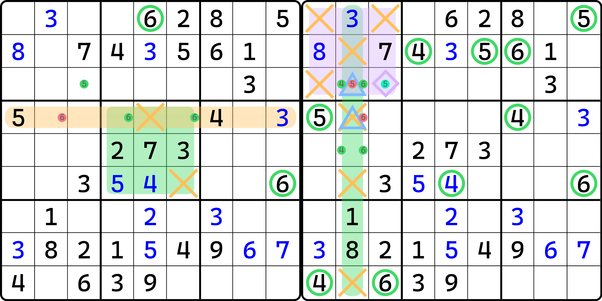
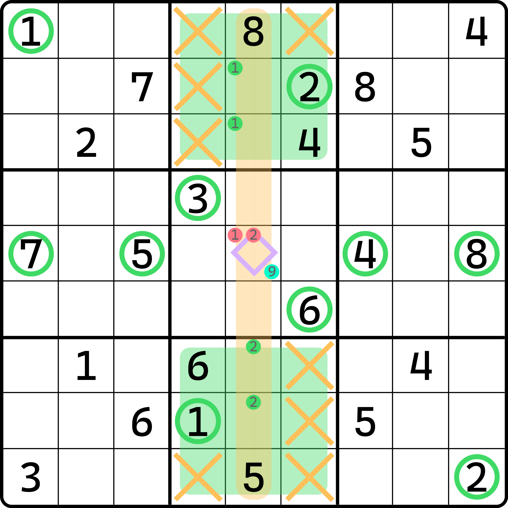

---
description: Direct Complex Single
---

# 直观复杂出数

前面我们学习了区块和数组的使用，我们发现它是用于辅助排除和唯一余数技巧出数得到结论的技巧。它们自身由于无法出数，所以使用上会出现复杂的用法。

前面我们接触到的都是只需要一个的情况。但是这样的出数显然比较简单，下面我们来看一些复杂的出数逻辑，需要依赖更多的区块和数组在同一个步骤之中。

## 例子 1：串行使用 

<figure><figcaption>
宫区块 + 隐性数对 + 宫排除
</figcaption></figure>

如图所示，我们先看左边的图，然后再看右边的图。左图里展示的是一个宫区块，得到的是 `b5` 的 6 区块结构。于是，我们可以得到 `r4c2 <> 6` 的结论。

然后利用这一点，我们可以得到右图“隐性数对 + 宫排除”的结论：因为 `r4c2 <> 6`，所以 `c2` 的 6 就只能卡在 `r35c2`，于是这两个单元格就只能是 4 和 6，构成隐性数对。

接着，得到结论之后，`r3c2 <> 5` 的结论就有了。于是我们根据宫排除得到 `b1` 内填入 5 的位置只能是 `r3c3`。所以 `r3c3 = 5`。

## 例子 2：并行使用 

前面的例子是一步一步这么下来的。下面我们来看一个出数需要同时直接依赖两个区块的例子。

<figure><figcaption>
两个宫区块 + 唯一余数
</figcaption></figure>

如图所示。`b7` 有个 5 的宫排除。我们先忽略它（实际上也帮不上什么忙）。

我们先对 `b2` 和 `b8` 分别作排除，可以得到这两个宫具有 1 和 2 的宫区块结果。然后我们发现，它们刚好都是竖着长的，所以 `r5c5` 刚好位于它俩的“作用域”上，所以 `r5c5 <> 1` 和 `r5c5 <> 2` 可以同时得到。

然后，我们针对于 `r5c5` 使用唯一余数，可以得到 `r5c5 = 9` 的结论。

